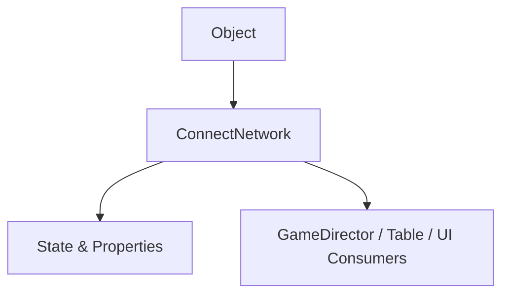

# 🏛️ `ConnectNetwork` Architectural Role & Runtime Integration

<!-- convention-summary-start -->
### ConnectNetwork Architectural Role & Runtime Integration Summary

- **Core Architecture / Purpose**: Technical reference, API contract, and integration guide for ConnectNetwork Architectural Role & Runtime Integration.
- **Key Mechanisms & Design**: Encapsulates core algorithms, event hooks, and performance optimizations within the slot framework runtime.
- **Domain Capabilities**: cc_core_lib, 01_overview
- **Scope & Code Paths**: `assets/cc-common/`
- **Related Docs**: [Master Index](../INDEX.md)
<!-- convention-summary-end -->

- **Package Source**: `assets/cc-common/cc-core-lib/share-lib`
- **Global Namespace Anchor**: `eno.ConnectNetwork` / `globalThis.eno.ConnectNetwork`
- **Inheritance Hierarchy**: `ConnectNetwork` ➔ `Object`

---

## 1. Architectural Mission

`ConnectNetwork` is an essential logic component within **`share-lib`**. It encapsulates dedicated business rules, lifecycle hooks, and optimized runtime performance tailored for high-framerate ($60\text{ FPS}$) Cocos Creator 2.4 slot games.

---

## 2. Core Responsibilities

1. **Deterministic Lifecycle Orchestration**:
   - Manages state machine transitions with zero uncontrolled side-effects.
2. **Memory & Performance Optimization**:
   - Zero-allocation design preventing Garbage Collection (GC) spikes during high-frequency spin loops.
3. **Cross-Platform Resilience**:
   - Normalizes engine quirks between iOS WebAudio, Android touch dispatchers, and desktop WebGL canvas adapters.
