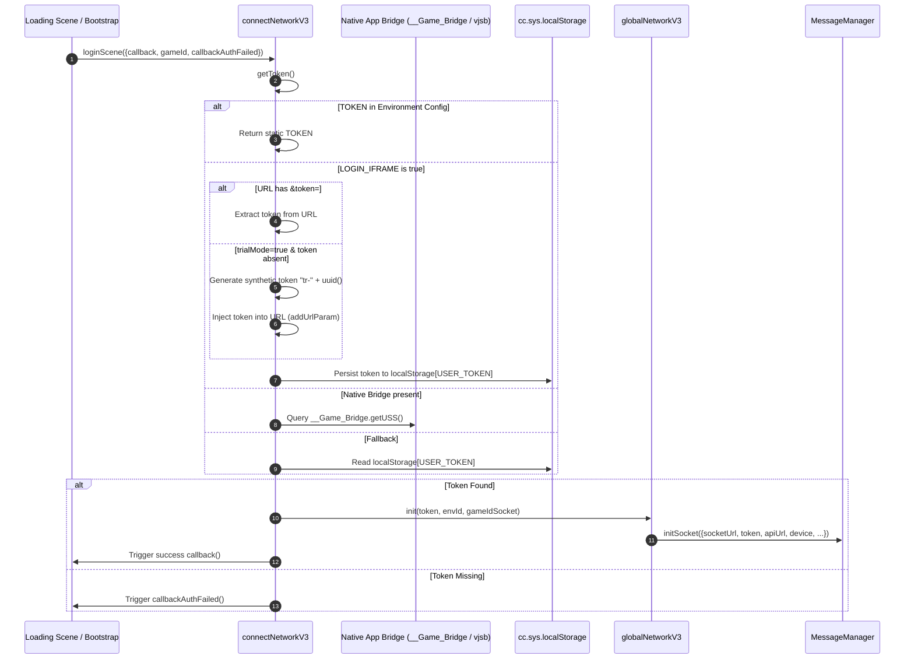
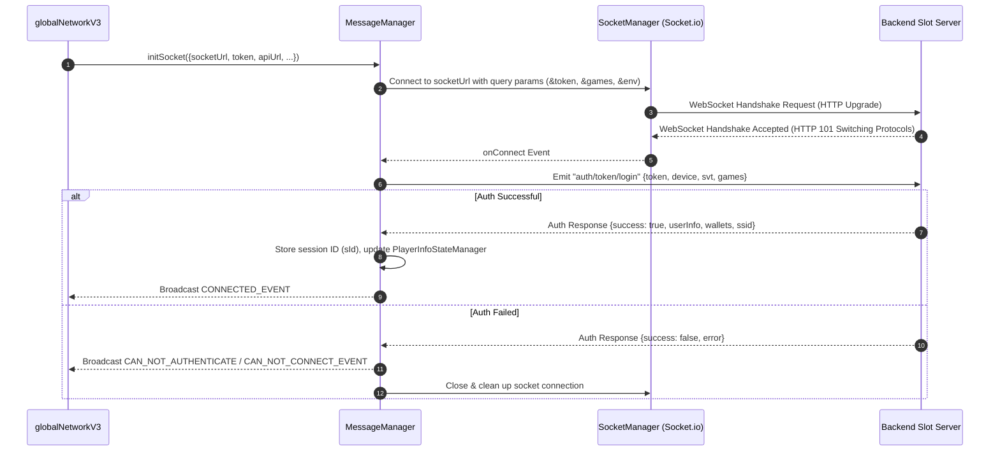
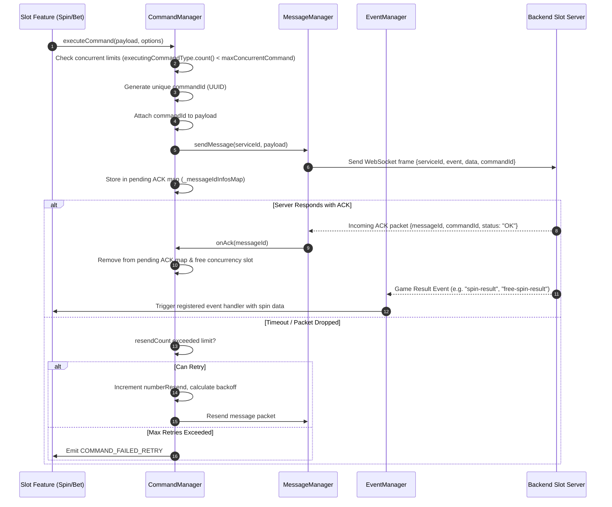
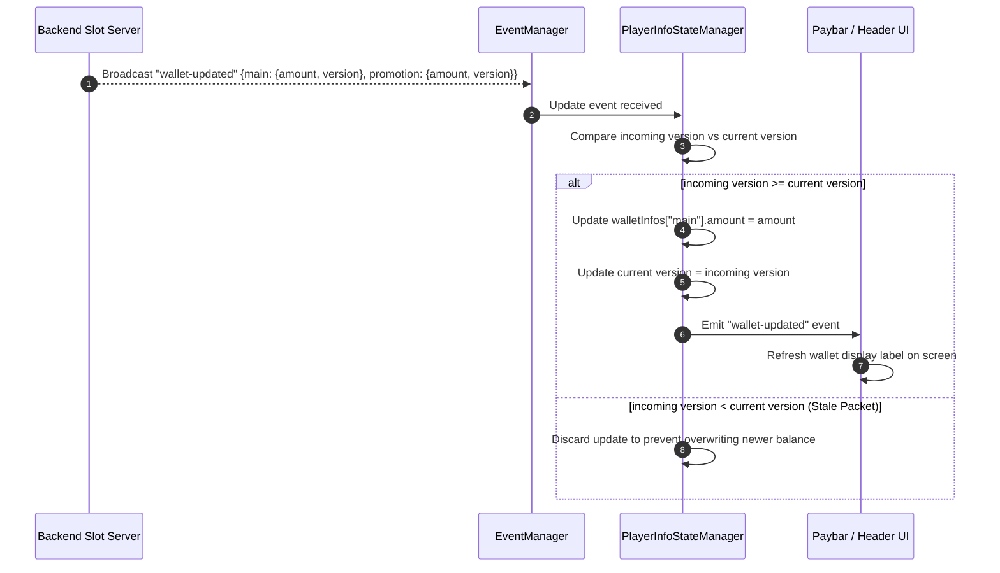

# 📊 Cocos Slot Network Kernel Sequence & Flow Diagrams

<!-- convention-summary-start -->
### Cocos Slot Network Kernel Sequence & Flow Diagrams Summary

- **Core Architecture / Purpose**: Defines network protocol, socket packet lifecycle, state persistence, and error handling for Cocos Slot Network Kernel Sequence & Flow Diagrams.
- **Key Mechanisms & Design**: Handles WebSocket frame dispatch, acknowledgment confirmation, state resume, and resilient synchronization between client DataStore and Backend Gateway.
- **Domain Capabilities**: cc_network, 00_architecture_and_conventions
- **Scope & Code Paths**: `assets/cc-common/cc-network/`
- **Related Docs**: [Master Index](../INDEX.md)
<!-- convention-summary-end -->

This document illustrates the end-to-end operational flows of the `cc-network` communication kernel using sequence and state machine diagrams.

---

## 1. 🔑 Authentication & Token Resolution Flow

---

## 2. ⚡ Socket Connection & Token Verification Handshake

---

## 3. 🎯 Outbound Command Dispatch & ACK Processing

---

## 4. 💰 Multi-Wallet Synchronization Flow

