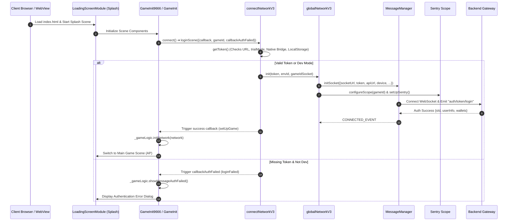

# 🚀 Game Flow 01: Bootstrap, Authentication & Login Flow

<!-- convention-summary-start -->
### Game Flow 01: Bootstrap, Authentication & Login Flow Summary

- **Core Architecture / Purpose**: Defines network protocol, socket packet lifecycle, state persistence, and error handling for Game Flow 01: Bootstrap, Authentication & Login Flow.
- **Key Mechanisms & Design**: Handles WebSocket frame dispatch, acknowledgment confirmation, state resume, and resilient synchronization between client DataStore and Backend Gateway.
- **Domain Capabilities**: cc_network, 01_game_flow_and_lifecycle
- **Scope & Code Paths**: `assets/cc-common/cc-network/`
- **Related Docs**: [Master Index](../INDEX.md)
<!-- convention-summary-end -->

This document details the exact sequence of events from when the player opens the game URL up to the successful establishment of the network session.

---

## 1. 📊 End-to-End Sequence Diagram

---

## 2. 🔍 Step-by-Step Execution Breakdown

### Step 1: Pre-ingame Scene Initialization
- The `LoadingScreenModule` loads visual assets, fonts, and sets up the progress bar.
- `GameInit` activates and queries `loadConfigAsync.getConfig()` to check if remote configuration (`IS_FINISHED_REMOTE`) has completed loading. If still in flight, it polls in 100ms intervals.

### Step 2: Token Resolution Priority
`connectNetworkV3.getToken()` evaluates the host environment:
1. **Config Override**: Uses `TOKEN` if explicitly set in environment config.
2. **Iframe Portal Parameter**: Parses `&token=` from `window.location.search`.
3. **Guest / Trial Mode**: If `&trialMode=true` and token is absent, generates a synthetic guest ID `tr-${uuid()}`, injects it into URL query via `addUrlParam("token", token)`, and persists it in `localStorage[USER_TOKEN]`.
4. **Native App Bridge**: Calls `window.__Game_Bridge.getUSS()` or `vjsb.sendGetToken()`.
5. **Local Storage Fallback**: Reads `localStorage[USER_TOKEN]`.

### Step 3: Global Network Initialization & Sentry Tagging
- `globalNetworkV3.init()` builds client device information (`os`, `platform`, `browser`, `language`).
- Sets up Sentry error reporting with `scope.setExtra("gameId", gameId)` to ensure all subsequent crashes are tagged by game title.

### Step 4: Socket Handshake & Verification
- `MessageManager.initSocket()` connects to `SOCKET_URL` with query parameters `?token=...&games=...&env=...`.
- Upon socket connection, emits `auth/token/login` to authenticate the WebSocket channel.
- Upon receiving confirmation, `GameInit.setUpGame()` binds `_gameLogic.initNetwork(network)` and transitions the scene into the Main Game (Action Panel).
