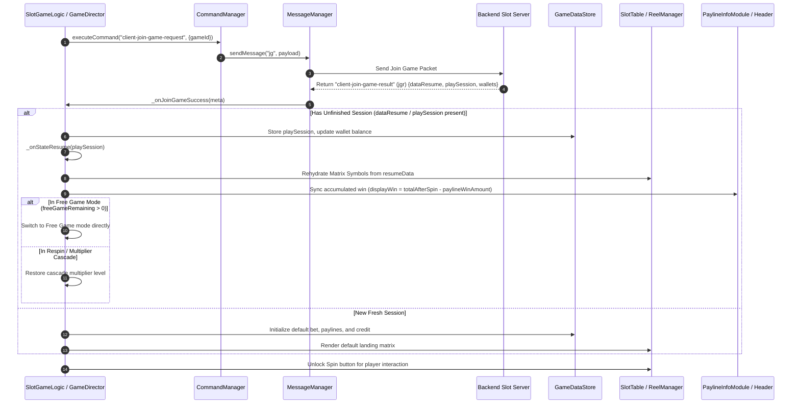

# 🔄 Game Flow 02: Join Game & Play Session State Resume Flow

<!-- convention-summary-start -->
### Game Flow 02: Join Game & Play Session State Resume Flow Summary

- **Core Architecture / Purpose**: Defines network protocol, socket packet lifecycle, state persistence, and error handling for Game Flow 02: Join Game & Play Session State Resume Flow.
- **Key Mechanisms & Design**: Handles WebSocket frame dispatch, acknowledgment confirmation, state resume, and resilient synchronization between client DataStore and Backend Gateway.
- **Domain Capabilities**: cc_network, 01_game_flow_and_lifecycle
- **Scope & Code Paths**: `../../../../../assets/cc-release-slot/cc1-red-cliff/scripts/Gui/PaylineInfoModule9666.ts#L474-L490`
- **Related Docs**: [Master Index](../INDEX.md)
<!-- convention-summary-end -->


This document details how the game joins a specific slot room and restores unfinished play states (`dataResume` / `playSession`).

---

## 1. 📊 Sequence Diagram: Join Game & State Rehydration



---

## 2. 🔍 Core Data Structures & Resume Logic

### 2.1 The `dataResume` / `playSession` Packet
When a player rejoins a game after closing the browser mid-spin or during an active Free Spin round, the server responds with a state envelope:

```typescript
interface JoinGameResumeData {
    matrix: number[][];                 // Reel strip symbols layout
    betAmount: number;                  // Locked bet value for ongoing free spins
    currentNormalGameWinAmount?: number;// Accumulated base game win
    totalFreeSpinWinAmount?: number;    // Accumulated free game win
    freeGameTotal?: number;             // Total awarded free spins
    freeGameRemaining?: number;         // Remaining free spins to execute
    multiplier?: number;                // Current cascade win multiplier
    freeGamePayLines?: any[];           // Winning lines from previous cascade
    normalGamePayLines?: any[];         // Base game winning lines
}
```

### 2.2 Win Bar & Display Calculation Gotcha
As implemented in [`PaylineInfoModule9666.ts`](../../../../../assets/cc-release-slot/cc1-red-cliff/scripts/Gui/PaylineInfoModule9666.ts#L474-L490):
```typescript
protected onJoinGameSuccess(data: any): void {
    const resumeData = data?.joinGameData?.dataResume || data?.dataResume || this.dataStore?.playSession;
    if (resumeData) {
        const paylines = resumeData.freeGamePayLines || resumeData.normalGamePayLines || resumeData.paylines;
        const totalAfterSpin = Number(resumeData.winAmountPS) || Number(resumeData.totalFreeSpinWinAmount) || Number(resumeData.freeGameWinAmount) || 0;
        let paylineWinAmount = 0;
        if (paylines) {
            paylineWinAmount = eno.SlotUtils.convertPayLineAllWays(paylines)
                .map(item => item.payLineWinAmount)
                .reduce((a, b) => a + b, 0);
        }
        // Calculate pre-spin display win to prevent double visual counting
        const displayWin = totalAfterSpin - paylineWinAmount;
        if (displayWin > 0 && this.lbRight) {
            this._lastAccumulatedWin = displayWin;
            this.setWinText(displayWin);
        }
    }
}
```
This ensures the Win label accurately reflects historical session winnings without re-animating paylines that have already completed.
