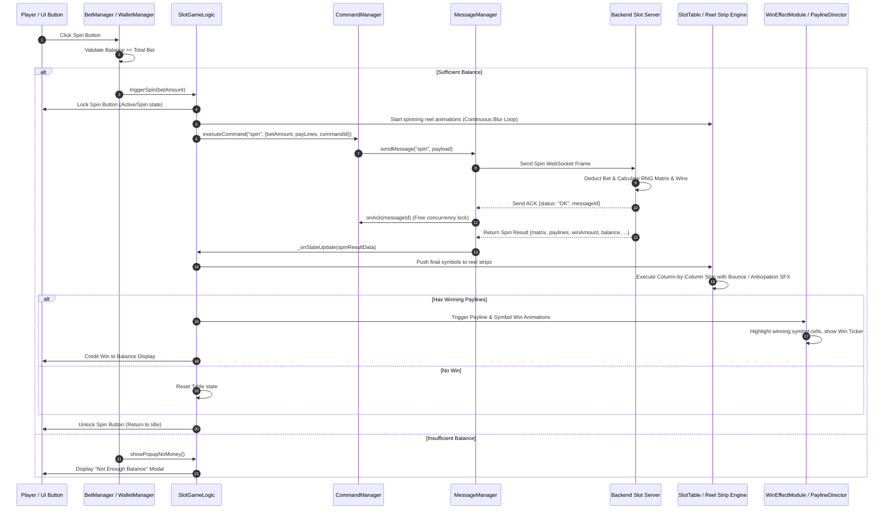

# 🎰 Game Flow 03: Normal Spin Cycle Packet Pipeline

<!-- convention-summary-start -->
### Game Flow 03: Normal Spin Cycle Packet Pipeline Summary

- **Core Architecture / Purpose**: Defines network protocol, socket packet lifecycle, state persistence, and error handling for Game Flow 03: Normal Spin Cycle Packet Pipeline.
- **Key Mechanisms & Design**: Handles WebSocket frame dispatch, acknowledgment confirmation, state resume, and resilient synchronization between client DataStore and Backend Gateway.
- **Domain Capabilities**: cc_network, 01_game_flow_and_lifecycle
- **Scope & Code Paths**: `assets/cc-common/cc-network/`
- **Related Docs**: [Master Index](../INDEX.md)
<!-- convention-summary-end -->

This document explains the standard lifecycle of a single reel spin from user click, through network dispatch and server calculation, to animation stop and payout.

---

## 1. 📊 Sequence Diagram: The Complete Spin Cycle

---

## 2. ⚡ Critical Timing Points & Gotchas

1. **Optimistic Visual Spin vs Server Response**:
   Reels immediately begin their visual spinning loop (blur animation) on client button click before the server matrix response arrives. This provides responsive tactile feedback ($0$ms latency feel).
2. **Reel Stop Triggering**:
   Once the spin result packet arrives, the reel engine computes stop positions. If the network packet is delayed, reels continue spinning smoothly until the matrix data is fully received.
3. **Idempotent `commandId`**:
   The unique UUID attached to each spin command prevents double betting if the network connection flickers and the packet is resent.
