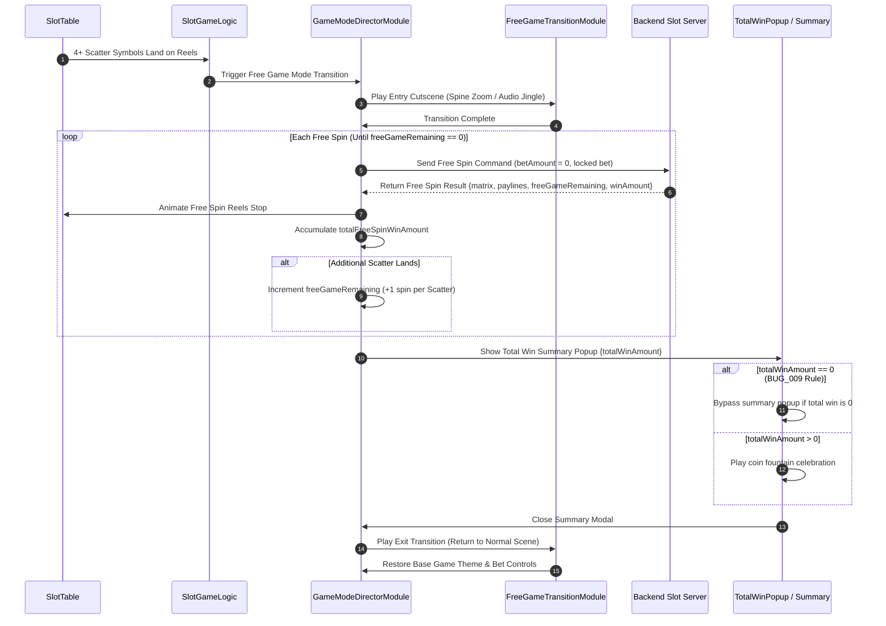

# 🎁 Game Flow 04: Free Game & Game Mode Transitions

<!-- convention-summary-start -->
### Game Flow 04: Free Game & Game Mode Transitions Summary

- **Core Architecture / Purpose**: Defines network protocol, socket packet lifecycle, state persistence, and error handling for Game Flow 04: Free Game & Game Mode Transitions.
- **Key Mechanisms & Design**: Handles WebSocket frame dispatch, acknowledgment confirmation, state resume, and resilient synchronization between client DataStore and Backend Gateway.
- **Domain Capabilities**: cc_network, 01_game_flow_and_lifecycle
- **Scope & Code Paths**: `assets/cc-common/cc-network/`
- **Related Docs**: [Master Index](../INDEX.md)
<!-- convention-summary-end -->

This document covers the end-to-end network and presentation flow when transitioning into, playing through, and exiting Free Game (Free Spins) mode.

---

## 1. 📊 Sequence Diagram: Free Game Lifecycle

---

## 2. ⚡ Key Business Rules & Network Gotchas

1. **Zero Bet Free Spins**: Free spin packets do not deduct player balance. The server evaluates payout using the locked `betAmount` established during the triggering base game spin.
2. **Total Win Popup Bypass (`BUG_009`)**: As specified in `BUG_009_bypass_total_win_popup_when_free_game_total_win_is_zero.md`, if the total accumulated win during free spins equals 0, the celebration popup is bypassed or immediately dismissed.
3. **Session Interruption Recovery**: If the network disconnects during Free Game, rejoining immediately resumes at the exact remaining spin count (`freeGameRemaining`) using cached server state.
