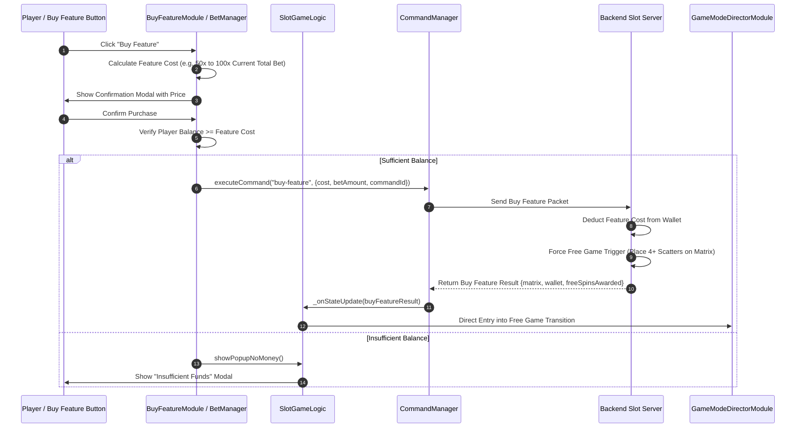

# 🛒 Game Flow 05: Buy Feature Network Flow

<!-- convention-summary-start -->
### Game Flow 05: Buy Feature Network Flow Summary

- **Core Architecture / Purpose**: Defines network protocol, socket packet lifecycle, state persistence, and error handling for Game Flow 05: Buy Feature Network Flow.
- **Key Mechanisms & Design**: Handles WebSocket frame dispatch, acknowledgment confirmation, state resume, and resilient synchronization between client DataStore and Backend Gateway.
- **Domain Capabilities**: cc_network, 01_game_flow_and_lifecycle
- **Scope & Code Paths**: `assets/cc-common/cc-network/`
- **Related Docs**: [Master Index](../INDEX.md)
<!-- convention-summary-end -->

This document details the network interaction when a player chooses to purchase a direct entry into Free Spins or Bonus Mode via the Buy Feature button.

---

## 1. 📊 Sequence Diagram: Buy Feature Purchase

---

## 2. ⚡ Important Gotchas
- **Wallet Deductions**: The server deducts the entire feature cost (e.g. `$50.00`) in a single atomic transaction before generating the scatter matrix.
- **Client Safeguard**: The Buy Feature button is automatically locked during spins and auto-spin modes to prevent concurrent transaction collisions.
