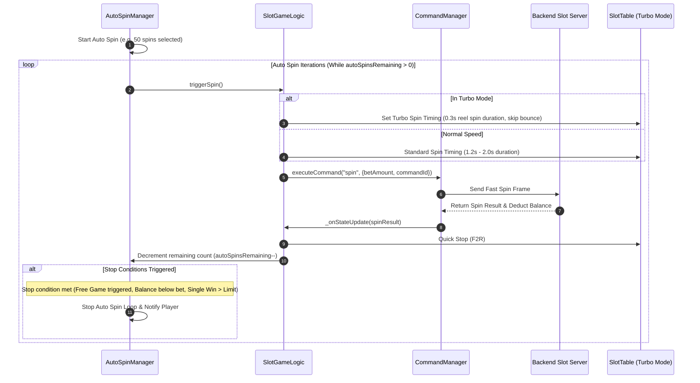

# ⚡ Game Flow 06: Auto & Turbo Spin Network Dynamics

<!-- convention-summary-start -->
### Game Flow 06: Auto & Turbo Spin Network Dynamics Summary

- **Core Architecture / Purpose**: Defines network protocol, socket packet lifecycle, state persistence, and error handling for Game Flow 06: Auto & Turbo Spin Network Dynamics.
- **Key Mechanisms & Design**: Handles WebSocket frame dispatch, acknowledgment confirmation, state resume, and resilient synchronization between client DataStore and Backend Gateway.
- **Domain Capabilities**: cc_network, 01_game_flow_and_lifecycle
- **Scope & Code Paths**: `assets/cc-common/cc-network/`
- **Related Docs**: [Master Index](../INDEX.md)
<!-- convention-summary-end -->

This document details the high-frequency networking and state constraints operating during Auto Spin and Turbo Spin (Fast to Result / F2R) modes.

---

## 1. 📊 Auto Spin & Turbo Spin Execution Pipeline

---

## 2. ⚡ Key Network Constraints & Bug Fix References

1. **Auto Spin Persistence Across Free Game (`BUG_006`)**:
   As documented in `BUG_006_autogen_turn_off_after_bigwin_freegame_transition.md`, Auto Spin state must be cleanly paused during Big Win or Free Game transitions, and automatically restored upon returning to Normal Game if configured.
2. **Turbo Reel Strip Blurring (`BUG_004`)**:
   In Turbo Mode, blur symbols on horizontal sub-reels must follow the standard blur exclusion rules to avoid visual artifacts.
