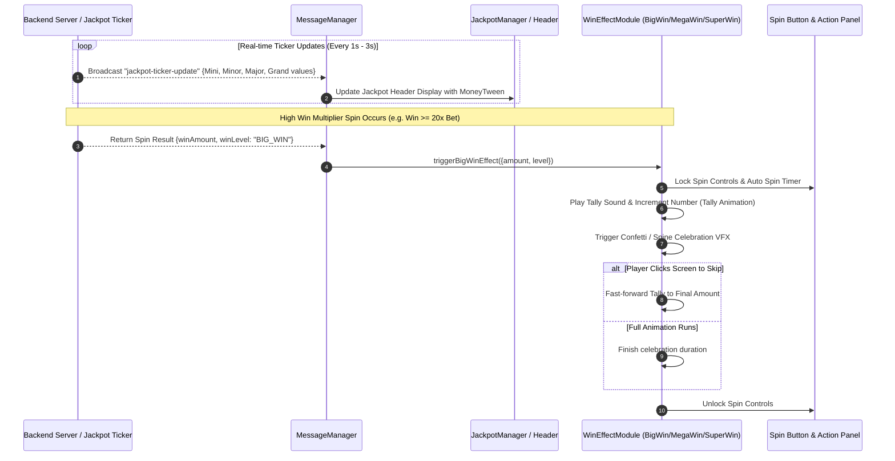

# 🏆 Game Flow 07: Jackpot Ticker Sync & Big Win Celebrations

<!-- convention-summary-start -->
### Game Flow 07: Jackpot Ticker Sync & Big Win Celebrations Summary

- **Core Architecture / Purpose**: Defines network protocol, socket packet lifecycle, state persistence, and error handling for Game Flow 07: Jackpot Ticker Sync & Big Win Celebrations.
- **Key Mechanisms & Design**: Handles WebSocket frame dispatch, acknowledgment confirmation, state resume, and resilient synchronization between client DataStore and Backend Gateway.
- **Domain Capabilities**: cc_network, 01_game_flow_and_lifecycle
- **Scope & Code Paths**: `assets/cc-common/cc-network/`
- **Related Docs**: [Master Index](../INDEX.md)
<!-- convention-summary-end -->

This document covers real-time Jackpot synchronization and the network synchronization requirements of Big Win celebration sequences.

---

## 1. 📊 Jackpot Ticker & Big Win Flow

---

## 2. ⚡ Key Business Rules & Network Gotchas
1. **Turbo Big Win Handling (`BUG_005`)**:
   As documented in `BUG_005_turbo_bigwin_skips_freegame_cutscene.md`, in Turbo Mode with Big Win, the celebration must never prematurely swallow or skip a pending Free Game cutscene transition.
2. **Server-Verified Payouts**:
   The client never decides win amounts locally. The exact Big Win tier and coin tally duration are derived directly from the server's validated `winAmount` packet.
