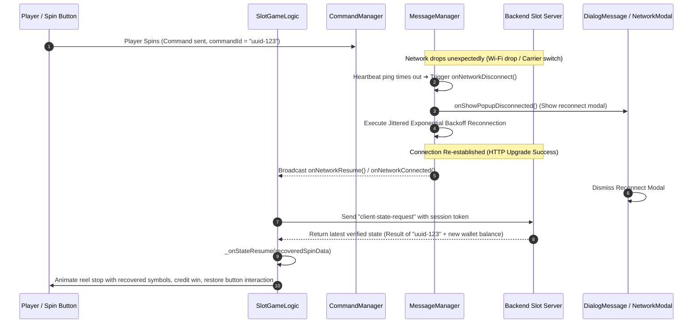

# 🛡️ Game Flow 08: Network Disconnections & Reconnect Resume Flow

<!-- convention-summary-start -->
### Game Flow 08: Network Disconnections & Reconnect Resume Flow Summary

- **Core Architecture / Purpose**: Defines network protocol, socket packet lifecycle, state persistence, and error handling for Game Flow 08: Network Disconnections & Reconnect Resume Flow.
- **Key Mechanisms & Design**: Handles WebSocket frame dispatch, acknowledgment confirmation, state resume, and resilient synchronization between client DataStore and Backend Gateway.
- **Domain Capabilities**: cc_network, 01_game_flow_and_lifecycle
- **Scope & Code Paths**: `assets/cc-common/cc-network/`
- **Related Docs**: [Master Index](../INDEX.md)
<!-- convention-summary-end -->

This document details how the network kernel handles unexpected drops during active spins and automatically restores uninterrupted gameplay upon reconnection.

---

## 1. 📊 Sequence Diagram: Drop Mid-Spin & Reconnect Recovery

---

## 2. ⚡ Key Fault-Tolerance Mechanisms

1. **Idempotent Retry Safety**:
   Because every spin command is assigned a unique UUID (`commandId`), if the client reconnects and queries state, the server returns the cached outcome of `uuid-123` instead of initiating a second debit.
2. **Smooth Recovery without Game Reload**:
   When network resumes within normal thresholds, `SlotGameLogic.onNetworkResume()` synchronizes data in-place without restarting the Cocos engine, preserving audio preferences, bet size selections, and ongoing cascade combos.
