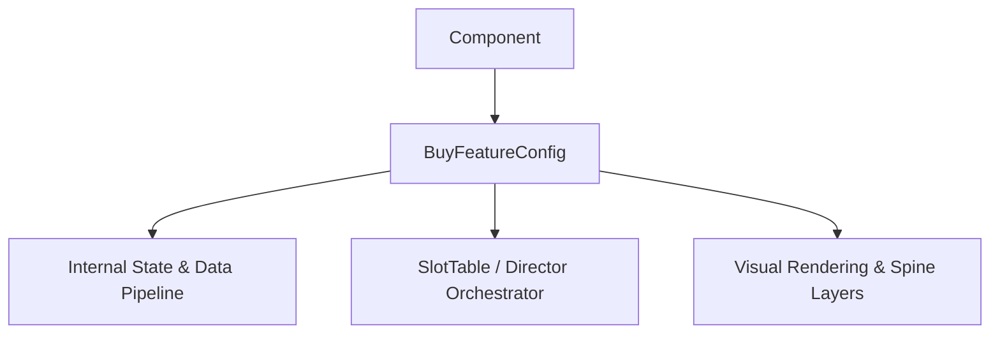

# 🏛️ `BuyFeatureConfig` Architectural Role & Mechanics Overview

<!-- convention-summary-start -->
### BuyFeatureConfig Architectural Role & Mechanics Overview Summary

- **Core Architecture / Purpose**: Technical reference, API contract, and integration guide for BuyFeatureConfig Architectural Role & Mechanics Overview.
- **Key Mechanisms & Design**: Encapsulates core algorithms, event hooks, and performance optimizations within the slot framework runtime.
- **Domain Capabilities**: cc_slot_mechanics, 01_overview
- **Scope & Code Paths**: `assets/cc-common/cc-slot-mechanics/BuyFeature/scripts/BuyFeatureConfig.ts`
- **Related Docs**: [Master Index](../INDEX.md)
<!-- convention-summary-end -->

- **Mechanics Package**: `assets/cc-common/cc-slot-mechanics/BuyFeature`
- **Source File**: `assets/cc-common/cc-slot-mechanics/BuyFeature/scripts/BuyFeatureConfig.ts`
- **Class Hierarchy**: `BuyFeatureConfig` ➔ `Component`
- **Subsystem Domain**: Direct Feature Purchase Modal System

---

## 1. Mathematical & Engineering Foundation

`BuyFeatureConfig` is a core runtime module within the **Direct Feature Purchase Modal System**.

> **Mathematical Foundation & Formulation**:  
> Purchase price formula: $\text{Cost} = \text{Total Bet} \times \text{CostMultiplier}$ (e.g. $100\times$).

---

## 2. Core Responsibilities & System Invariants

1. **State & Coordinate Calculation**:
   - Manages mathematical matrix models, reel coordinates, and bounding box calculations with zero memory leaks.
2. **Director & Writer Command Pipeline**:
   - Emits asynchronous step completion signals to `ScriptExecutor` to maintain uninterrupted $60\text{ FPS}$ spin loops.
3. **Event Bus Communication**:
   - Subscribes and publishes events: `BUY_FEATURE_CLICKED`, `CONFIRM_BUY_FEATURE`, `START_PURCHASED_FEATURE`.
