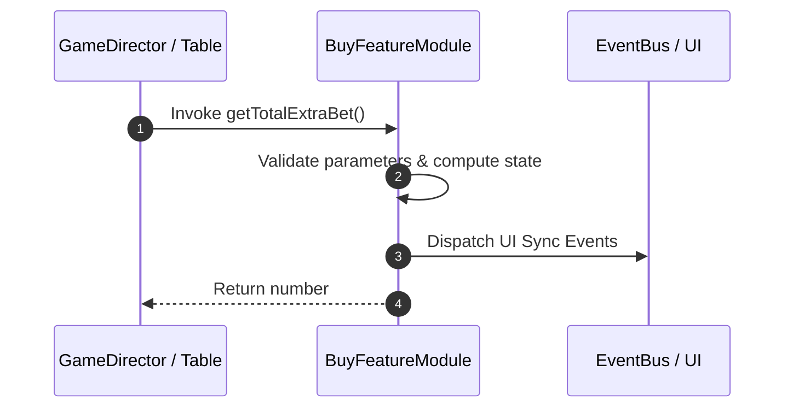

# 📖 `BuyFeatureModule.getTotalExtraBet()`

<!-- convention-summary-start -->
### BuyFeatureModule.getTotalExtraBet Line-by-Line Method Specification Summary

- **Core Architecture / Purpose**: Technical reference, API contract, and integration guide for BuyFeatureModule.getTotalExtraBet Line-by-Line Method Specification.
- **Key Mechanisms & Design**: Encapsulates core algorithms, event hooks, and performance optimizations within the slot framework runtime.
- **Domain Capabilities**: cc_slot_mechanics, 05_methods
- **Scope & Code Paths**: `assets/cc-common/cc-slot-mechanics/BuyFeature/scripts/BuyFeatureModule.ts`
- **Related Docs**: [Master Index](../INDEX.md)
<!-- convention-summary-end -->


---

## 1. Method Signature & Overview

```typescript
public getTotalExtraBet(): number
```

- **Declaring Class**: `BuyFeatureModule` (`assets/cc-common/cc-slot-mechanics/BuyFeature/scripts/BuyFeatureModule.ts`)
- **Source Code Location**: Lines 59 to 63
- **Execution Complexity**: $O(1)$ fast synchronous calculation or controlled timer Promise.

---

## 2. Complete Source Code Implementation

```typescript
	getTotalExtraBet(): number {
		const betManager = this.gameLogic.getBetManager();
		const totalExtraBet = betManager.getTotalExtraBet(this._betData.betKey, this._buyFeatureConfig.PREFIX_EXTRA_BET);
		return totalExtraBet;
	}
```

---

## 3. Line-by-Line Code Breakdown

| Line # | Code Snippet | Technical Analysis & Engine Behavior |
| :---: | :--- | :--- |
| **59** | `getTotalExtraBet(): number {` | Method entry signature declaring `getTotalExtraBet()` with return type `number`. |
| **60** | `const betManager = this.gameLogic.getBetManager();` | Local variable initialization allocating `betManager`. |
| **61** | `const totalExtraBet = betManager.getTotalExtraBet(this._betData.betKey, this._buyFeatureConfig.PREFIX_EXTRA_BET);` | Local variable initialization allocating `totalExtraBet`. |
| **62** | `return totalExtraBet;` | Returns computed value / promise to caller. |
| **63** | `}` | Method exit boundary, closing block scope. |

---

## 4. Data Flow & State Lifecycle



---

## 5. Production Gotchas & Edge Cases

1. **Null Guarding**: Always ensure caller passes non-null parameters or handles undefined fallbacks.
2. **Fast-Stop Safety**: If user triggers fast-stop during execution, ensure timers are cancelled cleanly via `unscheduleAllCallbacks()`.
