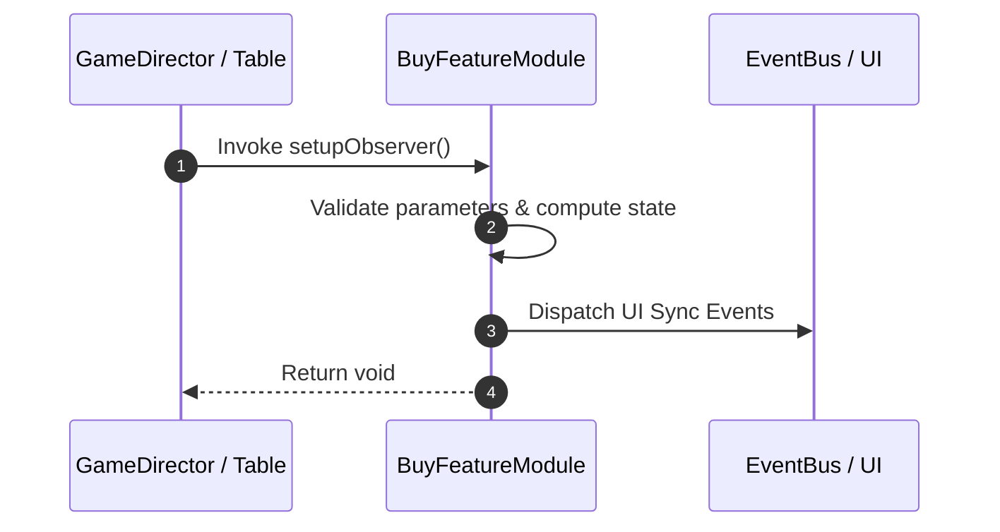

# 📖 `BuyFeatureModule.setupObserver()`

<!-- convention-summary-start -->
### BuyFeatureModule.setupObserver Line-by-Line Method Specification Summary

- **Core Architecture / Purpose**: Technical reference, API contract, and integration guide for BuyFeatureModule.setupObserver Line-by-Line Method Specification.
- **Key Mechanisms & Design**: Encapsulates core algorithms, event hooks, and performance optimizations within the slot framework runtime.
- **Domain Capabilities**: cc_slot_mechanics, 05_methods
- **Scope & Code Paths**: `assets/cc-common/cc-slot-mechanics/BuyFeature/scripts/BuyFeatureModule.ts`
- **Related Docs**: [Master Index](../INDEX.md)
<!-- convention-summary-end -->


---

## 1. Method Signature & Overview

```typescript
public setupObserver(): void
```

- **Declaring Class**: `BuyFeatureModule` (`assets/cc-common/cc-slot-mechanics/BuyFeature/scripts/BuyFeatureModule.ts`)
- **Source Code Location**: Lines 37 to 47
- **Execution Complexity**: $O(1)$ fast synchronous calculation or controlled timer Promise.

---

## 2. Complete Source Code Implementation

```typescript
	setupObserver(): void {
		this.uiManagerData = this.gameLogic.getDataModel().UIManagerData;
		this.observer.watch(this.uiManagerData, "isBuyFeaturePanelOpen", (isOpen) => {
			this.node.active = isOpen;
			setOpacity(this.node, isOpen ? 255 : 0);
		}, this, { fireImmediately: true });

		this.observer.watch(this._betData, "totalBet", this.onUpdateTotalBet.bind(this), this, { fireImmediately: true });
		this.observer.watch(this._betData, "minBetEnable", this.onMinBetEnable.bind(this), this, { canTriggerSameValue: true });
		this.observer.watch(this._betData, "maxBetEnable", this.onMaxBetEnable.bind(this), this, { canTriggerSameValue: true });
	}
```

---

## 3. Line-by-Line Code Breakdown

| Line # | Code Snippet | Technical Analysis & Engine Behavior |
| :---: | :--- | :--- |
| **37** | `setupObserver(): void {` | Method entry signature declaring `setupObserver()` with return type `void`. |
| **38** | `this.uiManagerData = this.gameLogic.getDataModel().UIManagerData;` | Applies operational logic and state mutation. |
| **39** | `this.observer.watch(this.uiManagerData, "isBuyFeaturePanelOpen", (isOpen) => {` | Applies operational logic and state mutation. |
| **40** | `this.node.active = isOpen;` | Applies operational logic and state mutation. |
| **41** | `setOpacity(this.node, isOpen ? 255 : 0);` | Applies operational logic and state mutation. |
| **42** | `}, this, { fireImmediately: true });` | Applies operational logic and state mutation. |
| **43** | `` | Applies operational logic and state mutation. |
| **44** | `this.observer.watch(this._betData, "totalBet", this.onUpdateTotalBet.bind(this), this, { fireImmediately: true });` | Applies operational logic and state mutation. |
| **45** | `this.observer.watch(this._betData, "minBetEnable", this.onMinBetEnable.bind(this), this, { canTriggerSameValue: true });` | Applies operational logic and state mutation. |
| **46** | `this.observer.watch(this._betData, "maxBetEnable", this.onMaxBetEnable.bind(this), this, { canTriggerSameValue: true });` | Applies operational logic and state mutation. |
| **47** | `}` | Method exit boundary, closing block scope. |

---

## 4. Data Flow & State Lifecycle



---

## 5. Production Gotchas & Edge Cases

1. **Null Guarding**: Always ensure caller passes non-null parameters or handles undefined fallbacks.
2. **Fast-Stop Safety**: If user triggers fast-stop during execution, ensure timers are cancelled cleanly via `unscheduleAllCallbacks()`.
