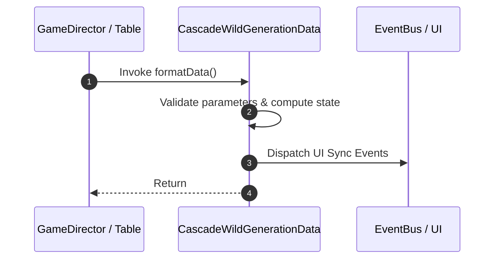

# 📖 `CascadeWildGenerationData.formatData()`

<!-- convention-summary-start -->
### CascadeWildGenerationData.formatData Line-by-Line Method Specification Summary

- **Core Architecture / Purpose**: Technical reference, API contract, and integration guide for CascadeWildGenerationData.formatData Line-by-Line Method Specification.
- **Key Mechanisms & Design**: Encapsulates core algorithms, event hooks, and performance optimizations within the slot framework runtime.
- **Domain Capabilities**: cc_slot_mechanics, 05_methods
- **Scope & Code Paths**: `assets/cc-common/cc-slot-mechanics/CascadeWildGeneration/scripts/CascadeWildGenerationData.ts`
- **Related Docs**: [Master Index](../INDEX.md)
<!-- convention-summary-end -->


---

## 1. Method Signature & Overview

```typescript
public formatData(): 
```

- **Declaring Class**: `CascadeWildGenerationData` (`assets/cc-common/cc-slot-mechanics/CascadeWildGeneration/scripts/CascadeWildGenerationData.ts`)
- **Source Code Location**: Lines 62 to 102
- **Execution Complexity**: $O(1)$ fast synchronous calculation or controlled timer Promise.

---

## 2. Complete Source Code Implementation

```typescript
	formatData(): { verticalMatrix: any[]; listTraceWayVertical: any[] } {
		const matrix = this.getMatrix().filter((e) => e.length > 0 && e[0] != "");
		const formatMatrix = this.getFormatMatrix() || this.cascadeWildGenerationConfig.CASCADE_TABLE_CONFIG.format;
		const traceWay = this.getTraceWay();
		let index = 0;
		let verticalMatrix = [];

		const sortedListSymbols = traceWay.sort(function (a, b) {
			return a - b;
		});

		const listTraceWayVertical = [];

		let wildIndex = -1;
		//wildAppearPosition format = currentPosition:appearPosition
		if (this["wildAppearPosition"]) {
			wildIndex = Number(this["wildAppearPosition"].split(':')[1]);
		}
        
		for (let i = 0; i < formatMatrix.length; i++) {
			const size = Number(formatMatrix[i]);
			verticalMatrix[i] = [];
			listTraceWayVertical[i] = [];
			for (let j = 0; j < size; j++) {
				// const height = Number(formatMatrix[i][j]);
				const height = 1;
				verticalMatrix[i][j] = matrix[index];
				if (sortedListSymbols.indexOf(index) > -1) {
					listTraceWayVertical[i][j] = `-1_1_${height}`;
				} else {
					listTraceWayVertical[i][j] = matrix[index];
				}
				if (wildIndex == index) {
					this.wildPosition = {col:i, row:j};
				}
				index++;
			}
		}

		return { verticalMatrix, listTraceWayVertical };
	}
```

---

## 3. Line-by-Line Code Breakdown

| Line # | Code Snippet | Technical Analysis & Engine Behavior |
| :---: | :--- | :--- |
| **62** | `formatData(): { verticalMatrix: any[]; listTraceWayVertical: any[] } {` | Method entry signature declaring `formatData()` with return type ``. |
| **63** | `const matrix = this.getMatrix().filter((e) => e.length > 0 && e[0] != "");` | Local variable initialization allocating `matrix`. |
| **64** | `const formatMatrix = this.getFormatMatrix() \|\| this.cascadeWildGenerationConfig.CASCADE_TABLE_CONFIG.format;` | Local variable initialization allocating `formatMatrix`. |
| **65** | `const traceWay = this.getTraceWay();` | Local variable initialization allocating `traceWay`. |
| **66** | `let index = 0;` | Local variable initialization allocating `index`. |
| **67** | `let verticalMatrix = [];` | Local variable initialization allocating `verticalMatrix`. |
| **68** | `` | Applies operational logic and state mutation. |
| **69** | `const sortedListSymbols = traceWay.sort(function (a, b) {` | Local variable initialization allocating `sortedListSymbols`. |
| **70** | `return a - b;` | Returns computed value / promise to caller. |
| **71** | `});` | Applies operational logic and state mutation. |
| **72** | `` | Applies operational logic and state mutation. |
| **73** | `const listTraceWayVertical = [];` | Local variable initialization allocating `listTraceWayVertical`. |
| **74** | `` | Applies operational logic and state mutation. |
| **75** | `let wildIndex = -1;` | Local variable initialization allocating `wildIndex`. |
| **76** | `//wildAppearPosition format = currentPosition:appearPosition` | Applies operational logic and state mutation. |
| **77** | `if (this["wildAppearPosition"]) {` | Conditional branch evaluation guarding edge cases or prerequisites. |
| **78** | `wildIndex = Number(this["wildAppearPosition"].split(':')[1]);` | Applies operational logic and state mutation. |
| **79** | `}` | Method exit boundary, closing block scope. |
| **80** | `` | Applies operational logic and state mutation. |
| **81** | `for (let i = 0; i < formatMatrix.length; i++) {` | Iterates over collection elements. |
| **82** | `const size = Number(formatMatrix[i]);` | Local variable initialization allocating `size`. |
| **83** | `verticalMatrix[i] = [];` | Applies operational logic and state mutation. |
| **84** | `listTraceWayVertical[i] = [];` | Applies operational logic and state mutation. |
| **85** | `for (let j = 0; j < size; j++) {` | Iterates over collection elements. |
| **86** | `// const height = Number(formatMatrix[i][j]);` | Applies operational logic and state mutation. |
| **87** | `const height = 1;` | Local variable initialization allocating `height`. |
| **88** | `verticalMatrix[i][j] = matrix[index];` | Applies operational logic and state mutation. |
| **89** | `if (sortedListSymbols.indexOf(index) > -1) {` | Conditional branch evaluation guarding edge cases or prerequisites. |
| **90** | `listTraceWayVertical[i][j] = `-1_1_${height}`;` | Applies operational logic and state mutation. |
| **91** | `} else {` | Applies operational logic and state mutation. |
| **92** | `listTraceWayVertical[i][j] = matrix[index];` | Applies operational logic and state mutation. |
| **93** | `}` | Method exit boundary, closing block scope. |
| **94** | `if (wildIndex == index) {` | Conditional branch evaluation guarding edge cases or prerequisites. |
| **95** | `this.wildPosition = {col:i, row:j};` | Applies operational logic and state mutation. |
| **96** | `}` | Method exit boundary, closing block scope. |
| **97** | `index++;` | Applies operational logic and state mutation. |
| **98** | `}` | Method exit boundary, closing block scope. |
| **99** | `}` | Method exit boundary, closing block scope. |
| **100** | `` | Applies operational logic and state mutation. |
| **101** | `return { verticalMatrix, listTraceWayVertical };` | Returns computed value / promise to caller. |
| **102** | `}` | Method exit boundary, closing block scope. |

---

## 4. Data Flow & State Lifecycle



---

## 5. Production Gotchas & Edge Cases

1. **Null Guarding**: Always ensure caller passes non-null parameters or handles undefined fallbacks.
2. **Fast-Stop Safety**: If user triggers fast-stop during execution, ensure timers are cancelled cleanly via `unscheduleAllCallbacks()`.
