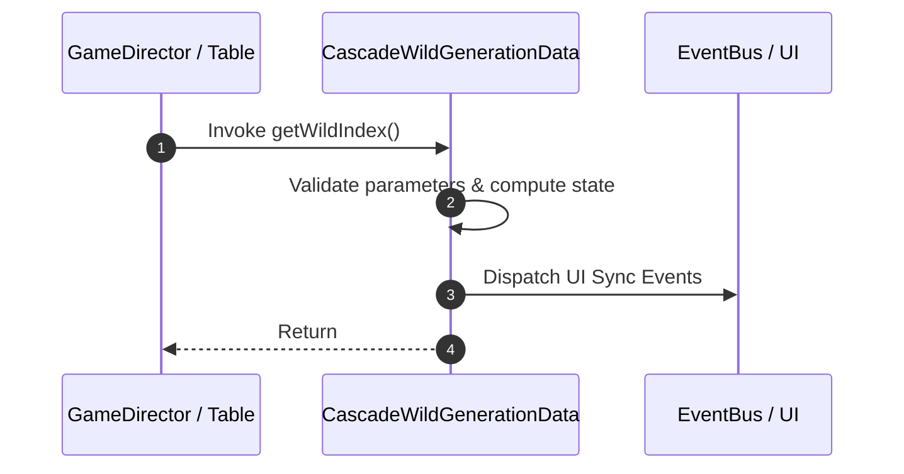

# 📖 `CascadeWildGenerationData.getWildIndex()`

<!-- convention-summary-start -->
### CascadeWildGenerationData.getWildIndex Line-by-Line Method Specification Summary

- **Core Architecture / Purpose**: Technical reference, API contract, and integration guide for CascadeWildGenerationData.getWildIndex Line-by-Line Method Specification.
- **Key Mechanisms & Design**: Encapsulates core algorithms, event hooks, and performance optimizations within the slot framework runtime.
- **Domain Capabilities**: cc_slot_mechanics, 05_methods
- **Scope & Code Paths**: `assets/cc-common/cc-slot-mechanics/CascadeWildGeneration/scripts/CascadeWildGenerationData.ts`
- **Related Docs**: [Master Index](../INDEX.md)
<!-- convention-summary-end -->


---

## 1. Method Signature & Overview

```typescript
public getWildIndex(): 
```

- **Declaring Class**: `CascadeWildGenerationData` (`assets/cc-common/cc-slot-mechanics/CascadeWildGeneration/scripts/CascadeWildGenerationData.ts`)
- **Source Code Location**: Lines 53 to 59
- **Execution Complexity**: $O(1)$ fast synchronous calculation or controlled timer Promise.

---

## 2. Complete Source Code Implementation

```typescript
	getWildIndex(): { col: number, row: number } {
		if (this["wildAppearPosition"]) {
			return this.wildPosition;
		} else {
			return {col:-1, row:-1};
		}
	}
```

---

## 3. Line-by-Line Code Breakdown

| Line # | Code Snippet | Technical Analysis & Engine Behavior |
| :---: | :--- | :--- |
| **53** | `getWildIndex(): { col: number, row: number } {` | Method entry signature declaring `getWildIndex()` with return type ``. |
| **54** | `if (this["wildAppearPosition"]) {` | Conditional branch evaluation guarding edge cases or prerequisites. |
| **55** | `return this.wildPosition;` | Returns computed value / promise to caller. |
| **56** | `} else {` | Applies operational logic and state mutation. |
| **57** | `return {col:-1, row:-1};` | Returns computed value / promise to caller. |
| **58** | `}` | Method exit boundary, closing block scope. |
| **59** | `}` | Method exit boundary, closing block scope. |

---

## 4. Data Flow & State Lifecycle



---

## 5. Production Gotchas & Edge Cases

1. **Null Guarding**: Always ensure caller passes non-null parameters or handles undefined fallbacks.
2. **Fast-Stop Safety**: If user triggers fast-stop during execution, ensure timers are cancelled cleanly via `unscheduleAllCallbacks()`.
