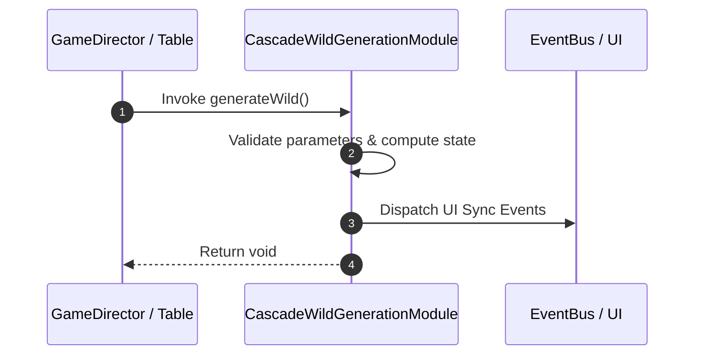

# 📖 `CascadeWildGenerationModule.generateWild()`

<!-- convention-summary-start -->
### CascadeWildGenerationModule.generateWild Line-by-Line Method Specification Summary

- **Core Architecture / Purpose**: Technical reference, API contract, and integration guide for CascadeWildGenerationModule.generateWild Line-by-Line Method Specification.
- **Key Mechanisms & Design**: Encapsulates core algorithms, event hooks, and performance optimizations within the slot framework runtime.
- **Domain Capabilities**: cc_slot_mechanics, 05_methods
- **Scope & Code Paths**: `assets/cc-common/cc-slot-mechanics/CascadeWildGeneration/scripts/CascadeWildGenerationModule.ts`
- **Related Docs**: [Master Index](../INDEX.md)
<!-- convention-summary-end -->


---

## 1. Method Signature & Overview

```typescript
public generateWild(): void
```

- **Declaring Class**: `CascadeWildGenerationModule` (`assets/cc-common/cc-slot-mechanics/CascadeWildGeneration/scripts/CascadeWildGenerationModule.ts`)
- **Source Code Location**: Lines 82 to 99
- **Execution Complexity**: $O(1)$ fast synchronous calculation or controlled timer Promise.

---

## 2. Complete Source Code Implementation

```typescript
	protected generateWild(): void {
		if (this.col != -1 && this.row != -1) {
			const col = this.col;
			const row = this.row;
			const oldRow = this.convertRow(col, row);
			const oldSymbolValue = this.listTraceWay[col][row];
			if (!oldSymbolValue.startsWith('-1')) { // if it's not a dropped symbol, remove it
				this.removeSymbolAt(col, oldRow);
			}

			const symbol = this.createNewSymbol(col, oldRow, 'K', 1);
			symbol.setPosition(this.generationPosition); 
			this.listSymbols[col][oldRow] = symbol;
            
			//update list traceway
			this.listTraceWay[col][row] = 'K_1_1';
		} 
	}
```

---

## 3. Line-by-Line Code Breakdown

| Line # | Code Snippet | Technical Analysis & Engine Behavior |
| :---: | :--- | :--- |
| **82** | `protected generateWild(): void {` | Method entry signature declaring `generateWild()` with return type `void`. |
| **83** | `if (this.col != -1 && this.row != -1) {` | Conditional branch evaluation guarding edge cases or prerequisites. |
| **84** | `const col = this.col;` | Local variable initialization allocating `col`. |
| **85** | `const row = this.row;` | Local variable initialization allocating `row`. |
| **86** | `const oldRow = this.convertRow(col, row);` | Local variable initialization allocating `oldRow`. |
| **87** | `const oldSymbolValue = this.listTraceWay[col][row];` | Local variable initialization allocating `oldSymbolValue`. |
| **88** | `if (!oldSymbolValue.startsWith('-1')) { // if it's not a dropped symbol, remove it` | Conditional branch evaluation guarding edge cases or prerequisites. |
| **89** | `this.removeSymbolAt(col, oldRow);` | Applies operational logic and state mutation. |
| **90** | `}` | Method exit boundary, closing block scope. |
| **91** | `` | Applies operational logic and state mutation. |
| **92** | `const symbol = this.createNewSymbol(col, oldRow, 'K', 1);` | Local variable initialization allocating `symbol`. |
| **93** | `symbol.setPosition(this.generationPosition);` | Applies operational logic and state mutation. |
| **94** | `this.listSymbols[col][oldRow] = symbol;` | Applies operational logic and state mutation. |
| **95** | `` | Applies operational logic and state mutation. |
| **96** | `//update list traceway` | Applies operational logic and state mutation. |
| **97** | `this.listTraceWay[col][row] = 'K_1_1';` | Applies operational logic and state mutation. |
| **98** | `}` | Method exit boundary, closing block scope. |
| **99** | `}` | Method exit boundary, closing block scope. |

---

## 4. Data Flow & State Lifecycle



---

## 5. Production Gotchas & Edge Cases

1. **Null Guarding**: Always ensure caller passes non-null parameters or handles undefined fallbacks.
2. **Fast-Stop Safety**: If user triggers fast-stop during execution, ensure timers are cancelled cleanly via `unscheduleAllCallbacks()`.
