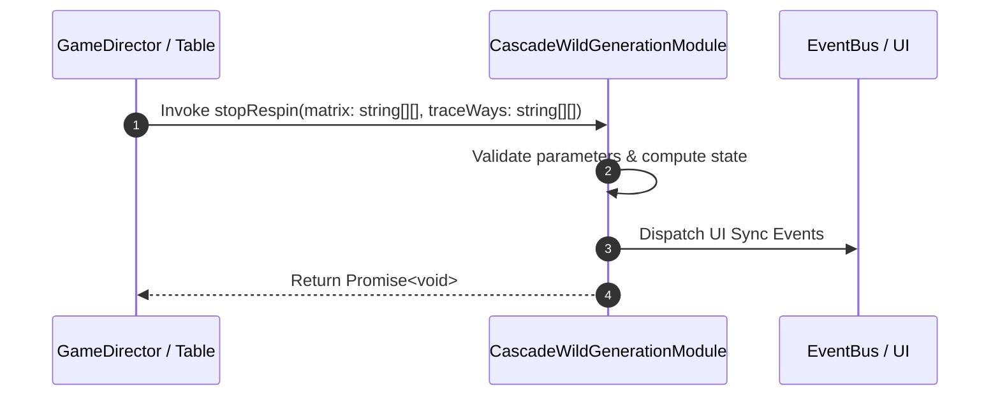

# 📖 `CascadeWildGenerationModule.stopRespin()`

<!-- convention-summary-start -->
### CascadeWildGenerationModule.stopRespin Line-by-Line Method Specification Summary

- **Core Architecture / Purpose**: Technical reference, API contract, and integration guide for CascadeWildGenerationModule.stopRespin Line-by-Line Method Specification.
- **Key Mechanisms & Design**: Encapsulates core algorithms, event hooks, and performance optimizations within the slot framework runtime.
- **Domain Capabilities**: cc_slot_mechanics, 05_methods
- **Scope & Code Paths**: `assets/cc-common/cc-slot-mechanics/CascadeWildGeneration/scripts/CascadeWildGenerationModule.ts`
- **Related Docs**: [Master Index](../INDEX.md)
<!-- convention-summary-end -->


---

## 1. Method Signature & Overview

```typescript
public stopRespin(matrix: string[][], traceWays: string[][]): Promise<void>
```

- **Declaring Class**: `CascadeWildGenerationModule` (`assets/cc-common/cc-slot-mechanics/CascadeWildGeneration/scripts/CascadeWildGenerationModule.ts`)
- **Source Code Location**: Lines 54 to 80
- **Execution Complexity**: $O(1)$ fast synchronous calculation or controlled timer Promise.

---

## 2. Complete Source Code Implementation

```typescript
	async stopRespin(matrix: string[][], traceWays: string[][]): Promise<void>  {
		this.matrix = matrix;

		this.updateWildGeneratedPosition();
		this.generateWild(); // generate wild
		this.checkForDropSymbols();
		this.processOldSymbols(); // get old symbols for dropping
		this.processNewSymbols(); // create all new symbols
        
		this.fallingSymbols(this.listDroppedSymbols);
		this.fallingSymbols(this.listNewSymbols);

		//TODO - need making override here, default is after CASCADING_TIME_COMPLETED time will be continue to other modules
		this.scheduleOnce(() => {
			this.listTraceWay = traceWays;
			this._stopRespinCB && this._stopRespinCB();
			this._stopRespinCB = null;
			this.generationPosition = null;
		}, this.config.CASCADING_TIME_COMPLETED);

		this._hasStartRespin = false;
		this._hasRespinCompleted = true;

		return new Promise((resolve) => {
			this._stopRespinCB = resolve;
		});
	}
```

---

## 3. Line-by-Line Code Breakdown

| Line # | Code Snippet | Technical Analysis & Engine Behavior |
| :---: | :--- | :--- |
| **54** | `async stopRespin(matrix: string[][], traceWays: string[][]): Promise<void>  {` | Method entry signature declaring `stopRespin(matrix: string[][], traceWays: string[][])` with return type `Promise<void>`. |
| **55** | `this.matrix = matrix;` | Applies operational logic and state mutation. |
| **56** | `` | Applies operational logic and state mutation. |
| **57** | `this.updateWildGeneratedPosition();` | Applies operational logic and state mutation. |
| **58** | `this.generateWild(); // generate wild` | Applies operational logic and state mutation. |
| **59** | `this.checkForDropSymbols();` | Applies operational logic and state mutation. |
| **60** | `this.processOldSymbols(); // get old symbols for dropping` | Applies operational logic and state mutation. |
| **61** | `this.processNewSymbols(); // create all new symbols` | Applies operational logic and state mutation. |
| **62** | `` | Applies operational logic and state mutation. |
| **63** | `this.fallingSymbols(this.listDroppedSymbols);` | Applies operational logic and state mutation. |
| **64** | `this.fallingSymbols(this.listNewSymbols);` | Applies operational logic and state mutation. |
| **65** | `` | Applies operational logic and state mutation. |
| **66** | `//TODO - need making override here, default is after CASCADING_TIME_COMPLETED time will be continue to other modules` | Applies operational logic and state mutation. |
| **67** | `this.scheduleOnce(() => {` | Schedules delayed execution callback using Cocos Creator timer. |
| **68** | `this.listTraceWay = traceWays;` | Applies operational logic and state mutation. |
| **69** | `this._stopRespinCB && this._stopRespinCB();` | Applies operational logic and state mutation. |
| **70** | `this._stopRespinCB = null;` | Applies operational logic and state mutation. |
| **71** | `this.generationPosition = null;` | Applies operational logic and state mutation. |
| **72** | `}, this.config.CASCADING_TIME_COMPLETED);` | Applies operational logic and state mutation. |
| **73** | `` | Applies operational logic and state mutation. |
| **74** | `this._hasStartRespin = false;` | Applies operational logic and state mutation. |
| **75** | `this._hasRespinCompleted = true;` | Applies operational logic and state mutation. |
| **76** | `` | Applies operational logic and state mutation. |
| **77** | `return new Promise((resolve) => {` | Returns computed value / promise to caller. |
| **78** | `this._stopRespinCB = resolve;` | Applies operational logic and state mutation. |
| **79** | `});` | Applies operational logic and state mutation. |
| **80** | `}` | Method exit boundary, closing block scope. |

---

## 4. Data Flow & State Lifecycle



---

## 5. Production Gotchas & Edge Cases

1. **Null Guarding**: Always ensure caller passes non-null parameters or handles undefined fallbacks.
2. **Fast-Stop Safety**: If user triggers fast-stop during execution, ensure timers are cancelled cleanly via `unscheduleAllCallbacks()`.
