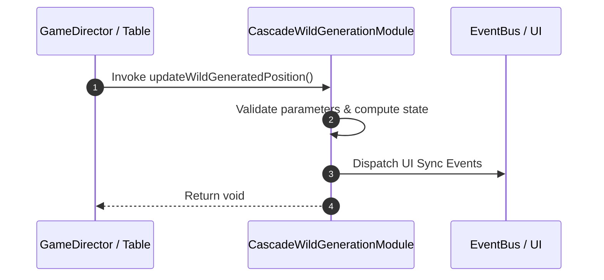

# 📖 `CascadeWildGenerationModule.updateWildGeneratedPosition()`

<!-- convention-summary-start -->
### CascadeWildGenerationModule.updateWildGeneratedPosition Line-by-Line Method Specification Summary

- **Core Architecture / Purpose**: Technical reference, API contract, and integration guide for CascadeWildGenerationModule.updateWildGeneratedPosition Line-by-Line Method Specification.
- **Key Mechanisms & Design**: Encapsulates core algorithms, event hooks, and performance optimizations within the slot framework runtime.
- **Domain Capabilities**: cc_slot_mechanics, 05_methods
- **Scope & Code Paths**: `assets/cc-common/cc-slot-mechanics/CascadeWildGeneration/scripts/CascadeWildGenerationModule.ts`
- **Related Docs**: [Master Index](../INDEX.md)
<!-- convention-summary-end -->


---

## 1. Method Signature & Overview

```typescript
public updateWildGeneratedPosition(): void
```

- **Declaring Class**: `CascadeWildGenerationModule` (`assets/cc-common/cc-slot-mechanics/CascadeWildGeneration/scripts/CascadeWildGenerationModule.ts`)
- **Source Code Location**: Lines 101 to 108
- **Execution Complexity**: $O(1)$ fast synchronous calculation or controlled timer Promise.

---

## 2. Complete Source Code Implementation

```typescript
	protected updateWildGeneratedPosition(): void {
		if (this.col != -1 && this.row != -1) {
			let newrow = this.convertRow(this.col, this.row);
			this.generationPosition = this.tableConfig.positions[this.col][newrow];
		} else {
			this.generationPosition = null;
		}
	}
```

---

## 3. Line-by-Line Code Breakdown

| Line # | Code Snippet | Technical Analysis & Engine Behavior |
| :---: | :--- | :--- |
| **101** | `protected updateWildGeneratedPosition(): void {` | Method entry signature declaring `updateWildGeneratedPosition()` with return type `void`. |
| **102** | `if (this.col != -1 && this.row != -1) {` | Conditional branch evaluation guarding edge cases or prerequisites. |
| **103** | `let newrow = this.convertRow(this.col, this.row);` | Local variable initialization allocating `newrow`. |
| **104** | `this.generationPosition = this.tableConfig.positions[this.col][newrow];` | Applies operational logic and state mutation. |
| **105** | `} else {` | Applies operational logic and state mutation. |
| **106** | `this.generationPosition = null;` | Applies operational logic and state mutation. |
| **107** | `}` | Method exit boundary, closing block scope. |
| **108** | `}` | Method exit boundary, closing block scope. |

---

## 4. Data Flow & State Lifecycle



---

## 5. Production Gotchas & Edge Cases

1. **Null Guarding**: Always ensure caller passes non-null parameters or handles undefined fallbacks.
2. **Fast-Stop Safety**: If user triggers fast-stop during execution, ensure timers are cancelled cleanly via `unscheduleAllCallbacks()`.
