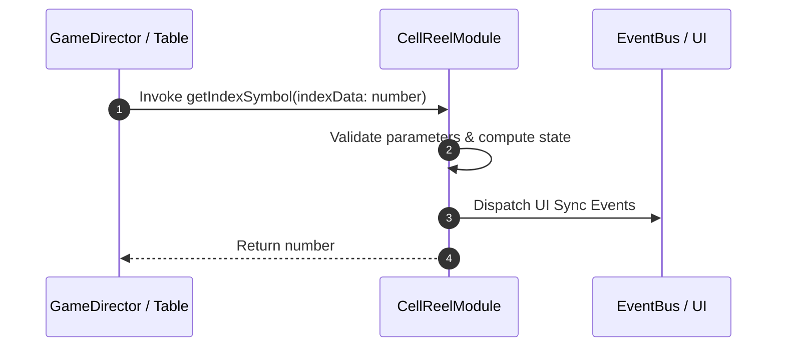

# 📖 `CellReelModule.getIndexSymbol()`

<!-- convention-summary-start -->
### CellReelModule.getIndexSymbol Line-by-Line Method Specification Summary

- **Core Architecture / Purpose**: Technical reference, API contract, and integration guide for CellReelModule.getIndexSymbol Line-by-Line Method Specification.
- **Key Mechanisms & Design**: Encapsulates core algorithms, event hooks, and performance optimizations within the slot framework runtime.
- **Domain Capabilities**: cc_slot_mechanics, 05_methods
- **Scope & Code Paths**: `assets/cc-common/cc-slot-mechanics/SlotCellTable/scripts/CellReelModule.ts`
- **Related Docs**: [Master Index](../INDEX.md)
<!-- convention-summary-end -->


---

## 1. Method Signature & Overview

```typescript
public getIndexSymbol(indexData: number): number
```

- **Declaring Class**: `CellReelModule` (`assets/cc-common/cc-slot-mechanics/SlotCellTable/scripts/CellReelModule.ts`)
- **Source Code Location**: Lines 45 to 55
- **Execution Complexity**: $O(1)$ fast synchronous calculation or controlled timer Promise.

---

## 2. Complete Source Code Implementation

```typescript
	getIndexSymbol(indexData: number): number {
		const indexConfig = this.config.SYMBOL_INDEXES[this.reelIndex];
		const symbolsIndex = [indexConfig[this.reelRow]];

		const bufferTop = Array(this.config.BUFFER_TOP).fill(-1);
		const bufferBot = Array(this.config.BUFFER_BOT).fill(-1);
		symbolsIndex.push(...bufferTop);
		symbolsIndex.unshift(...bufferBot);

		return symbolsIndex[indexData];
	}
```

---

## 3. Line-by-Line Code Breakdown

| Line # | Code Snippet | Technical Analysis & Engine Behavior |
| :---: | :--- | :--- |
| **45** | `getIndexSymbol(indexData: number): number {` | Method entry signature declaring `getIndexSymbol(indexData: number)` with return type `number`. |
| **46** | `const indexConfig = this.config.SYMBOL_INDEXES[this.reelIndex];` | Local variable initialization allocating `indexConfig`. |
| **47** | `const symbolsIndex = [indexConfig[this.reelRow]];` | Local variable initialization allocating `symbolsIndex`. |
| **48** | `` | Applies operational logic and state mutation. |
| **49** | `const bufferTop = Array(this.config.BUFFER_TOP).fill(-1);` | Local variable initialization allocating `bufferTop`. |
| **50** | `const bufferBot = Array(this.config.BUFFER_BOT).fill(-1);` | Local variable initialization allocating `bufferBot`. |
| **51** | `symbolsIndex.push(...bufferTop);` | Applies operational logic and state mutation. |
| **52** | `symbolsIndex.unshift(...bufferBot);` | Applies operational logic and state mutation. |
| **53** | `` | Applies operational logic and state mutation. |
| **54** | `return symbolsIndex[indexData];` | Returns computed value / promise to caller. |
| **55** | `}` | Method exit boundary, closing block scope. |

---

## 4. Data Flow & State Lifecycle



---

## 5. Production Gotchas & Edge Cases

1. **Null Guarding**: Always ensure caller passes non-null parameters or handles undefined fallbacks.
2. **Fast-Stop Safety**: If user triggers fast-stop during execution, ensure timers are cancelled cleanly via `unscheduleAllCallbacks()`.
