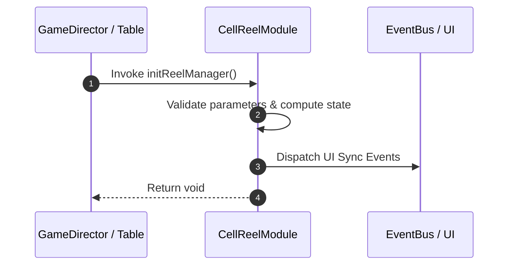

# 📖 `CellReelModule.initReelManager()`

<!-- convention-summary-start -->
### CellReelModule.initReelManager Line-by-Line Method Specification Summary

- **Core Architecture / Purpose**: Technical reference, API contract, and integration guide for CellReelModule.initReelManager Line-by-Line Method Specification.
- **Key Mechanisms & Design**: Encapsulates core algorithms, event hooks, and performance optimizations within the slot framework runtime.
- **Domain Capabilities**: cc_slot_mechanics, 05_methods
- **Scope & Code Paths**: `assets/cc-common/cc-slot-mechanics/SlotCellTable/scripts/CellReelModule.ts`
- **Related Docs**: [Master Index](../INDEX.md)
<!-- convention-summary-end -->


---

## 1. Method Signature & Overview

```typescript
public initReelManager(): void
```

- **Declaring Class**: `CellReelModule` (`assets/cc-common/cc-slot-mechanics/SlotCellTable/scripts/CellReelModule.ts`)
- **Source Code Location**: Lines 15 to 24
- **Execution Complexity**: $O(1)$ fast synchronous calculation or controlled timer Promise.

---

## 2. Complete Source Code Implementation

```typescript
	initReelManager(): void {
		const visibleSymbol = 1;
		const totalSymbol = visibleSymbol + this.config.BUFFER_TOP + this.config.BUFFER_BOT;
		const startX = 0;
		const startY = (visibleSymbol / 2 + this.config.BUFFER_TOP - 0.5) * this.config.SYMBOL_HEIGHT;

		this.reelManager = new ReelManager(totalSymbol, visibleSymbol);
		this.reelManager.startX = startX;
		this.reelManager.startY = startY;
	}
```

---

## 3. Line-by-Line Code Breakdown

| Line # | Code Snippet | Technical Analysis & Engine Behavior |
| :---: | :--- | :--- |
| **15** | `initReelManager(): void {` | Method entry signature declaring `initReelManager()` with return type `void`. |
| **16** | `const visibleSymbol = 1;` | Local variable initialization allocating `visibleSymbol`. |
| **17** | `const totalSymbol = visibleSymbol + this.config.BUFFER_TOP + this.config.BUFFER_BOT;` | Local variable initialization allocating `totalSymbol`. |
| **18** | `const startX = 0;` | Local variable initialization allocating `startX`. |
| **19** | `const startY = (visibleSymbol / 2 + this.config.BUFFER_TOP - 0.5) * this.config.SYMBOL_HEIGHT;` | Local variable initialization allocating `startY`. |
| **20** | `` | Applies operational logic and state mutation. |
| **21** | `this.reelManager = new ReelManager(totalSymbol, visibleSymbol);` | Applies operational logic and state mutation. |
| **22** | `this.reelManager.startX = startX;` | Applies operational logic and state mutation. |
| **23** | `this.reelManager.startY = startY;` | Applies operational logic and state mutation. |
| **24** | `}` | Method exit boundary, closing block scope. |

---

## 4. Data Flow & State Lifecycle



---

## 5. Production Gotchas & Edge Cases

1. **Null Guarding**: Always ensure caller passes non-null parameters or handles undefined fallbacks.
2. **Fast-Stop Safety**: If user triggers fast-stop during execution, ensure timers are cancelled cleanly via `unscheduleAllCallbacks()`.
