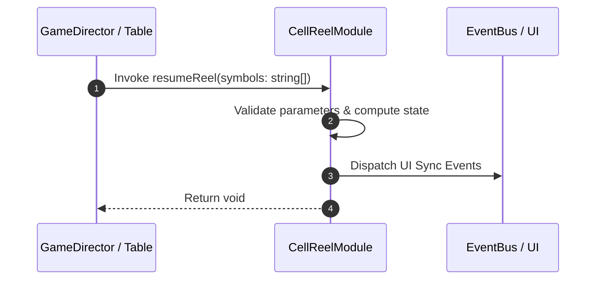

# 📖 `CellReelModule.resumeReel()`

<!-- convention-summary-start -->
### CellReelModule.resumeReel Line-by-Line Method Specification Summary

- **Core Architecture / Purpose**: Technical reference, API contract, and integration guide for CellReelModule.resumeReel Line-by-Line Method Specification.
- **Key Mechanisms & Design**: Encapsulates core algorithms, event hooks, and performance optimizations within the slot framework runtime.
- **Domain Capabilities**: cc_slot_mechanics, 05_methods
- **Scope & Code Paths**: `assets/cc-common/cc-slot-mechanics/SlotCellTable/scripts/CellReelModule.ts`
- **Related Docs**: [Master Index](../INDEX.md)
<!-- convention-summary-end -->


---

## 1. Method Signature & Overview

```typescript
public resumeReel(symbols: string[]): void
```

- **Declaring Class**: `CellReelModule` (`assets/cc-common/cc-slot-mechanics/SlotCellTable/scripts/CellReelModule.ts`)
- **Source Code Location**: Lines 26 to 43
- **Execution Complexity**: $O(1)$ fast synchronous calculation or controlled timer Promise.

---

## 2. Complete Source Code Implementation

```typescript
	resumeReel(symbols: string[]): void {
		this.updateReelResult(symbols);

		this.data.forEach((symbolValue: string, index: number) => {
			if (symbolValue) {
				const revertIndex = this.data.length - index - 1;
				const { symbolCode: code, symbolSize: size } = this.mapSymbolData(symbolValue);
				const symbol = this.symbolManager.createSymbol(code, size, this.node, SymbolOwnerType.REEL_SYMBOL);
				SlotSymbolModule.getModuleComponent(symbol).setIndex(this.getIndexSymbol(revertIndex));
				const position = this.initPositionByType(index, size);
				symbol.setPosition(position.x, position.y);
				eno.setOpacity(symbol, 255);
				this.listSymbols.push(symbol);
			}
		});

		this.symbolManager.updateSymbolSiblingIndex(this.listSymbols);
	}
```

---

## 3. Line-by-Line Code Breakdown

| Line # | Code Snippet | Technical Analysis & Engine Behavior |
| :---: | :--- | :--- |
| **26** | `resumeReel(symbols: string[]): void {` | Method entry signature declaring `resumeReel(symbols: string[])` with return type `void`. |
| **27** | `this.updateReelResult(symbols);` | Applies operational logic and state mutation. |
| **28** | `` | Applies operational logic and state mutation. |
| **29** | `this.data.forEach((symbolValue: string, index: number) => {` | Applies operational logic and state mutation. |
| **30** | `if (symbolValue) {` | Conditional branch evaluation guarding edge cases or prerequisites. |
| **31** | `const revertIndex = this.data.length - index - 1;` | Local variable initialization allocating `revertIndex`. |
| **32** | `const { symbolCode: code, symbolSize: size } = this.mapSymbolData(symbolValue);` | Local variable initialization allocating `{ symbolCode: code, symbolSize: size }`. |
| **33** | `const symbol = this.symbolManager.createSymbol(code, size, this.node, SymbolOwnerType.REEL_SYMBOL);` | Local variable initialization allocating `symbol`. |
| **34** | `SlotSymbolModule.getModuleComponent(symbol).setIndex(this.getIndexSymbol(revertIndex));` | Applies operational logic and state mutation. |
| **35** | `const position = this.initPositionByType(index, size);` | Local variable initialization allocating `position`. |
| **36** | `symbol.setPosition(position.x, position.y);` | Applies operational logic and state mutation. |
| **37** | `eno.setOpacity(symbol, 255);` | Applies operational logic and state mutation. |
| **38** | `this.listSymbols.push(symbol);` | Applies operational logic and state mutation. |
| **39** | `}` | Method exit boundary, closing block scope. |
| **40** | `});` | Applies operational logic and state mutation. |
| **41** | `` | Applies operational logic and state mutation. |
| **42** | `this.symbolManager.updateSymbolSiblingIndex(this.listSymbols);` | Applies operational logic and state mutation. |
| **43** | `}` | Method exit boundary, closing block scope. |

---

## 4. Data Flow & State Lifecycle



---

## 5. Production Gotchas & Edge Cases

1. **Null Guarding**: Always ensure caller passes non-null parameters or handles undefined fallbacks.
2. **Fast-Stop Safety**: If user triggers fast-stop during execution, ensure timers are cancelled cleanly via `unscheduleAllCallbacks()`.
