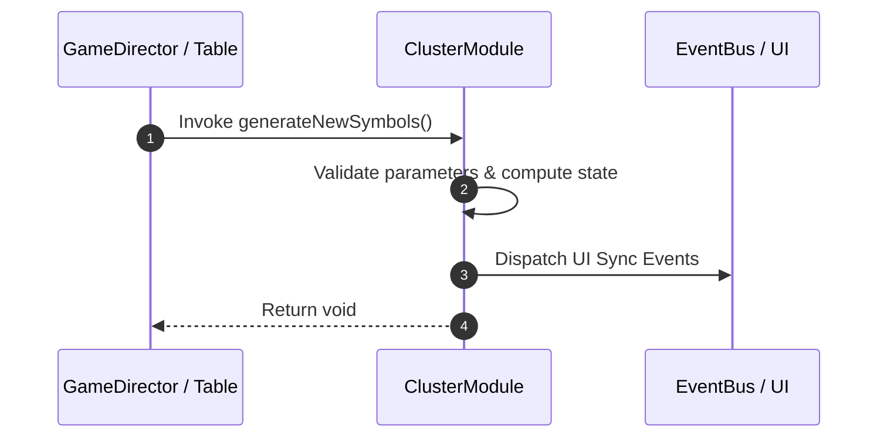

# 📖 `ClusterModule.generateNewSymbols()`

<!-- convention-summary-start -->
### ClusterModule.generateNewSymbols Line-by-Line Method Specification Summary

- **Core Architecture / Purpose**: Technical reference, API contract, and integration guide for ClusterModule.generateNewSymbols Line-by-Line Method Specification.
- **Key Mechanisms & Design**: Encapsulates core algorithms, event hooks, and performance optimizations within the slot framework runtime.
- **Domain Capabilities**: cc_slot_mechanics, 05_methods
- **Scope & Code Paths**: `assets/cc-common/cc-slot-mechanics/Cluster/scripts/ClusterModule.ts`
- **Related Docs**: [Master Index](../INDEX.md)
<!-- convention-summary-end -->


---

## 1. Method Signature & Overview

```typescript
public generateNewSymbols(): void
```

- **Declaring Class**: `ClusterModule` (`assets/cc-common/cc-slot-mechanics/Cluster/scripts/ClusterModule.ts`)
- **Source Code Location**: Lines 85 to 102
- **Execution Complexity**: $O(1)$ fast synchronous calculation or controlled timer Promise.

---

## 2. Complete Source Code Implementation

```typescript
	protected generateNewSymbols(): void {
		for (let i = 0; i < this._listClusterSymbols.length; i++) {
			const { col, row } = this._listClusterSymbols[i];
			const oldRow = this.convertRow(col, row);
			//remove old symbol
			this.removeSymbolAt(col, oldRow);

			const { symbolValue } = this._listClusterSymbols[i];
			const { code, size } = this.mapSymbolData(symbolValue);

			const symbol = this.createNewSymbol(col, oldRow, code, size);
			symbol.setPosition(this._listSymbolPosition[i]);
			this.listSymbols[col][oldRow] = symbol;

			//update list traceway
			this.listTraceWay[col][row] = symbolValue;
		}
	}
```

---

## 3. Line-by-Line Code Breakdown

| Line # | Code Snippet | Technical Analysis & Engine Behavior |
| :---: | :--- | :--- |
| **85** | `protected generateNewSymbols(): void {` | Method entry signature declaring `generateNewSymbols()` with return type `void`. |
| **86** | `for (let i = 0; i < this._listClusterSymbols.length; i++) {` | Iterates over collection elements. |
| **87** | `const { col, row } = this._listClusterSymbols[i];` | Local variable initialization allocating `{ col, row }`. |
| **88** | `const oldRow = this.convertRow(col, row);` | Local variable initialization allocating `oldRow`. |
| **89** | `//remove old symbol` | Applies operational logic and state mutation. |
| **90** | `this.removeSymbolAt(col, oldRow);` | Applies operational logic and state mutation. |
| **91** | `` | Applies operational logic and state mutation. |
| **92** | `const { symbolValue } = this._listClusterSymbols[i];` | Local variable initialization allocating `{ symbolValue }`. |
| **93** | `const { code, size } = this.mapSymbolData(symbolValue);` | Local variable initialization allocating `{ code, size }`. |
| **94** | `` | Applies operational logic and state mutation. |
| **95** | `const symbol = this.createNewSymbol(col, oldRow, code, size);` | Local variable initialization allocating `symbol`. |
| **96** | `symbol.setPosition(this._listSymbolPosition[i]);` | Applies operational logic and state mutation. |
| **97** | `this.listSymbols[col][oldRow] = symbol;` | Applies operational logic and state mutation. |
| **98** | `` | Applies operational logic and state mutation. |
| **99** | `//update list traceway` | Applies operational logic and state mutation. |
| **100** | `this.listTraceWay[col][row] = symbolValue;` | Applies operational logic and state mutation. |
| **101** | `}` | Method exit boundary, closing block scope. |
| **102** | `}` | Method exit boundary, closing block scope. |

---

## 4. Data Flow & State Lifecycle



---

## 5. Production Gotchas & Edge Cases

1. **Null Guarding**: Always ensure caller passes non-null parameters or handles undefined fallbacks.
2. **Fast-Stop Safety**: If user triggers fast-stop during execution, ensure timers are cancelled cleanly via `unscheduleAllCallbacks()`.
