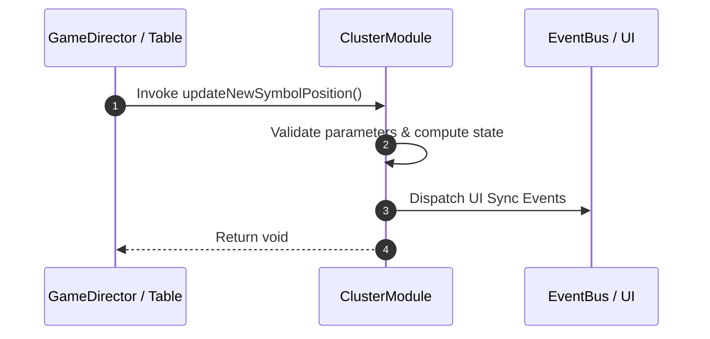

# 📖 `ClusterModule.updateNewSymbolPosition()`

<!-- convention-summary-start -->
### ClusterModule.updateNewSymbolPosition Line-by-Line Method Specification Summary

- **Core Architecture / Purpose**: Technical reference, API contract, and integration guide for ClusterModule.updateNewSymbolPosition Line-by-Line Method Specification.
- **Key Mechanisms & Design**: Encapsulates core algorithms, event hooks, and performance optimizations within the slot framework runtime.
- **Domain Capabilities**: cc_slot_mechanics, 05_methods
- **Scope & Code Paths**: `assets/cc-common/cc-slot-mechanics/Cluster/scripts/ClusterModule.ts`
- **Related Docs**: [Master Index](../INDEX.md)
<!-- convention-summary-end -->


---

## 1. Method Signature & Overview

```typescript
public updateNewSymbolPosition(): void
```

- **Declaring Class**: `ClusterModule` (`assets/cc-common/cc-slot-mechanics/Cluster/scripts/ClusterModule.ts`)
- **Source Code Location**: Lines 75 to 83
- **Execution Complexity**: $O(1)$ fast synchronous calculation or controlled timer Promise.

---

## 2. Complete Source Code Implementation

```typescript
	protected updateNewSymbolPosition(): void {
		for (let i = 0; i < this._listClusterSymbols.length; i++) {
			const { col, row } = this._listClusterSymbols[i];
			const symbol = this.getSymbolAt(col, row);
			if (symbol) {
				this._listSymbolPosition.push(new cc.Vec2(symbol.position.x, symbol.position.y));
			}
		}
	}
```

---

## 3. Line-by-Line Code Breakdown

| Line # | Code Snippet | Technical Analysis & Engine Behavior |
| :---: | :--- | :--- |
| **75** | `protected updateNewSymbolPosition(): void {` | Method entry signature declaring `updateNewSymbolPosition()` with return type `void`. |
| **76** | `for (let i = 0; i < this._listClusterSymbols.length; i++) {` | Iterates over collection elements. |
| **77** | `const { col, row } = this._listClusterSymbols[i];` | Local variable initialization allocating `{ col, row }`. |
| **78** | `const symbol = this.getSymbolAt(col, row);` | Local variable initialization allocating `symbol`. |
| **79** | `if (symbol) {` | Conditional branch evaluation guarding edge cases or prerequisites. |
| **80** | `this._listSymbolPosition.push(new cc.Vec2(symbol.position.x, symbol.position.y));` | Applies operational logic and state mutation. |
| **81** | `}` | Method exit boundary, closing block scope. |
| **82** | `}` | Method exit boundary, closing block scope. |
| **83** | `}` | Method exit boundary, closing block scope. |

---

## 4. Data Flow & State Lifecycle



---

## 5. Production Gotchas & Edge Cases

1. **Null Guarding**: Always ensure caller passes non-null parameters or handles undefined fallbacks.
2. **Fast-Stop Safety**: If user triggers fast-stop during execution, ensure timers are cancelled cleanly via `unscheduleAllCallbacks()`.
