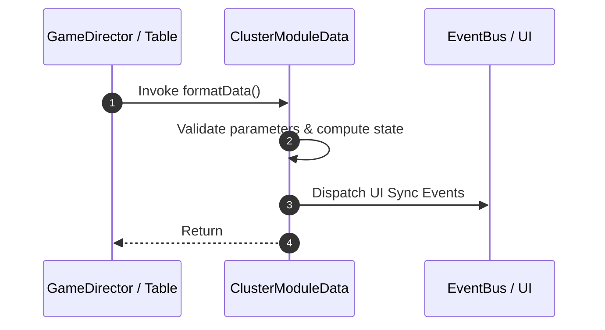

# 📖 `ClusterModuleData.formatData()`

<!-- convention-summary-start -->
### ClusterModuleData.formatData Line-by-Line Method Specification Summary

- **Core Architecture / Purpose**: Technical reference, API contract, and integration guide for ClusterModuleData.formatData Line-by-Line Method Specification.
- **Key Mechanisms & Design**: Encapsulates core algorithms, event hooks, and performance optimizations within the slot framework runtime.
- **Domain Capabilities**: cc_slot_mechanics, 05_methods
- **Scope & Code Paths**: `assets/cc-common/cc-slot-mechanics/Cluster/scripts/ClusterModuleData.ts`
- **Related Docs**: [Master Index](../INDEX.md)
<!-- convention-summary-end -->


---

## 1. Method Signature & Overview

```typescript
public formatData(): 
```

- **Declaring Class**: `ClusterModuleData` (`assets/cc-common/cc-slot-mechanics/Cluster/scripts/ClusterModuleData.ts`)
- **Source Code Location**: Lines 47 to 103
- **Execution Complexity**: $O(1)$ fast synchronous calculation or controlled timer Promise.

---

## 2. Complete Source Code Implementation

```typescript
	formatData(): { verticalMatrix: string[][], listTraceWayVertical: string[][], listClusters: { col: number, row: number, symbolValue: string }[] } {
		const matrix = this.getMatrix().filter((e) => e.length > 0 && e[0] != "");
		const formatMatrix = this.getFormatMatrix();
		const traceWay = this.getTraceWay();
		let totalClusterSymbols = 9; // for testing
		let row = 0;
		let index = 0;
		let verticalMatrix = [];
		let listTraceWayVertical = [];
		let listClusters = [];

		const sortedListSymbols = traceWay.sort(function (a, b) {
			return a - b;
		});

		for (let i = 0; i < formatMatrix.length; i++) {
			const size = formatMatrix[i].length;
			row = 0;
			verticalMatrix[i] = [];
			listTraceWayVertical[i] = [];
			for (let j = 0; j < size; j++) {
				const height = Number(formatMatrix[i][j]);
				if (i > 0 && i < formatMatrix.length - 1) {
					if (row == 0) {
						// to do
					} else {
						verticalMatrix[i][row - 1] = matrix[index];
						if (sortedListSymbols.indexOf(index) > -1) {
							listTraceWayVertical[i][row - 1] = `-1_1_${height}`;
						} else {
							listTraceWayVertical[i][row - 1] = matrix[index];
						}
						if (totalClusterSymbols > 0) {
							listClusters.push({col:i, row:row - 1, symbolValue: `3_1_${height}`});
						}
					}
				} else {
					verticalMatrix[i][row] = matrix[index];
					if (sortedListSymbols.indexOf(index) > -1) {
						listTraceWayVertical[i][row] = `-1_1_${height}`;
					} else {
						listTraceWayVertical[i][row] = matrix[index];
					}
					if (totalClusterSymbols > 0) {
						listClusters.push({col:i, row, symbolValue: `3_1_${height}`});
					}
				}
				row++;
				index++;
				if (totalClusterSymbols > 0) {
					totalClusterSymbols--;
				}
			}
		}

		return { verticalMatrix, listTraceWayVertical, listClusters };
	}
```

---

## 3. Line-by-Line Code Breakdown

| Line # | Code Snippet | Technical Analysis & Engine Behavior |
| :---: | :--- | :--- |
| **47** | `formatData(): { verticalMatrix: string[][], listTraceWayVertical: string[][], listClusters: { col: number, row: number, symbolValue: string }[] } {` | Method entry signature declaring `formatData()` with return type ``. |
| **48** | `const matrix = this.getMatrix().filter((e) => e.length > 0 && e[0] != "");` | Local variable initialization allocating `matrix`. |
| **49** | `const formatMatrix = this.getFormatMatrix();` | Local variable initialization allocating `formatMatrix`. |
| **50** | `const traceWay = this.getTraceWay();` | Local variable initialization allocating `traceWay`. |
| **51** | `let totalClusterSymbols = 9; // for testing` | Local variable initialization allocating `totalClusterSymbols`. |
| **52** | `let row = 0;` | Local variable initialization allocating `row`. |
| **53** | `let index = 0;` | Local variable initialization allocating `index`. |
| **54** | `let verticalMatrix = [];` | Local variable initialization allocating `verticalMatrix`. |
| **55** | `let listTraceWayVertical = [];` | Local variable initialization allocating `listTraceWayVertical`. |
| **56** | `let listClusters = [];` | Local variable initialization allocating `listClusters`. |
| **57** | `` | Applies operational logic and state mutation. |
| **58** | `const sortedListSymbols = traceWay.sort(function (a, b) {` | Local variable initialization allocating `sortedListSymbols`. |
| **59** | `return a - b;` | Returns computed value / promise to caller. |
| **60** | `});` | Applies operational logic and state mutation. |
| **61** | `` | Applies operational logic and state mutation. |
| **62** | `for (let i = 0; i < formatMatrix.length; i++) {` | Iterates over collection elements. |
| **63** | `const size = formatMatrix[i].length;` | Local variable initialization allocating `size`. |
| **64** | `row = 0;` | Applies operational logic and state mutation. |
| **65** | `verticalMatrix[i] = [];` | Applies operational logic and state mutation. |
| **66** | `listTraceWayVertical[i] = [];` | Applies operational logic and state mutation. |
| **67** | `for (let j = 0; j < size; j++) {` | Iterates over collection elements. |
| **68** | `const height = Number(formatMatrix[i][j]);` | Local variable initialization allocating `height`. |
| **69** | `if (i > 0 && i < formatMatrix.length - 1) {` | Conditional branch evaluation guarding edge cases or prerequisites. |
| **70** | `if (row == 0) {` | Conditional branch evaluation guarding edge cases or prerequisites. |
| **71** | `// to do` | Applies operational logic and state mutation. |
| **72** | `} else {` | Applies operational logic and state mutation. |
| **73** | `verticalMatrix[i][row - 1] = matrix[index];` | Applies operational logic and state mutation. |
| **74** | `if (sortedListSymbols.indexOf(index) > -1) {` | Conditional branch evaluation guarding edge cases or prerequisites. |
| **75** | `listTraceWayVertical[i][row - 1] = `-1_1_${height}`;` | Applies operational logic and state mutation. |
| **76** | `} else {` | Applies operational logic and state mutation. |
| **77** | `listTraceWayVertical[i][row - 1] = matrix[index];` | Applies operational logic and state mutation. |
| **78** | `}` | Method exit boundary, closing block scope. |
| **79** | `if (totalClusterSymbols > 0) {` | Conditional branch evaluation guarding edge cases or prerequisites. |
| **80** | `listClusters.push({col:i, row:row - 1, symbolValue: `3_1_${height}`});` | Applies operational logic and state mutation. |
| **81** | `}` | Method exit boundary, closing block scope. |
| **82** | `}` | Method exit boundary, closing block scope. |
| **83** | `} else {` | Applies operational logic and state mutation. |
| **84** | `verticalMatrix[i][row] = matrix[index];` | Applies operational logic and state mutation. |
| **85** | `if (sortedListSymbols.indexOf(index) > -1) {` | Conditional branch evaluation guarding edge cases or prerequisites. |
| **86** | `listTraceWayVertical[i][row] = `-1_1_${height}`;` | Applies operational logic and state mutation. |
| **87** | `} else {` | Applies operational logic and state mutation. |
| **88** | `listTraceWayVertical[i][row] = matrix[index];` | Applies operational logic and state mutation. |
| **89** | `}` | Method exit boundary, closing block scope. |
| **90** | `if (totalClusterSymbols > 0) {` | Conditional branch evaluation guarding edge cases or prerequisites. |
| **91** | `listClusters.push({col:i, row, symbolValue: `3_1_${height}`});` | Applies operational logic and state mutation. |
| **92** | `}` | Method exit boundary, closing block scope. |
| **93** | `}` | Method exit boundary, closing block scope. |
| **94** | `row++;` | Applies operational logic and state mutation. |
| **95** | `index++;` | Applies operational logic and state mutation. |
| **96** | `if (totalClusterSymbols > 0) {` | Conditional branch evaluation guarding edge cases or prerequisites. |
| **97** | `totalClusterSymbols--;` | Applies operational logic and state mutation. |
| **98** | `}` | Method exit boundary, closing block scope. |
| **99** | `}` | Method exit boundary, closing block scope. |
| **100** | `}` | Method exit boundary, closing block scope. |
| **101** | `` | Applies operational logic and state mutation. |
| **102** | `return { verticalMatrix, listTraceWayVertical, listClusters };` | Returns computed value / promise to caller. |
| **103** | `}` | Method exit boundary, closing block scope. |

---

## 4. Data Flow & State Lifecycle



---

## 5. Production Gotchas & Edge Cases

1. **Null Guarding**: Always ensure caller passes non-null parameters or handles undefined fallbacks.
2. **Fast-Stop Safety**: If user triggers fast-stop during execution, ensure timers are cancelled cleanly via `unscheduleAllCallbacks()`.
