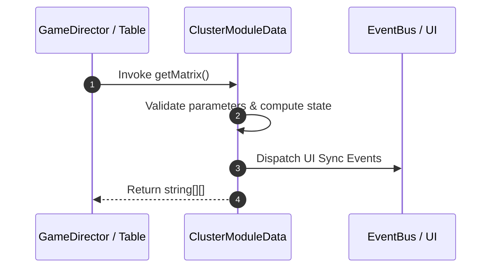

# 📖 `ClusterModuleData.getMatrix()`

<!-- convention-summary-start -->
### ClusterModuleData.getMatrix Line-by-Line Method Specification Summary

- **Core Architecture / Purpose**: Technical reference, API contract, and integration guide for ClusterModuleData.getMatrix Line-by-Line Method Specification.
- **Key Mechanisms & Design**: Encapsulates core algorithms, event hooks, and performance optimizations within the slot framework runtime.
- **Domain Capabilities**: cc_slot_mechanics, 05_methods
- **Scope & Code Paths**: `assets/cc-common/cc-slot-mechanics/Cluster/scripts/ClusterModuleData.ts`
- **Related Docs**: [Master Index](../INDEX.md)
<!-- convention-summary-end -->


---

## 1. Method Signature & Overview

```typescript
public getMatrix(): string[][]
```

- **Declaring Class**: `ClusterModuleData` (`assets/cc-common/cc-slot-mechanics/Cluster/scripts/ClusterModuleData.ts`)
- **Source Code Location**: Lines 34 to 45
- **Execution Complexity**: $O(1)$ fast synchronous calculation or controlled timer Promise.

---

## 2. Complete Source Code Implementation

```typescript
	getMatrix(): string[][] {
		let matrix = [];
		switch (this.gameMode) {
			case GAME_MODE_ENUM.NORMAL_GAME:
				matrix = this["normalGameMatrix"] || this["matrix0"] || this["matrix"];
				break;
			case GAME_MODE_ENUM.FREE_GAME:
				matrix = this["freeGameMatrix"] || this["matrix0"] || this["matrix"];
				break;
		}
		return matrix;
	}
```

---

## 3. Line-by-Line Code Breakdown

| Line # | Code Snippet | Technical Analysis & Engine Behavior |
| :---: | :--- | :--- |
| **34** | `getMatrix(): string[][] {` | Method entry signature declaring `getMatrix()` with return type `string[][]`. |
| **35** | `let matrix = [];` | Local variable initialization allocating `matrix`. |
| **36** | `switch (this.gameMode) {` | Applies operational logic and state mutation. |
| **37** | `case GAME_MODE_ENUM.NORMAL_GAME:` | Applies operational logic and state mutation. |
| **38** | `matrix = this["normalGameMatrix"] \|\| this["matrix0"] \|\| this["matrix"];` | Applies operational logic and state mutation. |
| **39** | `break;` | Applies operational logic and state mutation. |
| **40** | `case GAME_MODE_ENUM.FREE_GAME:` | Applies operational logic and state mutation. |
| **41** | `matrix = this["freeGameMatrix"] \|\| this["matrix0"] \|\| this["matrix"];` | Applies operational logic and state mutation. |
| **42** | `break;` | Applies operational logic and state mutation. |
| **43** | `}` | Method exit boundary, closing block scope. |
| **44** | `return matrix;` | Returns computed value / promise to caller. |
| **45** | `}` | Method exit boundary, closing block scope. |

---

## 4. Data Flow & State Lifecycle



---

## 5. Production Gotchas & Edge Cases

1. **Null Guarding**: Always ensure caller passes non-null parameters or handles undefined fallbacks.
2. **Fast-Stop Safety**: If user triggers fast-stop during execution, ensure timers are cancelled cleanly via `unscheduleAllCallbacks()`.
