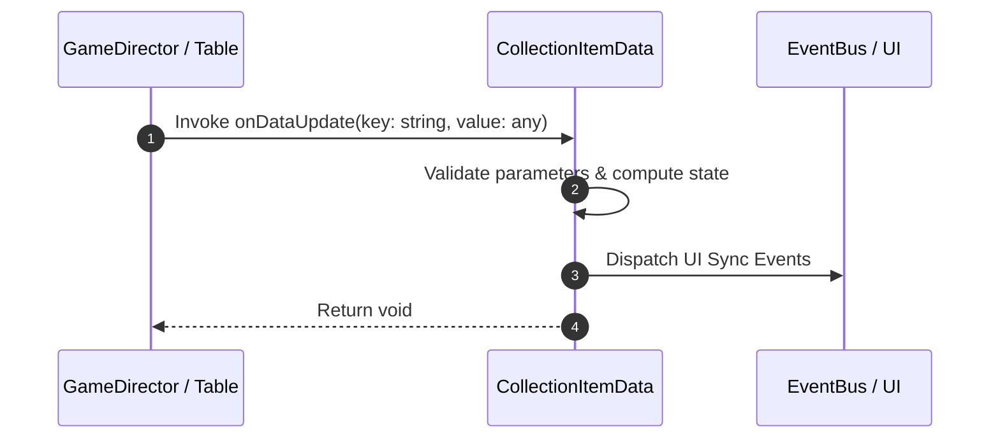

# 📖 `CollectionItemData.onDataUpdate()`

<!-- convention-summary-start -->
### CollectionItemData.onDataUpdate Line-by-Line Method Specification Summary

- **Core Architecture / Purpose**: Technical reference, API contract, and integration guide for CollectionItemData.onDataUpdate Line-by-Line Method Specification.
- **Key Mechanisms & Design**: Encapsulates core algorithms, event hooks, and performance optimizations within the slot framework runtime.
- **Domain Capabilities**: cc_slot_mechanics, 05_methods
- **Scope & Code Paths**: `assets/cc-common/cc-slot-mechanics/CollectionItem/scripts/CollectionItemData.ts`
- **Related Docs**: [Master Index](../INDEX.md)
<!-- convention-summary-end -->


---

## 1. Method Signature & Overview

```typescript
public onDataUpdate(key: string, value: any): void
```

- **Declaring Class**: `CollectionItemData` (`assets/cc-common/cc-slot-mechanics/CollectionItem/scripts/CollectionItemData.ts`)
- **Source Code Location**: Lines 22 to 35
- **Execution Complexity**: $O(1)$ fast synchronous calculation or controlled timer Promise.

---

## 2. Complete Source Code Implementation

```typescript
	onDataUpdate(key: string, value: any): void {
		this[key] = value;

		if (key === 'collectSymbols') {
			this._collectionItemData = value.map((item: string) => {
				const orderData = item.split(':');
				const symbolName = orderData[0];
				const amount = Number(orderData[1]);
				const totalAmount = Number(orderData[2]);

				return { symbolName, amount, totalAmount };
			});
		}
	}
```

---

## 3. Line-by-Line Code Breakdown

| Line # | Code Snippet | Technical Analysis & Engine Behavior |
| :---: | :--- | :--- |
| **22** | `onDataUpdate(key: string, value: any): void {` | Method entry signature declaring `onDataUpdate(key: string, value: any)` with return type `void`. |
| **23** | `this[key] = value;` | Applies operational logic and state mutation. |
| **24** | `` | Applies operational logic and state mutation. |
| **25** | `if (key === 'collectSymbols') {` | Conditional branch evaluation guarding edge cases or prerequisites. |
| **26** | `this._collectionItemData = value.map((item: string) => {` | Applies operational logic and state mutation. |
| **27** | `const orderData = item.split(':');` | Local variable initialization allocating `orderData`. |
| **28** | `const symbolName = orderData[0];` | Local variable initialization allocating `symbolName`. |
| **29** | `const amount = Number(orderData[1]);` | Local variable initialization allocating `amount`. |
| **30** | `const totalAmount = Number(orderData[2]);` | Local variable initialization allocating `totalAmount`. |
| **31** | `` | Applies operational logic and state mutation. |
| **32** | `return { symbolName, amount, totalAmount };` | Returns computed value / promise to caller. |
| **33** | `});` | Applies operational logic and state mutation. |
| **34** | `}` | Method exit boundary, closing block scope. |
| **35** | `}` | Method exit boundary, closing block scope. |

---

## 4. Data Flow & State Lifecycle



---

## 5. Production Gotchas & Edge Cases

1. **Null Guarding**: Always ensure caller passes non-null parameters or handles undefined fallbacks.
2. **Fast-Stop Safety**: If user triggers fast-stop during execution, ensure timers are cancelled cleanly via `unscheduleAllCallbacks()`.
