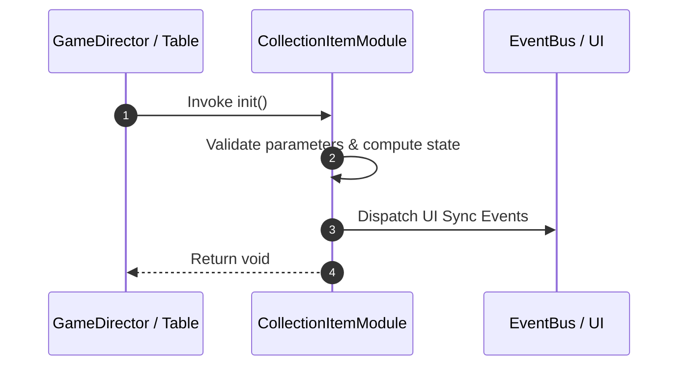

# 📖 `CollectionItemModule.init()`

<!-- convention-summary-start -->
### CollectionItemModule.init Line-by-Line Method Specification Summary

- **Core Architecture / Purpose**: Technical reference, API contract, and integration guide for CollectionItemModule.init Line-by-Line Method Specification.
- **Key Mechanisms & Design**: Encapsulates core algorithms, event hooks, and performance optimizations within the slot framework runtime.
- **Domain Capabilities**: cc_slot_mechanics, 05_methods
- **Scope & Code Paths**: `assets/cc-common/cc-slot-mechanics/CollectionItem/scripts/CollectionItemModule.ts`
- **Related Docs**: [Master Index](../INDEX.md)
<!-- convention-summary-end -->


---

## 1. Method Signature & Overview

```typescript
public init(): void
```

- **Declaring Class**: `CollectionItemModule` (`assets/cc-common/cc-slot-mechanics/CollectionItem/scripts/CollectionItemModule.ts`)
- **Source Code Location**: Lines 29 to 48
- **Execution Complexity**: $O(1)$ fast synchronous calculation or controlled timer Promise.

---

## 2. Complete Source Code Implementation

```typescript
	init(): void {
		this._config.ITEM_COLLECTION.forEach(item => {
			const node = instantiate(this.item);
			node.parent = this.holder;
			const collectionItem = node.getComponent(CollectionItem);
			collectionItem.init(item);
			this._collectionItems[item] = collectionItem;
		});

		// const collections = this._data.getCollection();
        
		// collections.forEach(item => {
		//     const node = instantiate(this.item);
		//     node.parent = this.holder;
		//     const collectionItem = node.getComponent(CollectionItem);
		//     collectionItem.init(item.symbolName);
		//     collectionItem.updateData(item.amount, item.totalAmount);
		//     this._collectionItems[item.symbolName] = collectionItem;
		// });
	}
```

---

## 3. Line-by-Line Code Breakdown

| Line # | Code Snippet | Technical Analysis & Engine Behavior |
| :---: | :--- | :--- |
| **29** | `init(): void {` | Method entry signature declaring `init()` with return type `void`. |
| **30** | `this._config.ITEM_COLLECTION.forEach(item => {` | Applies operational logic and state mutation. |
| **31** | `const node = instantiate(this.item);` | Local variable initialization allocating `node`. |
| **32** | `node.parent = this.holder;` | Applies operational logic and state mutation. |
| **33** | `const collectionItem = node.getComponent(CollectionItem);` | Local variable initialization allocating `collectionItem`. |
| **34** | `collectionItem.init(item);` | Applies operational logic and state mutation. |
| **35** | `this._collectionItems[item] = collectionItem;` | Applies operational logic and state mutation. |
| **36** | `});` | Applies operational logic and state mutation. |
| **37** | `` | Applies operational logic and state mutation. |
| **38** | `// const collections = this._data.getCollection();` | Applies operational logic and state mutation. |
| **39** | `` | Applies operational logic and state mutation. |
| **40** | `// collections.forEach(item => {` | Applies operational logic and state mutation. |
| **41** | `//     const node = instantiate(this.item);` | Applies operational logic and state mutation. |
| **42** | `//     node.parent = this.holder;` | Applies operational logic and state mutation. |
| **43** | `//     const collectionItem = node.getComponent(CollectionItem);` | Queries attached component instance from scene graph node. |
| **44** | `//     collectionItem.init(item.symbolName);` | Applies operational logic and state mutation. |
| **45** | `//     collectionItem.updateData(item.amount, item.totalAmount);` | Applies operational logic and state mutation. |
| **46** | `//     this._collectionItems[item.symbolName] = collectionItem;` | Applies operational logic and state mutation. |
| **47** | `// });` | Applies operational logic and state mutation. |
| **48** | `}` | Method exit boundary, closing block scope. |

---

## 4. Data Flow & State Lifecycle



---

## 5. Production Gotchas & Edge Cases

1. **Null Guarding**: Always ensure caller passes non-null parameters or handles undefined fallbacks.
2. **Fast-Stop Safety**: If user triggers fast-stop during execution, ensure timers are cancelled cleanly via `unscheduleAllCallbacks()`.
