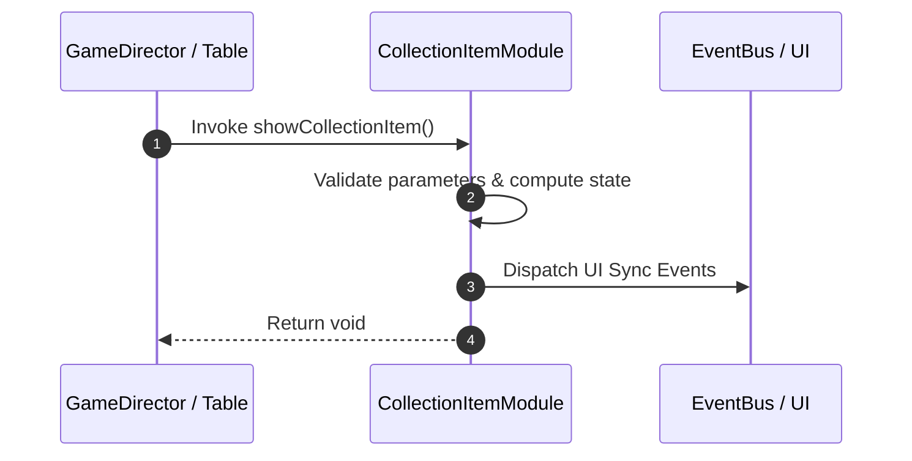

# 📖 `CollectionItemModule.showCollectionItem()`

<!-- convention-summary-start -->
### CollectionItemModule.showCollectionItem Line-by-Line Method Specification Summary

- **Core Architecture / Purpose**: Technical reference, API contract, and integration guide for CollectionItemModule.showCollectionItem Line-by-Line Method Specification.
- **Key Mechanisms & Design**: Encapsulates core algorithms, event hooks, and performance optimizations within the slot framework runtime.
- **Domain Capabilities**: cc_slot_mechanics, 05_methods
- **Scope & Code Paths**: `assets/cc-common/cc-slot-mechanics/CollectionItem/scripts/CollectionItemModule.ts`
- **Related Docs**: [Master Index](../INDEX.md)
<!-- convention-summary-end -->


---

## 1. Method Signature & Overview

```typescript
public showCollectionItem(): void
```

- **Declaring Class**: `CollectionItemModule` (`assets/cc-common/cc-slot-mechanics/CollectionItem/scripts/CollectionItemModule.ts`)
- **Source Code Location**: Lines 50 to 58
- **Execution Complexity**: $O(1)$ fast synchronous calculation or controlled timer Promise.

---

## 2. Complete Source Code Implementation

```typescript
	showCollectionItem(): void {
		const collection = this._data.getCollection();
		collection.forEach(item => {
			const collectionItem = this._collectionItems[item.symbolName];
			if (collectionItem) {
				collectionItem.updateData(item.amount, item.totalAmount);
			}
		});
	}
```

---

## 3. Line-by-Line Code Breakdown

| Line # | Code Snippet | Technical Analysis & Engine Behavior |
| :---: | :--- | :--- |
| **50** | `showCollectionItem(): void {` | Method entry signature declaring `showCollectionItem()` with return type `void`. |
| **51** | `const collection = this._data.getCollection();` | Local variable initialization allocating `collection`. |
| **52** | `collection.forEach(item => {` | Applies operational logic and state mutation. |
| **53** | `const collectionItem = this._collectionItems[item.symbolName];` | Local variable initialization allocating `collectionItem`. |
| **54** | `if (collectionItem) {` | Conditional branch evaluation guarding edge cases or prerequisites. |
| **55** | `collectionItem.updateData(item.amount, item.totalAmount);` | Applies operational logic and state mutation. |
| **56** | `}` | Method exit boundary, closing block scope. |
| **57** | `});` | Applies operational logic and state mutation. |
| **58** | `}` | Method exit boundary, closing block scope. |

---

## 4. Data Flow & State Lifecycle



---

## 5. Production Gotchas & Edge Cases

1. **Null Guarding**: Always ensure caller passes non-null parameters or handles undefined fallbacks.
2. **Fast-Stop Safety**: If user triggers fast-stop during execution, ensure timers are cancelled cleanly via `unscheduleAllCallbacks()`.
