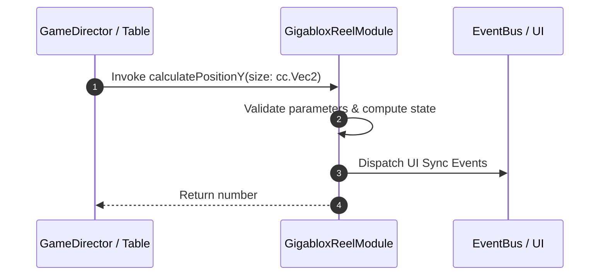

# 📖 `GigabloxReelModule.calculatePositionY()`

<!-- convention-summary-start -->
### GigabloxReelModule.calculatePositionY Line-by-Line Method Specification Summary

- **Core Architecture / Purpose**: Technical reference, API contract, and integration guide for GigabloxReelModule.calculatePositionY Line-by-Line Method Specification.
- **Key Mechanisms & Design**: Encapsulates core algorithms, event hooks, and performance optimizations within the slot framework runtime.
- **Domain Capabilities**: cc_slot_mechanics, 05_methods
- **Scope & Code Paths**: `assets/cc-common/cc-slot-mechanics/Gigablox/scripts/GigabloxReelModule.ts`
- **Related Docs**: [Master Index](../INDEX.md)
<!-- convention-summary-end -->


---

## 1. Method Signature & Overview

```typescript
public calculatePositionY(size: cc.Vec2): number
```

- **Declaring Class**: `GigabloxReelModule` (`assets/cc-common/cc-slot-mechanics/Gigablox/scripts/GigabloxReelModule.ts`)
- **Source Code Location**: Lines 160 to 164
- **Execution Complexity**: $O(1)$ fast synchronous calculation or controlled timer Promise.

---

## 2. Complete Source Code Implementation

```typescript
	protected calculatePositionY(size: cc.Vec2):number {
		const offsetY = size.y > this.DEFAULT_SIZE.y ? (size.y / 2 - 0.5) * this.SYMBOL_HEIGHT : 0;
		const topY = this.originalPosition.y + Math.abs(this.node.position.y) + this.reelManager.startY;
		return topY + offsetY;
	}
```

---

## 3. Line-by-Line Code Breakdown

| Line # | Code Snippet | Technical Analysis & Engine Behavior |
| :---: | :--- | :--- |
| **160** | `protected calculatePositionY(size: cc.Vec2):number {` | Method entry signature declaring `calculatePositionY(size: cc.Vec2)` with return type `number`. |
| **161** | `const offsetY = size.y > this.DEFAULT_SIZE.y ? (size.y / 2 - 0.5) * this.SYMBOL_HEIGHT : 0;` | Local variable initialization allocating `offsetY`. |
| **162** | `const topY = this.originalPosition.y + Math.abs(this.node.position.y) + this.reelManager.startY;` | Local variable initialization allocating `topY`. |
| **163** | `return topY + offsetY;` | Returns computed value / promise to caller. |
| **164** | `}` | Method exit boundary, closing block scope. |

---

## 4. Data Flow & State Lifecycle



---

## 5. Production Gotchas & Edge Cases

1. **Null Guarding**: Always ensure caller passes non-null parameters or handles undefined fallbacks.
2. **Fast-Stop Safety**: If user triggers fast-stop during execution, ensure timers are cancelled cleanly via `unscheduleAllCallbacks()`.
