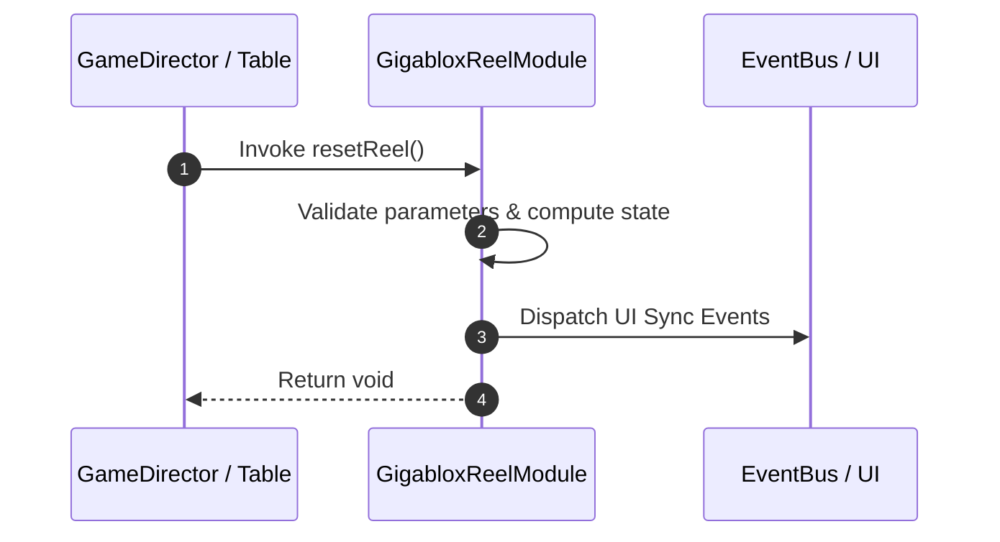

# 📖 `GigabloxReelModule.resetReel()`

<!-- convention-summary-start -->
### GigabloxReelModule.resetReel Line-by-Line Method Specification Summary

- **Core Architecture / Purpose**: Technical reference, API contract, and integration guide for GigabloxReelModule.resetReel Line-by-Line Method Specification.
- **Key Mechanisms & Design**: Encapsulates core algorithms, event hooks, and performance optimizations within the slot framework runtime.
- **Domain Capabilities**: cc_slot_mechanics, 05_methods
- **Scope & Code Paths**: `assets/cc-common/cc-slot-mechanics/Gigablox/scripts/GigabloxReelModule.ts`
- **Related Docs**: [Master Index](../INDEX.md)
<!-- convention-summary-end -->


---

## 1. Method Signature & Overview

```typescript
public resetReel(): void
```

- **Declaring Class**: `GigabloxReelModule` (`assets/cc-common/cc-slot-mechanics/Gigablox/scripts/GigabloxReelModule.ts`)
- **Source Code Location**: Lines 130 to 150
- **Execution Complexity**: $O(1)$ fast synchronous calculation or controlled timer Promise.

---

## 2. Complete Source Code Implementation

```typescript
	resetReel(): void {
		const offset = Math.abs(this.node.position.y);
		this._topGigaSymbol -= offset;
		
		if (this.listGigaSymbols.length > 1) {
			this.listGigaSymbols.forEach((s) => s.setPosition(s.position.x, s.position.y - offset));
			this.listGigaSymbols.sort((a, b) => b.position.y - a.position.y);
		}
		super.resetReel();

		let i = 0;
		while (i < this.listGigaSymbols.length) {
			const gigaSymbol = this.listGigaSymbols[i];
			if (gigaSymbol.position.y < this.node.position.y - this.reelManager.totalSymbol * this.config.SYMBOL_HEIGHT / 2) {
				this.symbolManager.removeSymbol(gigaSymbol);
				this.listGigaSymbols.splice(i, 1);
			} else {
				i++;
			}
		}
	}
```

---

## 3. Line-by-Line Code Breakdown

| Line # | Code Snippet | Technical Analysis & Engine Behavior |
| :---: | :--- | :--- |
| **130** | `resetReel(): void {` | Method entry signature declaring `resetReel()` with return type `void`. |
| **131** | `const offset = Math.abs(this.node.position.y);` | Local variable initialization allocating `offset`. |
| **132** | `this._topGigaSymbol -= offset;` | Applies operational logic and state mutation. |
| **133** | `` | Applies operational logic and state mutation. |
| **134** | `if (this.listGigaSymbols.length > 1) {` | Conditional branch evaluation guarding edge cases or prerequisites. |
| **135** | `this.listGigaSymbols.forEach((s) => s.setPosition(s.position.x, s.position.y - offset));` | Applies operational logic and state mutation. |
| **136** | `this.listGigaSymbols.sort((a, b) => b.position.y - a.position.y);` | Applies operational logic and state mutation. |
| **137** | `}` | Method exit boundary, closing block scope. |
| **138** | `super.resetReel();` | Applies operational logic and state mutation. |
| **139** | `` | Applies operational logic and state mutation. |
| **140** | `let i = 0;` | Local variable initialization allocating `i`. |
| **141** | `while (i < this.listGigaSymbols.length) {` | Applies operational logic and state mutation. |
| **142** | `const gigaSymbol = this.listGigaSymbols[i];` | Local variable initialization allocating `gigaSymbol`. |
| **143** | `if (gigaSymbol.position.y < this.node.position.y - this.reelManager.totalSymbol * this.config.SYMBOL_HEIGHT / 2) {` | Conditional branch evaluation guarding edge cases or prerequisites. |
| **144** | `this.symbolManager.removeSymbol(gigaSymbol);` | Applies operational logic and state mutation. |
| **145** | `this.listGigaSymbols.splice(i, 1);` | Applies operational logic and state mutation. |
| **146** | `} else {` | Applies operational logic and state mutation. |
| **147** | `i++;` | Applies operational logic and state mutation. |
| **148** | `}` | Method exit boundary, closing block scope. |
| **149** | `}` | Method exit boundary, closing block scope. |
| **150** | `}` | Method exit boundary, closing block scope. |

---

## 4. Data Flow & State Lifecycle



---

## 5. Production Gotchas & Edge Cases

1. **Null Guarding**: Always ensure caller passes non-null parameters or handles undefined fallbacks.
2. **Fast-Stop Safety**: If user triggers fast-stop during execution, ensure timers are cancelled cleanly via `unscheduleAllCallbacks()`.
