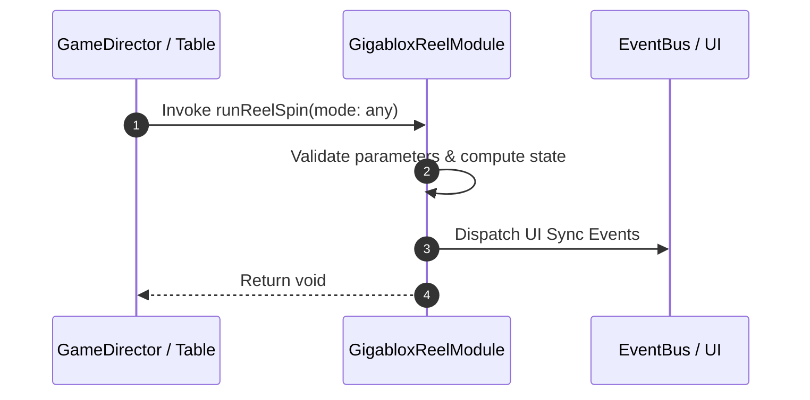

# 📖 `GigabloxReelModule.runReelSpin()`

<!-- convention-summary-start -->
### GigabloxReelModule.runReelSpin Line-by-Line Method Specification Summary

- **Core Architecture / Purpose**: Technical reference, API contract, and integration guide for GigabloxReelModule.runReelSpin Line-by-Line Method Specification.
- **Key Mechanisms & Design**: Encapsulates core algorithms, event hooks, and performance optimizations within the slot framework runtime.
- **Domain Capabilities**: cc_slot_mechanics, 05_methods
- **Scope & Code Paths**: `assets/cc-common/cc-slot-mechanics/Gigablox/scripts/GigabloxReelModule.ts`
- **Related Docs**: [Master Index](../INDEX.md)
<!-- convention-summary-end -->


---

## 1. Method Signature & Overview

```typescript
public runReelSpin(mode: any): void
```

- **Declaring Class**: `GigabloxReelModule` (`assets/cc-common/cc-slot-mechanics/Gigablox/scripts/GigabloxReelModule.ts`)
- **Source Code Location**: Lines 121 to 128
- **Execution Complexity**: $O(1)$ fast synchronous calculation or controlled timer Promise.

---

## 2. Complete Source Code Implementation

```typescript
	runReelSpin(mode: any): void {
		super.runReelSpin(mode);
		this.reelManager.totalSymbol = this.config.BUFFER_TOP + this.reelManager.showSymbol + this.config.BUFFER_BOT;
		this.listSymbols.forEach((s) => s.active = !this._isGigablox);
		this._isGigablox = false; // reset gigablox state
		this._gigabloxIndex = -1;
		this._isBeginHidingSymbol = false;
	}
```

---

## 3. Line-by-Line Code Breakdown

| Line # | Code Snippet | Technical Analysis & Engine Behavior |
| :---: | :--- | :--- |
| **121** | `runReelSpin(mode: any): void {` | Method entry signature declaring `runReelSpin(mode: any)` with return type `void`. |
| **122** | `super.runReelSpin(mode);` | Applies operational logic and state mutation. |
| **123** | `this.reelManager.totalSymbol = this.config.BUFFER_TOP + this.reelManager.showSymbol + this.config.BUFFER_BOT;` | Applies operational logic and state mutation. |
| **124** | `this.listSymbols.forEach((s) => s.active = !this._isGigablox);` | Applies operational logic and state mutation. |
| **125** | `this._isGigablox = false; // reset gigablox state` | Applies operational logic and state mutation. |
| **126** | `this._gigabloxIndex = -1;` | Applies operational logic and state mutation. |
| **127** | `this._isBeginHidingSymbol = false;` | Applies operational logic and state mutation. |
| **128** | `}` | Method exit boundary, closing block scope. |

---

## 4. Data Flow & State Lifecycle



---

## 5. Production Gotchas & Edge Cases

1. **Null Guarding**: Always ensure caller passes non-null parameters or handles undefined fallbacks.
2. **Fast-Stop Safety**: If user triggers fast-stop during execution, ensure timers are cancelled cleanly via `unscheduleAllCallbacks()`.
