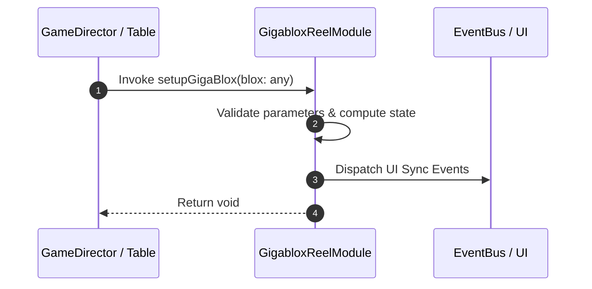

# 📖 `GigabloxReelModule.setupGigaBlox()`

<!-- convention-summary-start -->
### GigabloxReelModule.setupGigaBlox Line-by-Line Method Specification Summary

- **Core Architecture / Purpose**: Technical reference, API contract, and integration guide for GigabloxReelModule.setupGigaBlox Line-by-Line Method Specification.
- **Key Mechanisms & Design**: Encapsulates core algorithms, event hooks, and performance optimizations within the slot framework runtime.
- **Domain Capabilities**: cc_slot_mechanics, 05_methods
- **Scope & Code Paths**: `assets/cc-common/cc-slot-mechanics/Gigablox/scripts/GigabloxReelModule.ts`
- **Related Docs**: [Master Index](../INDEX.md)
<!-- convention-summary-end -->


---

## 1. Method Signature & Overview

```typescript
public setupGigaBlox(blox: any): void
```

- **Declaring Class**: `GigabloxReelModule` (`assets/cc-common/cc-slot-mechanics/Gigablox/scripts/GigabloxReelModule.ts`)
- **Source Code Location**: Lines 152 to 158
- **Execution Complexity**: $O(1)$ fast synchronous calculation or controlled timer Promise.

---

## 2. Complete Source Code Implementation

```typescript
	setupGigaBlox(blox: any): void {
		this._isGigablox = true;
		this._gigabloxIndex = blox.col;
		this._gigabloxSize = blox.size;
		//this._symbolBlox = blox.symbols;
		this._gigabloxStep = (this._gigabloxSize - blox.rows[0]) % this._gigabloxSize;
	}
```

---

## 3. Line-by-Line Code Breakdown

| Line # | Code Snippet | Technical Analysis & Engine Behavior |
| :---: | :--- | :--- |
| **152** | `setupGigaBlox(blox: any): void {` | Method entry signature declaring `setupGigaBlox(blox: any)` with return type `void`. |
| **153** | `this._isGigablox = true;` | Applies operational logic and state mutation. |
| **154** | `this._gigabloxIndex = blox.col;` | Applies operational logic and state mutation. |
| **155** | `this._gigabloxSize = blox.size;` | Applies operational logic and state mutation. |
| **156** | `//this._symbolBlox = blox.symbols;` | Applies operational logic and state mutation. |
| **157** | `this._gigabloxStep = (this._gigabloxSize - blox.rows[0]) % this._gigabloxSize;` | Applies operational logic and state mutation. |
| **158** | `}` | Method exit boundary, closing block scope. |

---

## 4. Data Flow & State Lifecycle



---

## 5. Production Gotchas & Edge Cases

1. **Null Guarding**: Always ensure caller passes non-null parameters or handles undefined fallbacks.
2. **Fast-Stop Safety**: If user triggers fast-stop during execution, ensure timers are cancelled cleanly via `unscheduleAllCallbacks()`.
