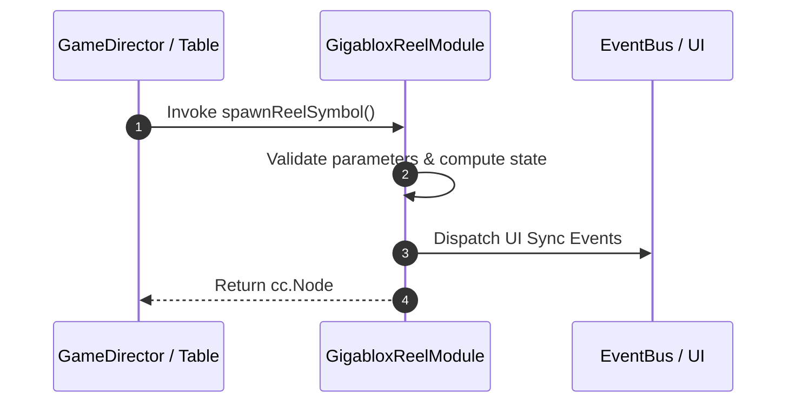

# 📖 `GigabloxReelModule.spawnReelSymbol()`

<!-- convention-summary-start -->
### GigabloxReelModule.spawnReelSymbol Line-by-Line Method Specification Summary

- **Core Architecture / Purpose**: Technical reference, API contract, and integration guide for GigabloxReelModule.spawnReelSymbol Line-by-Line Method Specification.
- **Key Mechanisms & Design**: Encapsulates core algorithms, event hooks, and performance optimizations within the slot framework runtime.
- **Domain Capabilities**: cc_slot_mechanics, 05_methods
- **Scope & Code Paths**: `assets/cc-common/cc-slot-mechanics/Gigablox/scripts/GigabloxReelModule.ts`
- **Related Docs**: [Master Index](../INDEX.md)
<!-- convention-summary-end -->


---

## 1. Method Signature & Overview

```typescript
public spawnReelSymbol(): cc.Node
```

- **Declaring Class**: `GigabloxReelModule` (`assets/cc-common/cc-slot-mechanics/Gigablox/scripts/GigabloxReelModule.ts`)
- **Source Code Location**: Lines 24 to 99
- **Execution Complexity**: $O(1)$ fast synchronous calculation or controlled timer Promise.

---

## 2. Complete Source Code Implementation

```typescript
	protected spawnReelSymbol(): cc.Node {
		let code = "", size = Vec2.ONE;
		let skip = false;
		let stop = 0;
		let indexSymbol = -1;
		let isHideSymbol = false;
        
		if (this.reelManager.state === ReelSpinState.SHOWING_RESULT && this.data.length) {
			//show result
			let symbolValue = this.data[this.reelManager.index];
			indexSymbol = this.getIndexSymbol(this.reelManager.index);
		
			if (this._isGigablox) {
				if (this._gigabloxStep == 0) {
					this._isBeginHidingSymbol = true;

					//save the top gigasymbol position
					const gigaSize = new Vec2(this._gigabloxSize, this._gigabloxSize);
					this._topGigaSymbol = this.calculatePositionY(gigaSize);
					
					if (this.reelIndex == this._gigabloxIndex) {
						//TODO: for testing
						if (this._gigabloxSize == 2) {
							code = 'K';
						} else if (this._gigabloxSize == 3) {
							code = 'K2';
						}
						const gigaSymbol = this.spawnSymbol(code, gigaSize, true);
						SlotSymbolModule.getModuleComponent(gigaSymbol).setIndex(SymbolIndexType.GIGABLOX);
						gigaSymbol.active = true;
					}
					this._gigabloxStep = this._gigabloxSize - 1;
				} else {
					this._gigabloxStep--;
				}
				if (!symbolValue) {
					this.reelManager.stop++;
				}
				isHideSymbol = this._isBeginHidingSymbol;
			}
            
			if (symbolValue) {
				({ symbolCode: code, symbolSize: size, stop } = this.mapSymbolData(symbolValue));
				this.reelManager.stop += stop;
			} else {
				skip = true;
			}
			this.reelManager.index++;
		} else {
			({ symbolCode: code, symbolSize: size } = this.getRandomSymbol());
		}
        
		if (!this.canPlaceSymbol() || skip) {
			return;
		}

		const symbol = this.spawnSymbol(code, size);
		if (this.reelManager.state === ReelSpinState.START) {
			symbol.active = true;
			// hide symbol if the symbol overlap the gigasymbol when scrolling
			if (this._topGigaSymbol) {
				if (symbol.position.y > 0 && symbol.position.y < this._topGigaSymbol + this._gigabloxSize * this.config.SYMBOL_HEIGHT) {
					symbol.active = false;
				}
			}
		} else if (this.reelManager.state === ReelSpinState.SHOWING_RESULT) {
			symbol.active = !isHideSymbol;
		}
        
		if (indexSymbol != -1) {
			SlotSymbolModule.getModuleComponent(symbol).setIndex(indexSymbol);
			this.resultSymbols.push(symbol);
		}

		return symbol;
	}
```

---

## 3. Line-by-Line Code Breakdown

| Line # | Code Snippet | Technical Analysis & Engine Behavior |
| :---: | :--- | :--- |
| **24** | `protected spawnReelSymbol(): cc.Node {` | Method entry signature declaring `spawnReelSymbol()` with return type `cc.Node`. |
| **25** | `let code = "", size = Vec2.ONE;` | Local variable initialization allocating `code`. |
| **26** | `let skip = false;` | Local variable initialization allocating `skip`. |
| **27** | `let stop = 0;` | Local variable initialization allocating `stop`. |
| **28** | `let indexSymbol = -1;` | Local variable initialization allocating `indexSymbol`. |
| **29** | `let isHideSymbol = false;` | Local variable initialization allocating `isHideSymbol`. |
| **30** | `` | Applies operational logic and state mutation. |
| **31** | `if (this.reelManager.state === ReelSpinState.SHOWING_RESULT && this.data.length) {` | Conditional branch evaluation guarding edge cases or prerequisites. |
| **32** | `//show result` | Applies operational logic and state mutation. |
| **33** | `let symbolValue = this.data[this.reelManager.index];` | Local variable initialization allocating `symbolValue`. |
| **34** | `indexSymbol = this.getIndexSymbol(this.reelManager.index);` | Applies operational logic and state mutation. |
| **35** | `` | Applies operational logic and state mutation. |
| **36** | `if (this._isGigablox) {` | Conditional branch evaluation guarding edge cases or prerequisites. |
| **37** | `if (this._gigabloxStep == 0) {` | Conditional branch evaluation guarding edge cases or prerequisites. |
| **38** | `this._isBeginHidingSymbol = true;` | Applies operational logic and state mutation. |
| **39** | `` | Applies operational logic and state mutation. |
| **40** | `//save the top gigasymbol position` | Applies operational logic and state mutation. |
| **41** | `const gigaSize = new Vec2(this._gigabloxSize, this._gigabloxSize);` | Local variable initialization allocating `gigaSize`. |
| **42** | `this._topGigaSymbol = this.calculatePositionY(gigaSize);` | Applies operational logic and state mutation. |
| **43** | `` | Applies operational logic and state mutation. |
| **44** | `if (this.reelIndex == this._gigabloxIndex) {` | Conditional branch evaluation guarding edge cases or prerequisites. |
| **45** | `//TODO: for testing` | Applies operational logic and state mutation. |
| **46** | `if (this._gigabloxSize == 2) {` | Conditional branch evaluation guarding edge cases or prerequisites. |
| **47** | `code = 'K';` | Applies operational logic and state mutation. |
| **48** | `} else if (this._gigabloxSize == 3) {` | Applies operational logic and state mutation. |
| **49** | `code = 'K2';` | Applies operational logic and state mutation. |
| **50** | `}` | Method exit boundary, closing block scope. |
| **51** | `const gigaSymbol = this.spawnSymbol(code, gigaSize, true);` | Local variable initialization allocating `gigaSymbol`. |
| **52** | `SlotSymbolModule.getModuleComponent(gigaSymbol).setIndex(SymbolIndexType.GIGABLOX);` | Applies operational logic and state mutation. |
| **53** | `gigaSymbol.active = true;` | Applies operational logic and state mutation. |
| **54** | `}` | Method exit boundary, closing block scope. |
| **55** | `this._gigabloxStep = this._gigabloxSize - 1;` | Applies operational logic and state mutation. |
| **56** | `} else {` | Applies operational logic and state mutation. |
| **57** | `this._gigabloxStep--;` | Applies operational logic and state mutation. |
| **58** | `}` | Method exit boundary, closing block scope. |
| **59** | `if (!symbolValue) {` | Conditional branch evaluation guarding edge cases or prerequisites. |
| **60** | `this.reelManager.stop++;` | Applies operational logic and state mutation. |
| **61** | `}` | Method exit boundary, closing block scope. |
| **62** | `isHideSymbol = this._isBeginHidingSymbol;` | Applies operational logic and state mutation. |
| **63** | `}` | Method exit boundary, closing block scope. |
| **64** | `` | Applies operational logic and state mutation. |
| **65** | `if (symbolValue) {` | Conditional branch evaluation guarding edge cases or prerequisites. |
| **66** | `({ symbolCode: code, symbolSize: size, stop } = this.mapSymbolData(symbolValue));` | Applies operational logic and state mutation. |
| **67** | `this.reelManager.stop += stop;` | Applies operational logic and state mutation. |
| **68** | `} else {` | Applies operational logic and state mutation. |
| **69** | `skip = true;` | Applies operational logic and state mutation. |
| **70** | `}` | Method exit boundary, closing block scope. |
| **71** | `this.reelManager.index++;` | Applies operational logic and state mutation. |
| **72** | `} else {` | Applies operational logic and state mutation. |
| **73** | `({ symbolCode: code, symbolSize: size } = this.getRandomSymbol());` | Applies operational logic and state mutation. |
| **74** | `}` | Method exit boundary, closing block scope. |
| **75** | `` | Applies operational logic and state mutation. |
| **76** | `if (!this.canPlaceSymbol() \|\| skip) {` | Conditional branch evaluation guarding edge cases or prerequisites. |
| **77** | `return;` | Applies operational logic and state mutation. |
| **78** | `}` | Method exit boundary, closing block scope. |
| **79** | `` | Applies operational logic and state mutation. |
| **80** | `const symbol = this.spawnSymbol(code, size);` | Local variable initialization allocating `symbol`. |
| **81** | `if (this.reelManager.state === ReelSpinState.START) {` | Conditional branch evaluation guarding edge cases or prerequisites. |
| **82** | `symbol.active = true;` | Applies operational logic and state mutation. |
| **83** | `// hide symbol if the symbol overlap the gigasymbol when scrolling` | Applies operational logic and state mutation. |
| **84** | `if (this._topGigaSymbol) {` | Conditional branch evaluation guarding edge cases or prerequisites. |
| **85** | `if (symbol.position.y > 0 && symbol.position.y < this._topGigaSymbol + this._gigabloxSize * this.config.SYMBOL_HEIGHT) {` | Conditional branch evaluation guarding edge cases or prerequisites. |
| **86** | `symbol.active = false;` | Applies operational logic and state mutation. |
| **87** | `}` | Method exit boundary, closing block scope. |
| **88** | `}` | Method exit boundary, closing block scope. |
| **89** | `} else if (this.reelManager.state === ReelSpinState.SHOWING_RESULT) {` | Applies operational logic and state mutation. |
| **90** | `symbol.active = !isHideSymbol;` | Applies operational logic and state mutation. |
| **91** | `}` | Method exit boundary, closing block scope. |
| **92** | `` | Applies operational logic and state mutation. |
| **93** | `if (indexSymbol != -1) {` | Conditional branch evaluation guarding edge cases or prerequisites. |
| **94** | `SlotSymbolModule.getModuleComponent(symbol).setIndex(indexSymbol);` | Applies operational logic and state mutation. |
| **95** | `this.resultSymbols.push(symbol);` | Applies operational logic and state mutation. |
| **96** | `}` | Method exit boundary, closing block scope. |
| **97** | `` | Applies operational logic and state mutation. |
| **98** | `return symbol;` | Returns computed value / promise to caller. |
| **99** | `}` | Method exit boundary, closing block scope. |

---

## 4. Data Flow & State Lifecycle



---

## 5. Production Gotchas & Edge Cases

1. **Null Guarding**: Always ensure caller passes non-null parameters or handles undefined fallbacks.
2. **Fast-Stop Safety**: If user triggers fast-stop during execution, ensure timers are cancelled cleanly via `unscheduleAllCallbacks()`.
