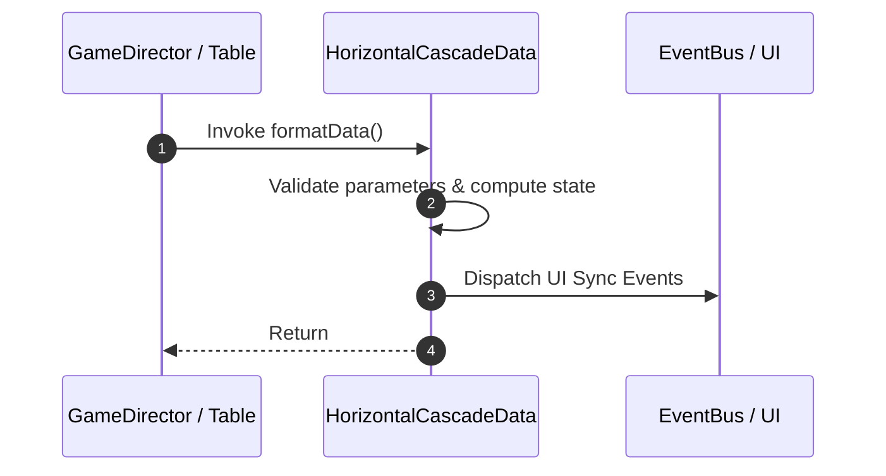

# 📖 `HorizontalCascadeData.formatData()`

<!-- convention-summary-start -->
### HorizontalCascadeData.formatData Line-by-Line Method Specification Summary

- **Core Architecture / Purpose**: Technical reference, API contract, and integration guide for HorizontalCascadeData.formatData Line-by-Line Method Specification.
- **Key Mechanisms & Design**: Encapsulates core algorithms, event hooks, and performance optimizations within the slot framework runtime.
- **Domain Capabilities**: cc_slot_mechanics, 05_methods
- **Scope & Code Paths**: `assets/cc-common/cc-slot-mechanics/HorizontalCascade/scripts/HorizontalCascadeData.ts`
- **Related Docs**: [Master Index](../INDEX.md)
<!-- convention-summary-end -->


---

## 1. Method Signature & Overview

```typescript
public formatData(): 
```

- **Declaring Class**: `HorizontalCascadeData` (`assets/cc-common/cc-slot-mechanics/HorizontalCascade/scripts/HorizontalCascadeData.ts`)
- **Source Code Location**: Lines 37 to 59
- **Execution Complexity**: $O(1)$ fast synchronous calculation or controlled timer Promise.

---

## 2. Complete Source Code Implementation

```typescript
	formatData(): { horizonMatrix: string[][], listTraceWay: string[][] } {
		const matrix = this.getMatrix();
		const traceWay = this.getTraceWay();
		const sortedListSymbols = traceWay.sort(function (a, b) {
			return a - b;
		});
		
		const listTraceWay = [];
		listTraceWay[0] = [];
		let horizonMatrix = [];
		horizonMatrix[0] = [];
		
		for (let i = 0; i < matrix.length; i++) {
			horizonMatrix[0][i] = matrix[i][0];
			if (sortedListSymbols.indexOf(i) > -1) {
				listTraceWay[0][i] = `${this.config.DROP_SYMBOL_CODE}`;
			} else {
				listTraceWay[0][i] = matrix[i][0];
			}
		}

		return { horizonMatrix, listTraceWay };
	}
```

---

## 3. Line-by-Line Code Breakdown

| Line # | Code Snippet | Technical Analysis & Engine Behavior |
| :---: | :--- | :--- |
| **37** | `formatData(): { horizonMatrix: string[][], listTraceWay: string[][] } {` | Method entry signature declaring `formatData()` with return type ``. |
| **38** | `const matrix = this.getMatrix();` | Local variable initialization allocating `matrix`. |
| **39** | `const traceWay = this.getTraceWay();` | Local variable initialization allocating `traceWay`. |
| **40** | `const sortedListSymbols = traceWay.sort(function (a, b) {` | Local variable initialization allocating `sortedListSymbols`. |
| **41** | `return a - b;` | Returns computed value / promise to caller. |
| **42** | `});` | Applies operational logic and state mutation. |
| **43** | `` | Applies operational logic and state mutation. |
| **44** | `const listTraceWay = [];` | Local variable initialization allocating `listTraceWay`. |
| **45** | `listTraceWay[0] = [];` | Applies operational logic and state mutation. |
| **46** | `let horizonMatrix = [];` | Local variable initialization allocating `horizonMatrix`. |
| **47** | `horizonMatrix[0] = [];` | Applies operational logic and state mutation. |
| **48** | `` | Applies operational logic and state mutation. |
| **49** | `for (let i = 0; i < matrix.length; i++) {` | Iterates over collection elements. |
| **50** | `horizonMatrix[0][i] = matrix[i][0];` | Applies operational logic and state mutation. |
| **51** | `if (sortedListSymbols.indexOf(i) > -1) {` | Conditional branch evaluation guarding edge cases or prerequisites. |
| **52** | `listTraceWay[0][i] = `${this.config.DROP_SYMBOL_CODE}`;` | Applies operational logic and state mutation. |
| **53** | `} else {` | Applies operational logic and state mutation. |
| **54** | `listTraceWay[0][i] = matrix[i][0];` | Applies operational logic and state mutation. |
| **55** | `}` | Method exit boundary, closing block scope. |
| **56** | `}` | Method exit boundary, closing block scope. |
| **57** | `` | Applies operational logic and state mutation. |
| **58** | `return { horizonMatrix, listTraceWay };` | Returns computed value / promise to caller. |
| **59** | `}` | Method exit boundary, closing block scope. |

---

## 4. Data Flow & State Lifecycle



---

## 5. Production Gotchas & Edge Cases

1. **Null Guarding**: Always ensure caller passes non-null parameters or handles undefined fallbacks.
2. **Fast-Stop Safety**: If user triggers fast-stop during execution, ensure timers are cancelled cleanly via `unscheduleAllCallbacks()`.
