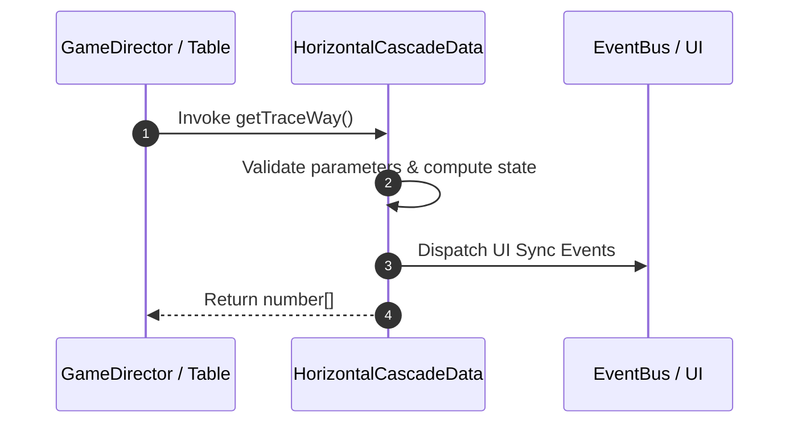

# 📖 `HorizontalCascadeData.getTraceWay()`

<!-- convention-summary-start -->
### HorizontalCascadeData.getTraceWay Line-by-Line Method Specification Summary

- **Core Architecture / Purpose**: Technical reference, API contract, and integration guide for HorizontalCascadeData.getTraceWay Line-by-Line Method Specification.
- **Key Mechanisms & Design**: Encapsulates core algorithms, event hooks, and performance optimizations within the slot framework runtime.
- **Domain Capabilities**: cc_slot_mechanics, 05_methods
- **Scope & Code Paths**: `assets/cc-common/cc-slot-mechanics/HorizontalCascade/scripts/HorizontalCascadeData.ts`
- **Related Docs**: [Master Index](../INDEX.md)
<!-- convention-summary-end -->


---

## 1. Method Signature & Overview

```typescript
public getTraceWay(): number[]
```

- **Declaring Class**: `HorizontalCascadeData` (`assets/cc-common/cc-slot-mechanics/HorizontalCascade/scripts/HorizontalCascadeData.ts`)
- **Source Code Location**: Lines 30 to 34
- **Execution Complexity**: $O(1)$ fast synchronous calculation or controlled timer Promise.

---

## 2. Complete Source Code Implementation

```typescript
	getTraceWay(): number[] {
		return this["traceWay"] ? this["traceWay"].sort(function (a, b) {
			return a - b; 
		}) : [];
	}
```

---

## 3. Line-by-Line Code Breakdown

| Line # | Code Snippet | Technical Analysis & Engine Behavior |
| :---: | :--- | :--- |
| **30** | `getTraceWay(): number[] {` | Method entry signature declaring `getTraceWay()` with return type `number[]`. |
| **31** | `return this["traceWay"] ? this["traceWay"].sort(function (a, b) {` | Returns computed value / promise to caller. |
| **32** | `return a - b;` | Returns computed value / promise to caller. |
| **33** | `}) : [];` | Applies operational logic and state mutation. |
| **34** | `}` | Method exit boundary, closing block scope. |

---

## 4. Data Flow & State Lifecycle



---

## 5. Production Gotchas & Edge Cases

1. **Null Guarding**: Always ensure caller passes non-null parameters or handles undefined fallbacks.
2. **Fast-Stop Safety**: If user triggers fast-stop during execution, ensure timers are cancelled cleanly via `unscheduleAllCallbacks()`.
