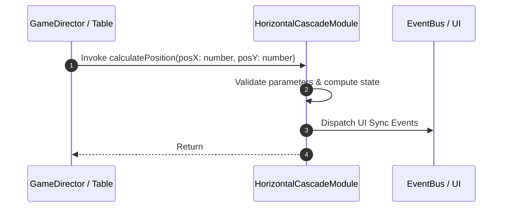

# 📖 `HorizontalCascadeModule.calculatePosition()`

<!-- convention-summary-start -->
### HorizontalCascadeModule.calculatePosition Line-by-Line Method Specification Summary

- **Core Architecture / Purpose**: Technical reference, API contract, and integration guide for HorizontalCascadeModule.calculatePosition Line-by-Line Method Specification.
- **Key Mechanisms & Design**: Encapsulates core algorithms, event hooks, and performance optimizations within the slot framework runtime.
- **Domain Capabilities**: cc_slot_mechanics, 05_methods
- **Scope & Code Paths**: `assets/cc-common/cc-slot-mechanics/HorizontalCascade/scripts/HorizontalCascadeModule.ts`
- **Related Docs**: [Master Index](../INDEX.md)
<!-- convention-summary-end -->


---

## 1. Method Signature & Overview

```typescript
public calculatePosition(posX: number, posY: number): 
```

- **Declaring Class**: `HorizontalCascadeModule` (`assets/cc-common/cc-slot-mechanics/HorizontalCascade/scripts/HorizontalCascadeModule.ts`)
- **Source Code Location**: Lines 151 to 157
- **Execution Complexity**: $O(1)$ fast synchronous calculation or controlled timer Promise.

---

## 2. Complete Source Code Implementation

```typescript
	protected calculatePosition(posX: number, posY: number): { targetPos: cc.Vec2, targetBouncePos: cc.Vec2 } {
		const targetPos = new cc.Vec2(posX, posY);
		const DELTA_BOUNCING = 10;
		const targetBouncePos = new cc.Vec2(posX + DELTA_BOUNCING, posY);

		return { targetPos, targetBouncePos };
	}
```

---

## 3. Line-by-Line Code Breakdown

| Line # | Code Snippet | Technical Analysis & Engine Behavior |
| :---: | :--- | :--- |
| **151** | `protected calculatePosition(posX: number, posY: number): { targetPos: cc.Vec2, targetBouncePos: cc.Vec2 } {` | Method entry signature declaring `calculatePosition(posX: number, posY: number)` with return type ``. |
| **152** | `const targetPos = new cc.Vec2(posX, posY);` | Local variable initialization allocating `targetPos`. |
| **153** | `const DELTA_BOUNCING = 10;` | Local variable initialization allocating `DELTA_BOUNCING`. |
| **154** | `const targetBouncePos = new cc.Vec2(posX + DELTA_BOUNCING, posY);` | Local variable initialization allocating `targetBouncePos`. |
| **155** | `` | Applies operational logic and state mutation. |
| **156** | `return { targetPos, targetBouncePos };` | Returns computed value / promise to caller. |
| **157** | `}` | Method exit boundary, closing block scope. |

---

## 4. Data Flow & State Lifecycle



---

## 5. Production Gotchas & Edge Cases

1. **Null Guarding**: Always ensure caller passes non-null parameters or handles undefined fallbacks.
2. **Fast-Stop Safety**: If user triggers fast-stop during execution, ensure timers are cancelled cleanly via `unscheduleAllCallbacks()`.
