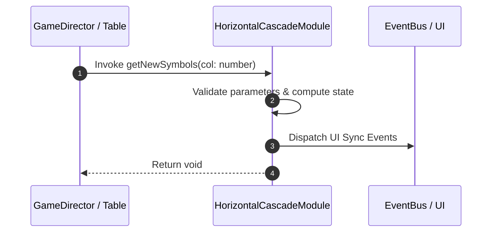

# 📖 `HorizontalCascadeModule.getNewSymbols()`

<!-- convention-summary-start -->
### HorizontalCascadeModule.getNewSymbols Line-by-Line Method Specification Summary

- **Core Architecture / Purpose**: Technical reference, API contract, and integration guide for HorizontalCascadeModule.getNewSymbols Line-by-Line Method Specification.
- **Key Mechanisms & Design**: Encapsulates core algorithms, event hooks, and performance optimizations within the slot framework runtime.
- **Domain Capabilities**: cc_slot_mechanics, 05_methods
- **Scope & Code Paths**: `assets/cc-common/cc-slot-mechanics/HorizontalCascade/scripts/HorizontalCascadeModule.ts`
- **Related Docs**: [Master Index](../INDEX.md)
<!-- convention-summary-end -->


---

## 1. Method Signature & Overview

```typescript
public getNewSymbols(col: number): void
```

- **Declaring Class**: `HorizontalCascadeModule` (`assets/cc-common/cc-slot-mechanics/HorizontalCascade/scripts/HorizontalCascadeModule.ts`)
- **Source Code Location**: Lines 126 to 149
- **Execution Complexity**: $O(1)$ fast synchronous calculation or controlled timer Promise.

---

## 2. Complete Source Code Implementation

```typescript
	protected getNewSymbols(col: number): void {
		const listIndex = this.getConfig().SYMBOL_INDEXES;
		const totalCols = this.tableConfig.format.length;
		const rightPosition = this.tableConfig.positions[0][totalCols - 1];
		const listOldSymbols = this.listTraceWay[col].filter((symbol) => !symbol.startsWith('-1'));
		const startIndex = listOldSymbols.length;
        
		for (let i = listIndex[col].length - 1; i >= startIndex; i--) {
			const symbolValue = this.matrix[col][i];
			const { code, size } = this.mapSymbolData(symbolValue);
            
			const symbol = this.createNewSymbol(col, i, code, size);
			if (symbol) {
				const position = this.tableConfig.positions[0][i];
				symbol.setPosition(new cc.Vec2(rightPosition.x + (size + i - startIndex) * this.tableConfig.cellSize.x, position.y));

				const droppedPosition = this.calculatePosition(position.x, position.y);
				symbol["droppedPosition"] = droppedPosition;

				this.listSymbols[col][i] = symbol;                
				this.listNewSymbols.push(symbol);
			}
		}
	}
```

---

## 3. Line-by-Line Code Breakdown

| Line # | Code Snippet | Technical Analysis & Engine Behavior |
| :---: | :--- | :--- |
| **126** | `protected getNewSymbols(col: number): void {` | Method entry signature declaring `getNewSymbols(col: number)` with return type `void`. |
| **127** | `const listIndex = this.getConfig().SYMBOL_INDEXES;` | Local variable initialization allocating `listIndex`. |
| **128** | `const totalCols = this.tableConfig.format.length;` | Local variable initialization allocating `totalCols`. |
| **129** | `const rightPosition = this.tableConfig.positions[0][totalCols - 1];` | Local variable initialization allocating `rightPosition`. |
| **130** | `const listOldSymbols = this.listTraceWay[col].filter((symbol) => !symbol.startsWith('-1'));` | Local variable initialization allocating `listOldSymbols`. |
| **131** | `const startIndex = listOldSymbols.length;` | Local variable initialization allocating `startIndex`. |
| **132** | `` | Applies operational logic and state mutation. |
| **133** | `for (let i = listIndex[col].length - 1; i >= startIndex; i--) {` | Iterates over collection elements. |
| **134** | `const symbolValue = this.matrix[col][i];` | Local variable initialization allocating `symbolValue`. |
| **135** | `const { code, size } = this.mapSymbolData(symbolValue);` | Local variable initialization allocating `{ code, size }`. |
| **136** | `` | Applies operational logic and state mutation. |
| **137** | `const symbol = this.createNewSymbol(col, i, code, size);` | Local variable initialization allocating `symbol`. |
| **138** | `if (symbol) {` | Conditional branch evaluation guarding edge cases or prerequisites. |
| **139** | `const position = this.tableConfig.positions[0][i];` | Local variable initialization allocating `position`. |
| **140** | `symbol.setPosition(new cc.Vec2(rightPosition.x + (size + i - startIndex) * this.tableConfig.cellSize.x, position.y));` | Applies operational logic and state mutation. |
| **141** | `` | Applies operational logic and state mutation. |
| **142** | `const droppedPosition = this.calculatePosition(position.x, position.y);` | Local variable initialization allocating `droppedPosition`. |
| **143** | `symbol["droppedPosition"] = droppedPosition;` | Applies operational logic and state mutation. |
| **144** | `` | Applies operational logic and state mutation. |
| **145** | `this.listSymbols[col][i] = symbol;` | Applies operational logic and state mutation. |
| **146** | `this.listNewSymbols.push(symbol);` | Applies operational logic and state mutation. |
| **147** | `}` | Method exit boundary, closing block scope. |
| **148** | `}` | Method exit boundary, closing block scope. |
| **149** | `}` | Method exit boundary, closing block scope. |

---

## 4. Data Flow & State Lifecycle



---

## 5. Production Gotchas & Edge Cases

1. **Null Guarding**: Always ensure caller passes non-null parameters or handles undefined fallbacks.
2. **Fast-Stop Safety**: If user triggers fast-stop during execution, ensure timers are cancelled cleanly via `unscheduleAllCallbacks()`.
