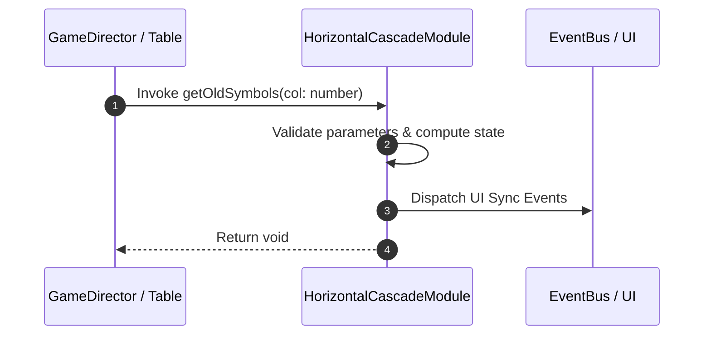

# 📖 `HorizontalCascadeModule.getOldSymbols()`

<!-- convention-summary-start -->
### HorizontalCascadeModule.getOldSymbols Line-by-Line Method Specification Summary

- **Core Architecture / Purpose**: Technical reference, API contract, and integration guide for HorizontalCascadeModule.getOldSymbols Line-by-Line Method Specification.
- **Key Mechanisms & Design**: Encapsulates core algorithms, event hooks, and performance optimizations within the slot framework runtime.
- **Domain Capabilities**: cc_slot_mechanics, 05_methods
- **Scope & Code Paths**: `assets/cc-common/cc-slot-mechanics/HorizontalCascade/scripts/HorizontalCascadeModule.ts`
- **Related Docs**: [Master Index](../INDEX.md)
<!-- convention-summary-end -->


---

## 1. Method Signature & Overview

```typescript
public getOldSymbols(col: number): void
```

- **Declaring Class**: `HorizontalCascadeModule` (`assets/cc-common/cc-slot-mechanics/HorizontalCascade/scripts/HorizontalCascadeModule.ts`)
- **Source Code Location**: Lines 97 to 124
- **Execution Complexity**: $O(1)$ fast synchronous calculation or controlled timer Promise.

---

## 2. Complete Source Code Implementation

```typescript
	protected getOldSymbols(col: number): void {
		const listOldSymbols = this.listTraceWay[col].filter((symbol) => !symbol.startsWith('-1'));
		if (listOldSymbols.length < this.listTraceWay[0].length) {
			const listIndex = this.getConfig().SYMBOL_INDEXES;

			for (let i = 0; i < listOldSymbols.length; i++) {
				let index = i;
				let symbol = this.listSymbols[0][index];
				while (!symbol && index < listIndex[0].length) {
					index++;
					symbol = this.listSymbols[0][index];
				}

				if (!symbol || index == i) {
					continue;
				}

				this.swapSymbol(0, i, index);
				SlotSymbolModule.getModuleComponent(symbol).setIndex(listIndex[0][i]);

				const posX = symbol.position.x - (index - i) * this.tableConfig.cellSize.x;
				const droppedPosition = this.calculatePosition(posX, symbol.position.y);
            
				symbol["droppedPosition"] = droppedPosition;
				this.listDroppedSymbols.push(symbol);
			}
		}    
	}
```

---

## 3. Line-by-Line Code Breakdown

| Line # | Code Snippet | Technical Analysis & Engine Behavior |
| :---: | :--- | :--- |
| **97** | `protected getOldSymbols(col: number): void {` | Method entry signature declaring `getOldSymbols(col: number)` with return type `void`. |
| **98** | `const listOldSymbols = this.listTraceWay[col].filter((symbol) => !symbol.startsWith('-1'));` | Local variable initialization allocating `listOldSymbols`. |
| **99** | `if (listOldSymbols.length < this.listTraceWay[0].length) {` | Conditional branch evaluation guarding edge cases or prerequisites. |
| **100** | `const listIndex = this.getConfig().SYMBOL_INDEXES;` | Local variable initialization allocating `listIndex`. |
| **101** | `` | Applies operational logic and state mutation. |
| **102** | `for (let i = 0; i < listOldSymbols.length; i++) {` | Iterates over collection elements. |
| **103** | `let index = i;` | Local variable initialization allocating `index`. |
| **104** | `let symbol = this.listSymbols[0][index];` | Local variable initialization allocating `symbol`. |
| **105** | `while (!symbol && index < listIndex[0].length) {` | Applies operational logic and state mutation. |
| **106** | `index++;` | Applies operational logic and state mutation. |
| **107** | `symbol = this.listSymbols[0][index];` | Applies operational logic and state mutation. |
| **108** | `}` | Method exit boundary, closing block scope. |
| **109** | `` | Applies operational logic and state mutation. |
| **110** | `if (!symbol \|\| index == i) {` | Conditional branch evaluation guarding edge cases or prerequisites. |
| **111** | `continue;` | Applies operational logic and state mutation. |
| **112** | `}` | Method exit boundary, closing block scope. |
| **113** | `` | Applies operational logic and state mutation. |
| **114** | `this.swapSymbol(0, i, index);` | Applies operational logic and state mutation. |
| **115** | `SlotSymbolModule.getModuleComponent(symbol).setIndex(listIndex[0][i]);` | Applies operational logic and state mutation. |
| **116** | `` | Applies operational logic and state mutation. |
| **117** | `const posX = symbol.position.x - (index - i) * this.tableConfig.cellSize.x;` | Local variable initialization allocating `posX`. |
| **118** | `const droppedPosition = this.calculatePosition(posX, symbol.position.y);` | Local variable initialization allocating `droppedPosition`. |
| **119** | `` | Applies operational logic and state mutation. |
| **120** | `symbol["droppedPosition"] = droppedPosition;` | Applies operational logic and state mutation. |
| **121** | `this.listDroppedSymbols.push(symbol);` | Applies operational logic and state mutation. |
| **122** | `}` | Method exit boundary, closing block scope. |
| **123** | `}` | Method exit boundary, closing block scope. |
| **124** | `}` | Method exit boundary, closing block scope. |

---

## 4. Data Flow & State Lifecycle



---

## 5. Production Gotchas & Edge Cases

1. **Null Guarding**: Always ensure caller passes non-null parameters or handles undefined fallbacks.
2. **Fast-Stop Safety**: If user triggers fast-stop during execution, ensure timers are cancelled cleanly via `unscheduleAllCallbacks()`.
