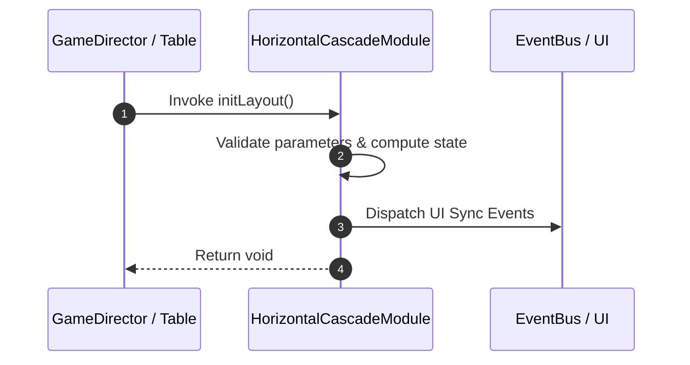

# 📖 `HorizontalCascadeModule.initLayout()`

<!-- convention-summary-start -->
### HorizontalCascadeModule.initLayout Line-by-Line Method Specification Summary

- **Core Architecture / Purpose**: Technical reference, API contract, and integration guide for HorizontalCascadeModule.initLayout Line-by-Line Method Specification.
- **Key Mechanisms & Design**: Encapsulates core algorithms, event hooks, and performance optimizations within the slot framework runtime.
- **Domain Capabilities**: cc_slot_mechanics, 05_methods
- **Scope & Code Paths**: `assets/cc-common/cc-slot-mechanics/HorizontalCascade/scripts/HorizontalCascadeModule.ts`
- **Related Docs**: [Master Index](../INDEX.md)
<!-- convention-summary-end -->


---

## 1. Method Signature & Overview

```typescript
public initLayout(): void
```

- **Declaring Class**: `HorizontalCascadeModule` (`assets/cc-common/cc-slot-mechanics/HorizontalCascade/scripts/HorizontalCascadeModule.ts`)
- **Source Code Location**: Lines 19 to 33
- **Execution Complexity**: $O(1)$ fast synchronous calculation or controlled timer Promise.

---

## 2. Complete Source Code Implementation

```typescript
	protected initLayout(): void {
		this.tableConfig = this.getConfig().CASCADE_TABLE_CONFIG;

		let positions: cc.Vec2[][] = [];
		positions[0] = [];
		const cellSize = this.tableConfig.cellSize;
		for (let col = 0; col < this.tableConfig.format.length; col++) {
			const tableWidth = this.tableConfig.format.length * cellSize.x;
			//const tableHeight = this.tableConfig.format[col] * cellSize.y;
			const offsetX = - tableWidth / 2 + cellSize.x / 2;
			const x = offsetX + col * cellSize.x;
			positions[0][col] = new cc.Vec2(x, 0);
		}
		this.tableConfig.positions = positions;
	}
```

---

## 3. Line-by-Line Code Breakdown

| Line # | Code Snippet | Technical Analysis & Engine Behavior |
| :---: | :--- | :--- |
| **19** | `protected initLayout(): void {` | Method entry signature declaring `initLayout()` with return type `void`. |
| **20** | `this.tableConfig = this.getConfig().CASCADE_TABLE_CONFIG;` | Applies operational logic and state mutation. |
| **21** | `` | Applies operational logic and state mutation. |
| **22** | `let positions: cc.Vec2[][] = [];` | Local variable initialization allocating `positions: cc.Vec2[][]`. |
| **23** | `positions[0] = [];` | Applies operational logic and state mutation. |
| **24** | `const cellSize = this.tableConfig.cellSize;` | Local variable initialization allocating `cellSize`. |
| **25** | `for (let col = 0; col < this.tableConfig.format.length; col++) {` | Iterates over collection elements. |
| **26** | `const tableWidth = this.tableConfig.format.length * cellSize.x;` | Local variable initialization allocating `tableWidth`. |
| **27** | `//const tableHeight = this.tableConfig.format[col] * cellSize.y;` | Applies operational logic and state mutation. |
| **28** | `const offsetX = - tableWidth / 2 + cellSize.x / 2;` | Local variable initialization allocating `offsetX`. |
| **29** | `const x = offsetX + col * cellSize.x;` | Local variable initialization allocating `x`. |
| **30** | `positions[0][col] = new cc.Vec2(x, 0);` | Applies operational logic and state mutation. |
| **31** | `}` | Method exit boundary, closing block scope. |
| **32** | `this.tableConfig.positions = positions;` | Applies operational logic and state mutation. |
| **33** | `}` | Method exit boundary, closing block scope. |

---

## 4. Data Flow & State Lifecycle



---

## 5. Production Gotchas & Edge Cases

1. **Null Guarding**: Always ensure caller passes non-null parameters or handles undefined fallbacks.
2. **Fast-Stop Safety**: If user triggers fast-stop during execution, ensure timers are cancelled cleanly via `unscheduleAllCallbacks()`.
