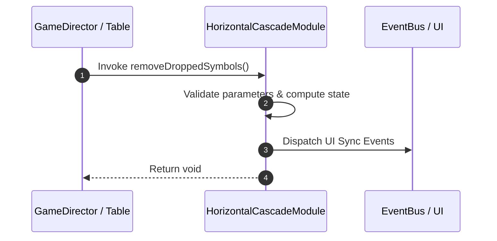

# 📖 `HorizontalCascadeModule.removeDroppedSymbols()`

<!-- convention-summary-start -->
### HorizontalCascadeModule.removeDroppedSymbols Line-by-Line Method Specification Summary

- **Core Architecture / Purpose**: Technical reference, API contract, and integration guide for HorizontalCascadeModule.removeDroppedSymbols Line-by-Line Method Specification.
- **Key Mechanisms & Design**: Encapsulates core algorithms, event hooks, and performance optimizations within the slot framework runtime.
- **Domain Capabilities**: cc_slot_mechanics, 05_methods
- **Scope & Code Paths**: `assets/cc-common/cc-slot-mechanics/HorizontalCascade/scripts/HorizontalCascadeModule.ts`
- **Related Docs**: [Master Index](../INDEX.md)
<!-- convention-summary-end -->


---

## 1. Method Signature & Overview

```typescript
public removeDroppedSymbols(): void
```

- **Declaring Class**: `HorizontalCascadeModule` (`assets/cc-common/cc-slot-mechanics/HorizontalCascade/scripts/HorizontalCascadeModule.ts`)
- **Source Code Location**: Lines 82 to 95
- **Execution Complexity**: $O(1)$ fast synchronous calculation or controlled timer Promise.

---

## 2. Complete Source Code Implementation

```typescript
	protected removeDroppedSymbols(): void {
		for (let i = 0; i < this.listDropColumns.length; i++) {
			const col = this.listDropColumns[i];
			let row = this.listSymbols[i].length - 1;
			for (let j = this.listTraceWay[col].length - 1; j >= 0; j--) {
				const value = this.listTraceWay[col][j];
				const { code, size } = this.mapSymbolData(value);
				if (code == "-1") {
					this.removeSymbolAt(col, row);
				}
				row = row - size;
			}
		}
	}
```

---

## 3. Line-by-Line Code Breakdown

| Line # | Code Snippet | Technical Analysis & Engine Behavior |
| :---: | :--- | :--- |
| **82** | `protected removeDroppedSymbols(): void {` | Method entry signature declaring `removeDroppedSymbols()` with return type `void`. |
| **83** | `for (let i = 0; i < this.listDropColumns.length; i++) {` | Iterates over collection elements. |
| **84** | `const col = this.listDropColumns[i];` | Local variable initialization allocating `col`. |
| **85** | `let row = this.listSymbols[i].length - 1;` | Local variable initialization allocating `row`. |
| **86** | `for (let j = this.listTraceWay[col].length - 1; j >= 0; j--) {` | Iterates over collection elements. |
| **87** | `const value = this.listTraceWay[col][j];` | Local variable initialization allocating `value`. |
| **88** | `const { code, size } = this.mapSymbolData(value);` | Local variable initialization allocating `{ code, size }`. |
| **89** | `if (code == "-1") {` | Conditional branch evaluation guarding edge cases or prerequisites. |
| **90** | `this.removeSymbolAt(col, row);` | Applies operational logic and state mutation. |
| **91** | `}` | Method exit boundary, closing block scope. |
| **92** | `row = row - size;` | Applies operational logic and state mutation. |
| **93** | `}` | Method exit boundary, closing block scope. |
| **94** | `}` | Method exit boundary, closing block scope. |
| **95** | `}` | Method exit boundary, closing block scope. |

---

## 4. Data Flow & State Lifecycle



---

## 5. Production Gotchas & Edge Cases

1. **Null Guarding**: Always ensure caller passes non-null parameters or handles undefined fallbacks.
2. **Fast-Stop Safety**: If user triggers fast-stop during execution, ensure timers are cancelled cleanly via `unscheduleAllCallbacks()`.
