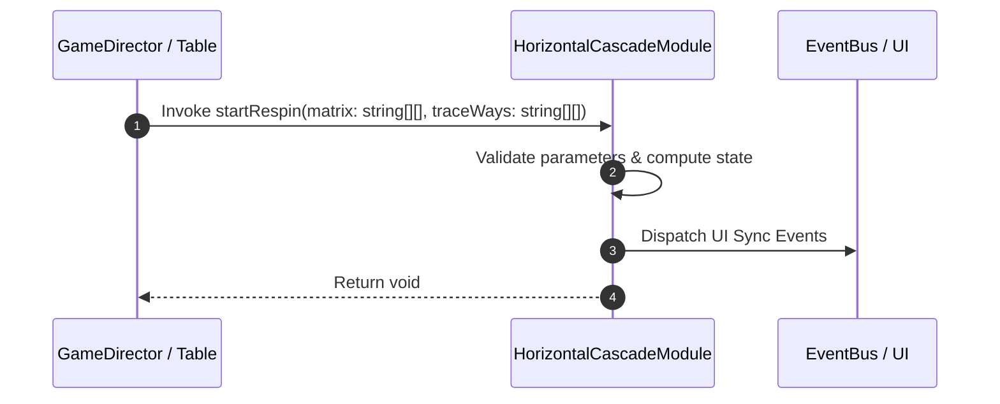

# 📖 `HorizontalCascadeModule.startRespin()`

<!-- convention-summary-start -->
### HorizontalCascadeModule.startRespin Line-by-Line Method Specification Summary

- **Core Architecture / Purpose**: Technical reference, API contract, and integration guide for HorizontalCascadeModule.startRespin Line-by-Line Method Specification.
- **Key Mechanisms & Design**: Encapsulates core algorithms, event hooks, and performance optimizations within the slot framework runtime.
- **Domain Capabilities**: cc_slot_mechanics, 05_methods
- **Scope & Code Paths**: `assets/cc-common/cc-slot-mechanics/HorizontalCascade/scripts/HorizontalCascadeModule.ts`
- **Related Docs**: [Master Index](../INDEX.md)
<!-- convention-summary-end -->


---

## 1. Method Signature & Overview

```typescript
public startRespin(matrix: string[][], traceWays: string[][]): void
```

- **Declaring Class**: `HorizontalCascadeModule` (`assets/cc-common/cc-slot-mechanics/HorizontalCascade/scripts/HorizontalCascadeModule.ts`)
- **Source Code Location**: Lines 35 to 43
- **Execution Complexity**: $O(1)$ fast synchronous calculation or controlled timer Promise.

---

## 2. Complete Source Code Implementation

```typescript
	public startRespin(matrix: string[][], traceWays: string[][]): void {
		if (!matrix && !traceWays) {
			const cascadeData: HorizontalCascadeData = this.getComponent(HorizontalCascadeData);
			const { horizonMatrix, listTraceWay } = cascadeData.formatData();
			super.startRespin(horizonMatrix, listTraceWay);
		} else {
			super.startRespin(matrix, traceWays);
		}
	}
```

---

## 3. Line-by-Line Code Breakdown

| Line # | Code Snippet | Technical Analysis & Engine Behavior |
| :---: | :--- | :--- |
| **35** | `public startRespin(matrix: string[][], traceWays: string[][]): void {` | Method entry signature declaring `startRespin(matrix: string[][], traceWays: string[][])` with return type `void`. |
| **36** | `if (!matrix && !traceWays) {` | Conditional branch evaluation guarding edge cases or prerequisites. |
| **37** | `const cascadeData: HorizontalCascadeData = this.getComponent(HorizontalCascadeData);` | Local variable initialization allocating `cascadeData: HorizontalCascadeData`. |
| **38** | `const { horizonMatrix, listTraceWay } = cascadeData.formatData();` | Local variable initialization allocating `{ horizonMatrix, listTraceWay }`. |
| **39** | `super.startRespin(horizonMatrix, listTraceWay);` | Applies operational logic and state mutation. |
| **40** | `} else {` | Applies operational logic and state mutation. |
| **41** | `super.startRespin(matrix, traceWays);` | Applies operational logic and state mutation. |
| **42** | `}` | Method exit boundary, closing block scope. |
| **43** | `}` | Method exit boundary, closing block scope. |

---

## 4. Data Flow & State Lifecycle



---

## 5. Production Gotchas & Edge Cases

1. **Null Guarding**: Always ensure caller passes non-null parameters or handles undefined fallbacks.
2. **Fast-Stop Safety**: If user triggers fast-stop during execution, ensure timers are cancelled cleanly via `unscheduleAllCallbacks()`.
