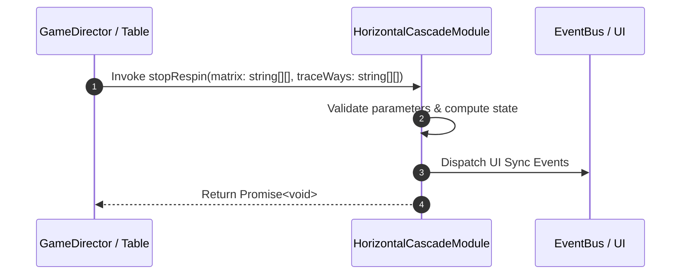

# 📖 `HorizontalCascadeModule.stopRespin()`

<!-- convention-summary-start -->
### HorizontalCascadeModule.stopRespin Line-by-Line Method Specification Summary

- **Core Architecture / Purpose**: Technical reference, API contract, and integration guide for HorizontalCascadeModule.stopRespin Line-by-Line Method Specification.
- **Key Mechanisms & Design**: Encapsulates core algorithms, event hooks, and performance optimizations within the slot framework runtime.
- **Domain Capabilities**: cc_slot_mechanics, 05_methods
- **Scope & Code Paths**: `assets/cc-common/cc-slot-mechanics/HorizontalCascade/scripts/HorizontalCascadeModule.ts`
- **Related Docs**: [Master Index](../INDEX.md)
<!-- convention-summary-end -->


---

## 1. Method Signature & Overview

```typescript
public stopRespin(matrix: string[][], traceWays: string[][]): Promise<void>
```

- **Declaring Class**: `HorizontalCascadeModule` (`assets/cc-common/cc-slot-mechanics/HorizontalCascade/scripts/HorizontalCascadeModule.ts`)
- **Source Code Location**: Lines 45 to 55
- **Execution Complexity**: $O(1)$ fast synchronous calculation or controlled timer Promise.

---

## 2. Complete Source Code Implementation

```typescript
	public stopRespin(matrix: string[][], traceWays: string[][]): Promise<void>  {
		if (!matrix && !traceWays) {
			const cascadeData: HorizontalCascadeData = this.getComponent(HorizontalCascadeData);
			const { horizonMatrix, listTraceWay } = cascadeData.formatData();
			
			matrix = horizonMatrix;
			traceWays = listTraceWay;
		}

		return super.stopRespin(matrix, traceWays);
	}
```

---

## 3. Line-by-Line Code Breakdown

| Line # | Code Snippet | Technical Analysis & Engine Behavior |
| :---: | :--- | :--- |
| **45** | `public stopRespin(matrix: string[][], traceWays: string[][]): Promise<void>  {` | Method entry signature declaring `stopRespin(matrix: string[][], traceWays: string[][])` with return type `Promise<void>`. |
| **46** | `if (!matrix && !traceWays) {` | Conditional branch evaluation guarding edge cases or prerequisites. |
| **47** | `const cascadeData: HorizontalCascadeData = this.getComponent(HorizontalCascadeData);` | Local variable initialization allocating `cascadeData: HorizontalCascadeData`. |
| **48** | `const { horizonMatrix, listTraceWay } = cascadeData.formatData();` | Local variable initialization allocating `{ horizonMatrix, listTraceWay }`. |
| **49** | `` | Applies operational logic and state mutation. |
| **50** | `matrix = horizonMatrix;` | Applies operational logic and state mutation. |
| **51** | `traceWays = listTraceWay;` | Applies operational logic and state mutation. |
| **52** | `}` | Method exit boundary, closing block scope. |
| **53** | `` | Applies operational logic and state mutation. |
| **54** | `return super.stopRespin(matrix, traceWays);` | Returns computed value / promise to caller. |
| **55** | `}` | Method exit boundary, closing block scope. |

---

## 4. Data Flow & State Lifecycle



---

## 5. Production Gotchas & Edge Cases

1. **Null Guarding**: Always ensure caller passes non-null parameters or handles undefined fallbacks.
2. **Fast-Stop Safety**: If user triggers fast-stop during execution, ensure timers are cancelled cleanly via `unscheduleAllCallbacks()`.
