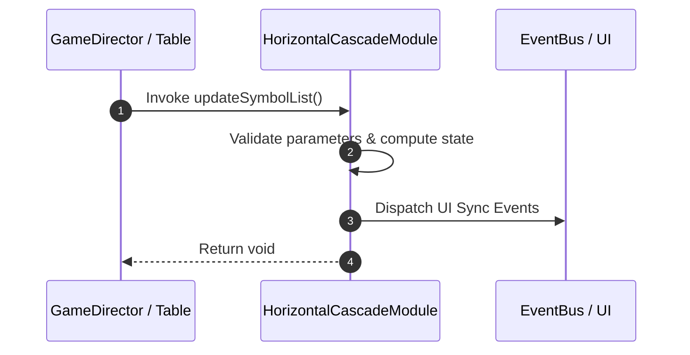

# 📖 `HorizontalCascadeModule.updateSymbolList()`

<!-- convention-summary-start -->
### HorizontalCascadeModule.updateSymbolList Line-by-Line Method Specification Summary

- **Core Architecture / Purpose**: Technical reference, API contract, and integration guide for HorizontalCascadeModule.updateSymbolList Line-by-Line Method Specification.
- **Key Mechanisms & Design**: Encapsulates core algorithms, event hooks, and performance optimizations within the slot framework runtime.
- **Domain Capabilities**: cc_slot_mechanics, 05_methods
- **Scope & Code Paths**: `assets/cc-common/cc-slot-mechanics/HorizontalCascade/scripts/HorizontalCascadeModule.ts`
- **Related Docs**: [Master Index](../INDEX.md)
<!-- convention-summary-end -->


---

## 1. Method Signature & Overview

```typescript
public updateSymbolList(): void
```

- **Declaring Class**: `HorizontalCascadeModule` (`assets/cc-common/cc-slot-mechanics/HorizontalCascade/scripts/HorizontalCascadeModule.ts`)
- **Source Code Location**: Lines 59 to 79
- **Execution Complexity**: $O(1)$ fast synchronous calculation or controlled timer Promise.

---

## 2. Complete Source Code Implementation

```typescript
	protected updateSymbolList(): void {
		const listIndex = this.getConfig().SYMBOL_INDEXES;

		let col = 0;
		let index = 0;
		for (let j = 0; j < this.matrix[0].length; j++) {
			const symbolValue = this.matrix[0][j];
			const { size } = this.mapSymbolData(symbolValue);
			col = col + size - 1;
			index = listIndex[0][j];
			const symbol = this.symbolManager.getSymbolByIndex(index, SymbolOwnerType.CASCADE_SYMBOL);
			const position = this.tableConfig.positions[0][j];
			if (symbol) {
				this.listSymbols[0][col] = symbol;
                
				symbol.setParent(this.container);
				symbol.setPosition(position);
			}
			col++;
		}
	}
```

---

## 3. Line-by-Line Code Breakdown

| Line # | Code Snippet | Technical Analysis & Engine Behavior |
| :---: | :--- | :--- |
| **59** | `protected updateSymbolList(): void {` | Method entry signature declaring `updateSymbolList()` with return type `void`. |
| **60** | `const listIndex = this.getConfig().SYMBOL_INDEXES;` | Local variable initialization allocating `listIndex`. |
| **61** | `` | Applies operational logic and state mutation. |
| **62** | `let col = 0;` | Local variable initialization allocating `col`. |
| **63** | `let index = 0;` | Local variable initialization allocating `index`. |
| **64** | `for (let j = 0; j < this.matrix[0].length; j++) {` | Iterates over collection elements. |
| **65** | `const symbolValue = this.matrix[0][j];` | Local variable initialization allocating `symbolValue`. |
| **66** | `const { size } = this.mapSymbolData(symbolValue);` | Local variable initialization allocating `{ size }`. |
| **67** | `col = col + size - 1;` | Applies operational logic and state mutation. |
| **68** | `index = listIndex[0][j];` | Applies operational logic and state mutation. |
| **69** | `const symbol = this.symbolManager.getSymbolByIndex(index, SymbolOwnerType.CASCADE_SYMBOL);` | Local variable initialization allocating `symbol`. |
| **70** | `const position = this.tableConfig.positions[0][j];` | Local variable initialization allocating `position`. |
| **71** | `if (symbol) {` | Conditional branch evaluation guarding edge cases or prerequisites. |
| **72** | `this.listSymbols[0][col] = symbol;` | Applies operational logic and state mutation. |
| **73** | `` | Applies operational logic and state mutation. |
| **74** | `symbol.setParent(this.container);` | Applies operational logic and state mutation. |
| **75** | `symbol.setPosition(position);` | Applies operational logic and state mutation. |
| **76** | `}` | Method exit boundary, closing block scope. |
| **77** | `col++;` | Applies operational logic and state mutation. |
| **78** | `}` | Method exit boundary, closing block scope. |
| **79** | `}` | Method exit boundary, closing block scope. |

---

## 4. Data Flow & State Lifecycle



---

## 5. Production Gotchas & Edge Cases

1. **Null Guarding**: Always ensure caller passes non-null parameters or handles undefined fallbacks.
2. **Fast-Stop Safety**: If user triggers fast-stop during execution, ensure timers are cancelled cleanly via `unscheduleAllCallbacks()`.
