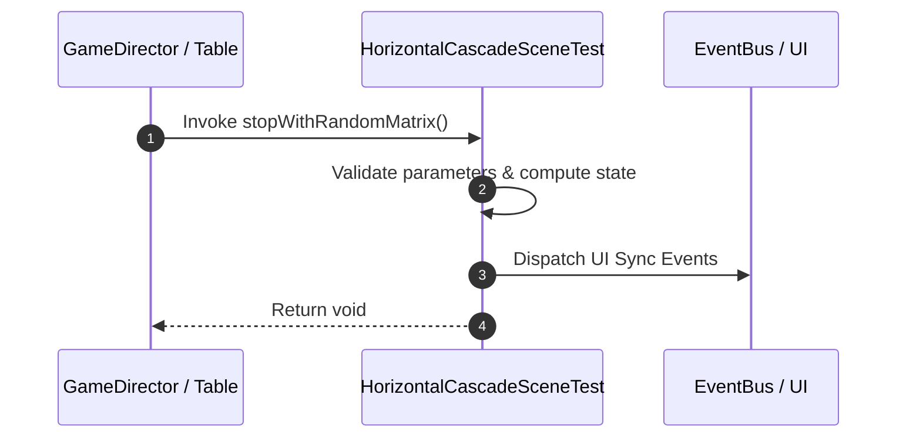

# 📖 `HorizontalCascadeSceneTest.stopWithRandomMatrix()`

<!-- convention-summary-start -->
### HorizontalCascadeSceneTest.stopWithRandomMatrix Line-by-Line Method Specification Summary

- **Core Architecture / Purpose**: Technical reference, API contract, and integration guide for HorizontalCascadeSceneTest.stopWithRandomMatrix Line-by-Line Method Specification.
- **Key Mechanisms & Design**: Encapsulates core algorithms, event hooks, and performance optimizations within the slot framework runtime.
- **Domain Capabilities**: cc_slot_mechanics, 05_methods
- **Scope & Code Paths**: `assets/cc-common/cc-slot-mechanics/HorizontalCascade/scripts/HorizontalCascadeSceneTest.ts`
- **Related Docs**: [Master Index](../INDEX.md)
<!-- convention-summary-end -->


---

## 1. Method Signature & Overview

```typescript
public stopWithRandomMatrix(): void
```

- **Declaring Class**: `HorizontalCascadeSceneTest` (`assets/cc-common/cc-slot-mechanics/HorizontalCascade/scripts/HorizontalCascadeSceneTest.ts`)
- **Source Code Location**: Lines 25 to 38
- **Execution Complexity**: $O(1)$ fast synchronous calculation or controlled timer Promise.

---

## 2. Complete Source Code Implementation

```typescript
	stopWithRandomMatrix(): void {
        const slotData = this.table.getComponent(HorizontalTableData);
        slotData["matrix"] = [2,3,3,2,3].map(String);
		this.table.stopSpin();
        
        this.scheduleOnce(() => {
            // fake respin
            const cascadeData = this.cascadeModule.getComponent(HorizontalCascadeData);
            cascadeData["matrix"] = slotData["matrix"];
            cascadeData["traceWay"] = [2];
            this.cascadeModule.startRespin(null, null);
			this.stopRespin();
		}, 2);
	}
```

---

## 3. Line-by-Line Code Breakdown

| Line # | Code Snippet | Technical Analysis & Engine Behavior |
| :---: | :--- | :--- |
| **25** | `stopWithRandomMatrix(): void {` | Method entry signature declaring `stopWithRandomMatrix()` with return type `void`. |
| **26** | `const slotData = this.table.getComponent(HorizontalTableData);` | Local variable initialization allocating `slotData`. |
| **27** | `slotData["matrix"] = [2,3,3,2,3].map(String);` | Applies operational logic and state mutation. |
| **28** | `this.table.stopSpin();` | Applies operational logic and state mutation. |
| **29** | `` | Applies operational logic and state mutation. |
| **30** | `this.scheduleOnce(() => {` | Schedules delayed execution callback using Cocos Creator timer. |
| **31** | `// fake respin` | Applies operational logic and state mutation. |
| **32** | `const cascadeData = this.cascadeModule.getComponent(HorizontalCascadeData);` | Local variable initialization allocating `cascadeData`. |
| **33** | `cascadeData["matrix"] = slotData["matrix"];` | Applies operational logic and state mutation. |
| **34** | `cascadeData["traceWay"] = [2];` | Applies operational logic and state mutation. |
| **35** | `this.cascadeModule.startRespin(null, null);` | Applies operational logic and state mutation. |
| **36** | `this.stopRespin();` | Applies operational logic and state mutation. |
| **37** | `}, 2);` | Applies operational logic and state mutation. |
| **38** | `}` | Method exit boundary, closing block scope. |

---

## 4. Data Flow & State Lifecycle



---

## 5. Production Gotchas & Edge Cases

1. **Null Guarding**: Always ensure caller passes non-null parameters or handles undefined fallbacks.
2. **Fast-Stop Safety**: If user triggers fast-stop during execution, ensure timers are cancelled cleanly via `unscheduleAllCallbacks()`.
