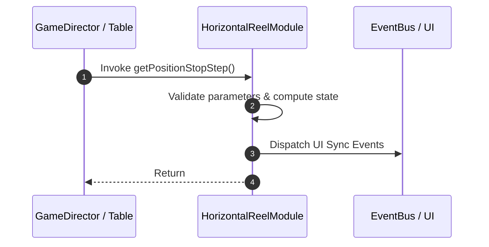

# 📖 `HorizontalReelModule.getPositionStopStep()`

<!-- convention-summary-start -->
### HorizontalReelModule.getPositionStopStep Line-by-Line Method Specification Summary

- **Core Architecture / Purpose**: Technical reference, API contract, and integration guide for HorizontalReelModule.getPositionStopStep Line-by-Line Method Specification.
- **Key Mechanisms & Design**: Encapsulates core algorithms, event hooks, and performance optimizations within the slot framework runtime.
- **Domain Capabilities**: cc_slot_mechanics, 05_methods
- **Scope & Code Paths**: `assets/cc-common/cc-slot-mechanics/HorizontalReel/scripts/HorizontalReelModule.ts`
- **Related Docs**: [Master Index](../INDEX.md)
<!-- convention-summary-end -->


---

## 1. Method Signature & Overview

```typescript
public getPositionStopStep(): 
```

- **Declaring Class**: `HorizontalReelModule` (`assets/cc-common/cc-slot-mechanics/HorizontalReel/scripts/HorizontalReelModule.ts`)
- **Source Code Location**: Lines 79 to 85
- **Execution Complexity**: $O(1)$ fast synchronous calculation or controlled timer Promise.

---

## 2. Complete Source Code Implementation

```typescript
	getPositionStopStep(): { positionStep1: cc.Vec2, positionStep2: cc.Vec2 } {
		const stepDistance = this.currentMode.easingStop;
		const positionStep1 = new Vec2(-stepDistance, 0);
		const positionStep2 = new Vec2(stepDistance, 0);

		return { positionStep1, positionStep2 };
	}
```

---

## 3. Line-by-Line Code Breakdown

| Line # | Code Snippet | Technical Analysis & Engine Behavior |
| :---: | :--- | :--- |
| **79** | `getPositionStopStep(): { positionStep1: cc.Vec2, positionStep2: cc.Vec2 } {` | Method entry signature declaring `getPositionStopStep()` with return type ``. |
| **80** | `const stepDistance = this.currentMode.easingStop;` | Local variable initialization allocating `stepDistance`. |
| **81** | `const positionStep1 = new Vec2(-stepDistance, 0);` | Local variable initialization allocating `positionStep1`. |
| **82** | `const positionStep2 = new Vec2(stepDistance, 0);` | Local variable initialization allocating `positionStep2`. |
| **83** | `` | Applies operational logic and state mutation. |
| **84** | `return { positionStep1, positionStep2 };` | Returns computed value / promise to caller. |
| **85** | `}` | Method exit boundary, closing block scope. |

---

## 4. Data Flow & State Lifecycle



---

## 5. Production Gotchas & Edge Cases

1. **Null Guarding**: Always ensure caller passes non-null parameters or handles undefined fallbacks.
2. **Fast-Stop Safety**: If user triggers fast-stop during execution, ensure timers are cancelled cleanly via `unscheduleAllCallbacks()`.
