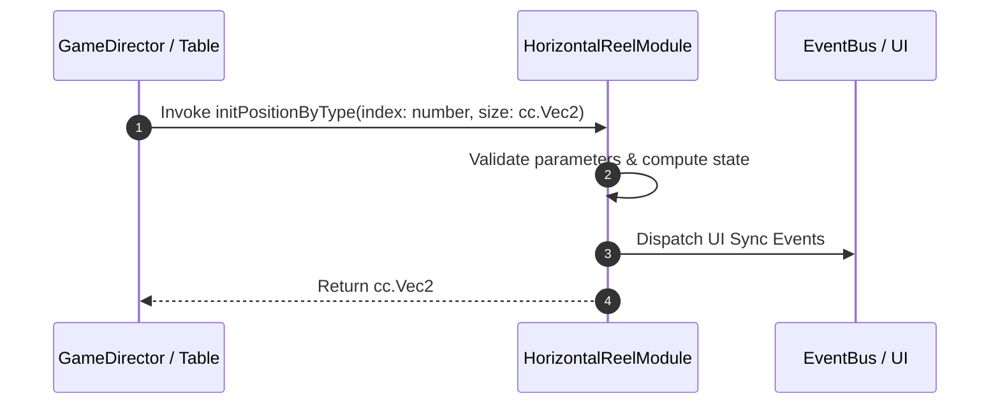

# 📖 `HorizontalReelModule.initPositionByType()`

<!-- convention-summary-start -->
### HorizontalReelModule.initPositionByType Line-by-Line Method Specification Summary

- **Core Architecture / Purpose**: Technical reference, API contract, and integration guide for HorizontalReelModule.initPositionByType Line-by-Line Method Specification.
- **Key Mechanisms & Design**: Encapsulates core algorithms, event hooks, and performance optimizations within the slot framework runtime.
- **Domain Capabilities**: cc_slot_mechanics, 05_methods
- **Scope & Code Paths**: `assets/cc-common/cc-slot-mechanics/HorizontalReel/scripts/HorizontalReelModule.ts`
- **Related Docs**: [Master Index](../INDEX.md)
<!-- convention-summary-end -->


---

## 1. Method Signature & Overview

```typescript
public initPositionByType(index: number, size: cc.Vec2): cc.Vec2
```

- **Declaring Class**: `HorizontalReelModule` (`assets/cc-common/cc-slot-mechanics/HorizontalReel/scripts/HorizontalReelModule.ts`)
- **Source Code Location**: Lines 16 to 22
- **Execution Complexity**: $O(1)$ fast synchronous calculation or controlled timer Promise.

---

## 2. Complete Source Code Implementation

```typescript
	protected initPositionByType(index: number, size: cc.Vec2): cc.Vec2 {
		const { startX } = this.reelManager;
		const x = index * this.SYMBOL_WIDTH - startX;
		const y = 0;

		return v2(x, y);
	}
```

---

## 3. Line-by-Line Code Breakdown

| Line # | Code Snippet | Technical Analysis & Engine Behavior |
| :---: | :--- | :--- |
| **16** | `protected initPositionByType(index: number, size: cc.Vec2): cc.Vec2 {` | Method entry signature declaring `initPositionByType(index: number, size: cc.Vec2)` with return type `cc.Vec2`. |
| **17** | `const { startX } = this.reelManager;` | Local variable initialization allocating `{ startX }`. |
| **18** | `const x = index * this.SYMBOL_WIDTH - startX;` | Local variable initialization allocating `x`. |
| **19** | `const y = 0;` | Local variable initialization allocating `y`. |
| **20** | `` | Applies operational logic and state mutation. |
| **21** | `return v2(x, y);` | Returns computed value / promise to caller. |
| **22** | `}` | Method exit boundary, closing block scope. |

---

## 4. Data Flow & State Lifecycle



---

## 5. Production Gotchas & Edge Cases

1. **Null Guarding**: Always ensure caller passes non-null parameters or handles undefined fallbacks.
2. **Fast-Stop Safety**: If user triggers fast-stop during execution, ensure timers are cancelled cleanly via `unscheduleAllCallbacks()`.
