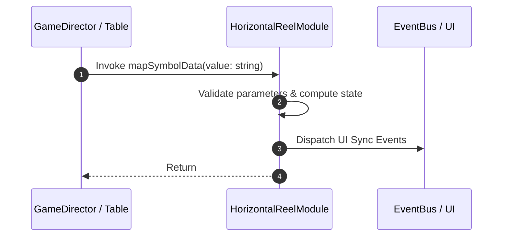

# 📖 `HorizontalReelModule.mapSymbolData()`

<!-- convention-summary-start -->
### HorizontalReelModule.mapSymbolData Line-by-Line Method Specification Summary

- **Core Architecture / Purpose**: Technical reference, API contract, and integration guide for HorizontalReelModule.mapSymbolData Line-by-Line Method Specification.
- **Key Mechanisms & Design**: Encapsulates core algorithms, event hooks, and performance optimizations within the slot framework runtime.
- **Domain Capabilities**: cc_slot_mechanics, 05_methods
- **Scope & Code Paths**: `assets/cc-common/cc-slot-mechanics/HorizontalReel/scripts/HorizontalReelModule.ts`
- **Related Docs**: [Master Index](../INDEX.md)
<!-- convention-summary-end -->


---

## 1. Method Signature & Overview

```typescript
public mapSymbolData(value: string): 
```

- **Declaring Class**: `HorizontalReelModule` (`assets/cc-common/cc-slot-mechanics/HorizontalReel/scripts/HorizontalReelModule.ts`)
- **Source Code Location**: Lines 87 to 96
- **Execution Complexity**: $O(1)$ fast synchronous calculation or controlled timer Promise.

---

## 2. Complete Source Code Implementation

```typescript
	mapSymbolData(value: string): { symbolCode: string, symbolSize: cc.Vec2, stop: number } {
		if (value.indexOf('_') >= 0) {
			const resultList = value.split("_");
			const [symbolCode, sizeX, sizeY] = resultList;
			const symbolSize = sizeX && sizeY ? v2(+sizeX, +sizeY) : this.config.DEFAULT_SIZE;
			return { symbolCode, symbolSize, stop: symbolSize.x };
		} else {
			return { symbolCode: value, symbolSize: this.config.DEFAULT_SIZE, stop: this.config.DEFAULT_SIZE.x };
		}
	}
```

---

## 3. Line-by-Line Code Breakdown

| Line # | Code Snippet | Technical Analysis & Engine Behavior |
| :---: | :--- | :--- |
| **87** | `mapSymbolData(value: string): { symbolCode: string, symbolSize: cc.Vec2, stop: number } {` | Method entry signature declaring `mapSymbolData(value: string)` with return type ``. |
| **88** | `if (value.indexOf('_') >= 0) {` | Conditional branch evaluation guarding edge cases or prerequisites. |
| **89** | `const resultList = value.split("_");` | Local variable initialization allocating `resultList`. |
| **90** | `const [symbolCode, sizeX, sizeY] = resultList;` | Local variable initialization allocating `[symbolCode, sizeX, sizeY]`. |
| **91** | `const symbolSize = sizeX && sizeY ? v2(+sizeX, +sizeY) : this.config.DEFAULT_SIZE;` | Local variable initialization allocating `symbolSize`. |
| **92** | `return { symbolCode, symbolSize, stop: symbolSize.x };` | Returns computed value / promise to caller. |
| **93** | `} else {` | Applies operational logic and state mutation. |
| **94** | `return { symbolCode: value, symbolSize: this.config.DEFAULT_SIZE, stop: this.config.DEFAULT_SIZE.x };` | Returns computed value / promise to caller. |
| **95** | `}` | Method exit boundary, closing block scope. |
| **96** | `}` | Method exit boundary, closing block scope. |

---

## 4. Data Flow & State Lifecycle



---

## 5. Production Gotchas & Edge Cases

1. **Null Guarding**: Always ensure caller passes non-null parameters or handles undefined fallbacks.
2. **Fast-Stop Safety**: If user triggers fast-stop during execution, ensure timers are cancelled cleanly via `unscheduleAllCallbacks()`.
