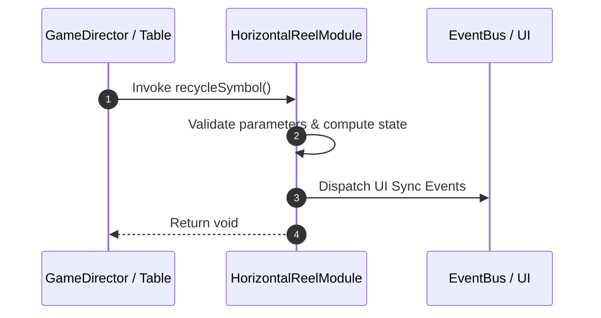

# 📖 `HorizontalReelModule.recycleSymbol()`

<!-- convention-summary-start -->
### HorizontalReelModule.recycleSymbol Line-by-Line Method Specification Summary

- **Core Architecture / Purpose**: Technical reference, API contract, and integration guide for HorizontalReelModule.recycleSymbol Line-by-Line Method Specification.
- **Key Mechanisms & Design**: Encapsulates core algorithms, event hooks, and performance optimizations within the slot framework runtime.
- **Domain Capabilities**: cc_slot_mechanics, 05_methods
- **Scope & Code Paths**: `assets/cc-common/cc-slot-mechanics/HorizontalReel/scripts/HorizontalReelModule.ts`
- **Related Docs**: [Master Index](../INDEX.md)
<!-- convention-summary-end -->


---

## 1. Method Signature & Overview

```typescript
public recycleSymbol(): void
```

- **Declaring Class**: `HorizontalReelModule` (`assets/cc-common/cc-slot-mechanics/HorizontalReel/scripts/HorizontalReelModule.ts`)
- **Source Code Location**: Lines 52 to 77
- **Execution Complexity**: $O(1)$ fast synchronous calculation or controlled timer Promise.

---

## 2. Complete Source Code Implementation

```typescript
	protected recycleSymbol(): void {
		if (!this.listSymbols.length) {
			return;
		}

		const symbol = this.listSymbols[0];
		const comp = SlotSymbolModule.getModuleComponent(symbol);

		if (!comp.getSize().equals(this.DEFAULT_SIZE) && comp.sizeCount > 1) {
			comp.sizeCount--;
		} else {
			this.symbolManager.removeSymbol(symbol);
			this.listSymbols.shift();
		}

		this.reelManager.step--;
		if (this.reelManager.step < this.reelManager.totalSymbol) {
			this.reelManager.changeState(ReelSpinState.SHOWING_RESULT);
		}

		this.spawnReelSymbol();

		if (this.reelManager.stop >= this.reelManager.totalSymbol) {
			this.reelManager.changeState(ReelSpinState.STOPPED);
		}
	}
```

---

## 3. Line-by-Line Code Breakdown

| Line # | Code Snippet | Technical Analysis & Engine Behavior |
| :---: | :--- | :--- |
| **52** | `protected recycleSymbol(): void {` | Method entry signature declaring `recycleSymbol()` with return type `void`. |
| **53** | `if (!this.listSymbols.length) {` | Conditional branch evaluation guarding edge cases or prerequisites. |
| **54** | `return;` | Applies operational logic and state mutation. |
| **55** | `}` | Method exit boundary, closing block scope. |
| **56** | `` | Applies operational logic and state mutation. |
| **57** | `const symbol = this.listSymbols[0];` | Local variable initialization allocating `symbol`. |
| **58** | `const comp = SlotSymbolModule.getModuleComponent(symbol);` | Local variable initialization allocating `comp`. |
| **59** | `` | Applies operational logic and state mutation. |
| **60** | `if (!comp.getSize().equals(this.DEFAULT_SIZE) && comp.sizeCount > 1) {` | Conditional branch evaluation guarding edge cases or prerequisites. |
| **61** | `comp.sizeCount--;` | Applies operational logic and state mutation. |
| **62** | `} else {` | Applies operational logic and state mutation. |
| **63** | `this.symbolManager.removeSymbol(symbol);` | Applies operational logic and state mutation. |
| **64** | `this.listSymbols.shift();` | Applies operational logic and state mutation. |
| **65** | `}` | Method exit boundary, closing block scope. |
| **66** | `` | Applies operational logic and state mutation. |
| **67** | `this.reelManager.step--;` | Applies operational logic and state mutation. |
| **68** | `if (this.reelManager.step < this.reelManager.totalSymbol) {` | Conditional branch evaluation guarding edge cases or prerequisites. |
| **69** | `this.reelManager.changeState(ReelSpinState.SHOWING_RESULT);` | Applies operational logic and state mutation. |
| **70** | `}` | Method exit boundary, closing block scope. |
| **71** | `` | Applies operational logic and state mutation. |
| **72** | `this.spawnReelSymbol();` | Applies operational logic and state mutation. |
| **73** | `` | Applies operational logic and state mutation. |
| **74** | `if (this.reelManager.stop >= this.reelManager.totalSymbol) {` | Conditional branch evaluation guarding edge cases or prerequisites. |
| **75** | `this.reelManager.changeState(ReelSpinState.STOPPED);` | Applies operational logic and state mutation. |
| **76** | `}` | Method exit boundary, closing block scope. |
| **77** | `}` | Method exit boundary, closing block scope. |

---

## 4. Data Flow & State Lifecycle



---

## 5. Production Gotchas & Edge Cases

1. **Null Guarding**: Always ensure caller passes non-null parameters or handles undefined fallbacks.
2. **Fast-Stop Safety**: If user triggers fast-stop during execution, ensure timers are cancelled cleanly via `unscheduleAllCallbacks()`.
