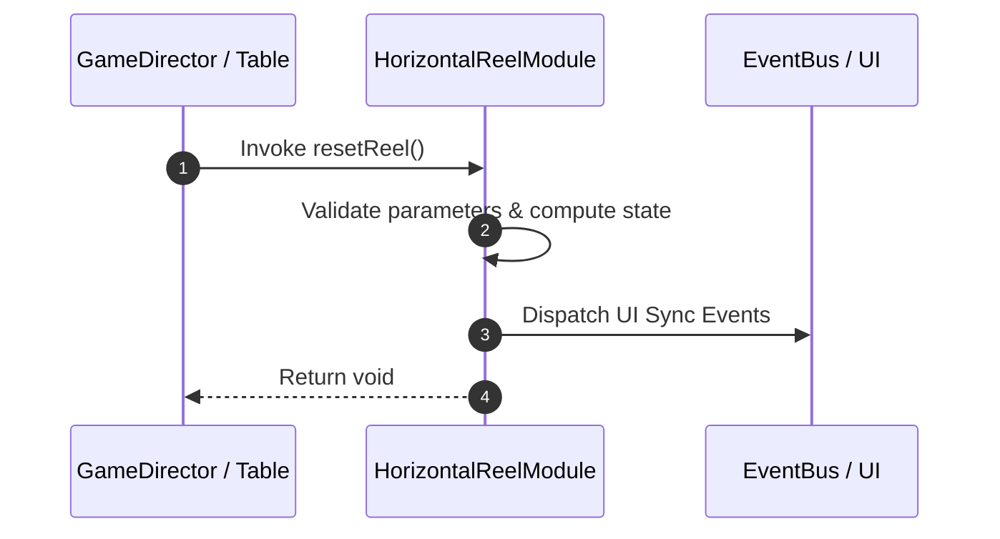

# 📖 `HorizontalReelModule.resetReel()`

<!-- convention-summary-start -->
### HorizontalReelModule.resetReel Line-by-Line Method Specification Summary

- **Core Architecture / Purpose**: Technical reference, API contract, and integration guide for HorizontalReelModule.resetReel Line-by-Line Method Specification.
- **Key Mechanisms & Design**: Encapsulates core algorithms, event hooks, and performance optimizations within the slot framework runtime.
- **Domain Capabilities**: cc_slot_mechanics, 05_methods
- **Scope & Code Paths**: `assets/cc-common/cc-slot-mechanics/HorizontalReel/scripts/HorizontalReelModule.ts`
- **Related Docs**: [Master Index](../INDEX.md)
<!-- convention-summary-end -->


---

## 1. Method Signature & Overview

```typescript
public resetReel(): void
```

- **Declaring Class**: `HorizontalReelModule` (`assets/cc-common/cc-slot-mechanics/HorizontalReel/scripts/HorizontalReelModule.ts`)
- **Source Code Location**: Lines 120 to 125
- **Execution Complexity**: $O(1)$ fast synchronous calculation or controlled timer Promise.

---

## 2. Complete Source Code Implementation

```typescript
	resetReel(): void {
		const offset = Math.abs(this.node.position.x);
		this.listSymbols.forEach((s) => s.setPosition(s.position.x - offset, s.position.y));
		this.listSymbols.sort((a, b) => b.position.x - a.position.x);
		this.node.setPosition(0, this.node.position.y);
	}
```

---

## 3. Line-by-Line Code Breakdown

| Line # | Code Snippet | Technical Analysis & Engine Behavior |
| :---: | :--- | :--- |
| **120** | `resetReel(): void {` | Method entry signature declaring `resetReel()` with return type `void`. |
| **121** | `const offset = Math.abs(this.node.position.x);` | Local variable initialization allocating `offset`. |
| **122** | `this.listSymbols.forEach((s) => s.setPosition(s.position.x - offset, s.position.y));` | Applies operational logic and state mutation. |
| **123** | `this.listSymbols.sort((a, b) => b.position.x - a.position.x);` | Applies operational logic and state mutation. |
| **124** | `this.node.setPosition(0, this.node.position.y);` | Applies operational logic and state mutation. |
| **125** | `}` | Method exit boundary, closing block scope. |

---

## 4. Data Flow & State Lifecycle



---

## 5. Production Gotchas & Edge Cases

1. **Null Guarding**: Always ensure caller passes non-null parameters or handles undefined fallbacks.
2. **Fast-Stop Safety**: If user triggers fast-stop during execution, ensure timers are cancelled cleanly via `unscheduleAllCallbacks()`.
