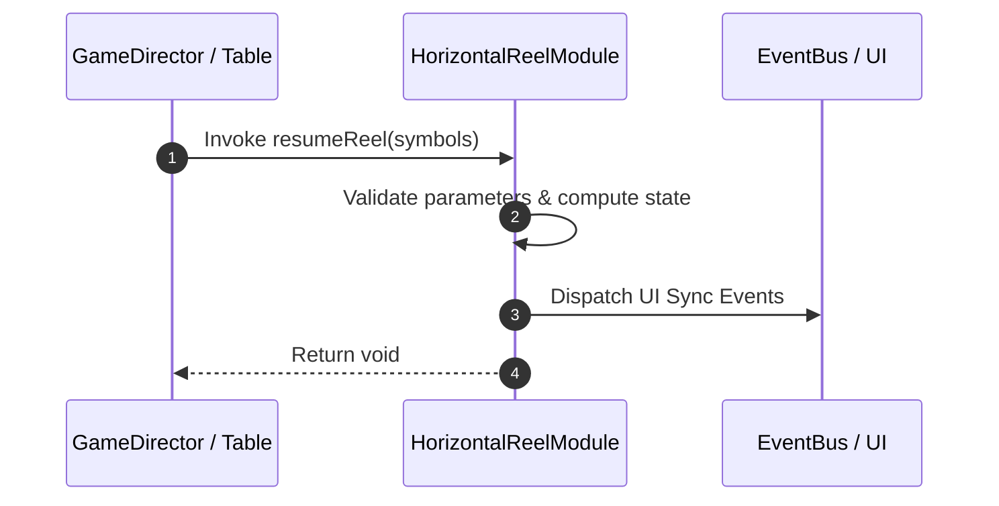

# 📖 `HorizontalReelModule.resumeReel()`

<!-- convention-summary-start -->
### HorizontalReelModule.resumeReel Line-by-Line Method Specification Summary

- **Core Architecture / Purpose**: Technical reference, API contract, and integration guide for HorizontalReelModule.resumeReel Line-by-Line Method Specification.
- **Key Mechanisms & Design**: Encapsulates core algorithms, event hooks, and performance optimizations within the slot framework runtime.
- **Domain Capabilities**: cc_slot_mechanics, 05_methods
- **Scope & Code Paths**: `assets/cc-common/cc-slot-mechanics/HorizontalReel/scripts/HorizontalReelModule.ts`
- **Related Docs**: [Master Index](../INDEX.md)
<!-- convention-summary-end -->


---

## 1. Method Signature & Overview

```typescript
public resumeReel(symbols): void
```

- **Declaring Class**: `HorizontalReelModule` (`assets/cc-common/cc-slot-mechanics/HorizontalReel/scripts/HorizontalReelModule.ts`)
- **Source Code Location**: Lines 127 to 149
- **Execution Complexity**: $O(1)$ fast synchronous calculation or controlled timer Promise.

---

## 2. Complete Source Code Implementation

```typescript
	resumeReel(symbols): void {
		this.data = [...symbols];

		for (let index = 0; index < this.config.BUFFER_RIGHT; index++) {
			this.data.push(this.getRandomSymbolWithException().symbolCode);
		}

		for (let index = 0; index < this.config.BUFFER_LEFT; index++) {
			this.data.unshift(this.getRandomSymbolWithException().symbolCode);
		}

		this.data.forEach((symbolValue, index) => {
			if (symbolValue) {
				const { symbolCode: code, symbolSize: size } = this.mapSymbolData(symbolValue);
				const symbol = this.symbolManager.createSymbol(code, size, this.node, SymbolOwnerType.REEL_SYMBOL);
				SlotSymbolModule.getModuleComponent(symbol).setIndex(this.getIndexSymbol(index));
				const position = this.initPositionByType(index, size);
				symbol.setPosition(position.x, position.y);
				this.listSymbols.push(symbol);
			}
		});
		this.symbolManager.updateSymbolSiblingIndex(this.listSymbols);
	}
```

---

## 3. Line-by-Line Code Breakdown

| Line # | Code Snippet | Technical Analysis & Engine Behavior |
| :---: | :--- | :--- |
| **127** | `resumeReel(symbols): void {` | Method entry signature declaring `resumeReel(symbols)` with return type `void`. |
| **128** | `this.data = [...symbols];` | Applies operational logic and state mutation. |
| **129** | `` | Applies operational logic and state mutation. |
| **130** | `for (let index = 0; index < this.config.BUFFER_RIGHT; index++) {` | Iterates over collection elements. |
| **131** | `this.data.push(this.getRandomSymbolWithException().symbolCode);` | Applies operational logic and state mutation. |
| **132** | `}` | Method exit boundary, closing block scope. |
| **133** | `` | Applies operational logic and state mutation. |
| **134** | `for (let index = 0; index < this.config.BUFFER_LEFT; index++) {` | Iterates over collection elements. |
| **135** | `this.data.unshift(this.getRandomSymbolWithException().symbolCode);` | Applies operational logic and state mutation. |
| **136** | `}` | Method exit boundary, closing block scope. |
| **137** | `` | Applies operational logic and state mutation. |
| **138** | `this.data.forEach((symbolValue, index) => {` | Applies operational logic and state mutation. |
| **139** | `if (symbolValue) {` | Conditional branch evaluation guarding edge cases or prerequisites. |
| **140** | `const { symbolCode: code, symbolSize: size } = this.mapSymbolData(symbolValue);` | Local variable initialization allocating `{ symbolCode: code, symbolSize: size }`. |
| **141** | `const symbol = this.symbolManager.createSymbol(code, size, this.node, SymbolOwnerType.REEL_SYMBOL);` | Local variable initialization allocating `symbol`. |
| **142** | `SlotSymbolModule.getModuleComponent(symbol).setIndex(this.getIndexSymbol(index));` | Applies operational logic and state mutation. |
| **143** | `const position = this.initPositionByType(index, size);` | Local variable initialization allocating `position`. |
| **144** | `symbol.setPosition(position.x, position.y);` | Applies operational logic and state mutation. |
| **145** | `this.listSymbols.push(symbol);` | Applies operational logic and state mutation. |
| **146** | `}` | Method exit boundary, closing block scope. |
| **147** | `});` | Applies operational logic and state mutation. |
| **148** | `this.symbolManager.updateSymbolSiblingIndex(this.listSymbols);` | Applies operational logic and state mutation. |
| **149** | `}` | Method exit boundary, closing block scope. |

---

## 4. Data Flow & State Lifecycle



---

## 5. Production Gotchas & Edge Cases

1. **Null Guarding**: Always ensure caller passes non-null parameters or handles undefined fallbacks.
2. **Fast-Stop Safety**: If user triggers fast-stop during execution, ensure timers are cancelled cleanly via `unscheduleAllCallbacks()`.
